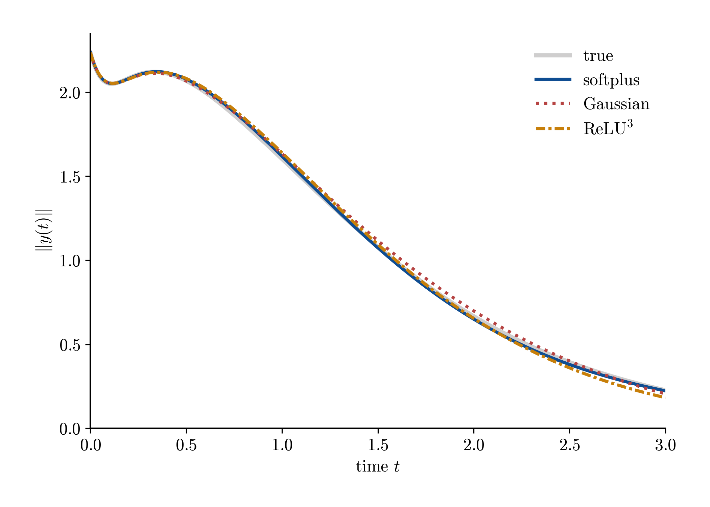
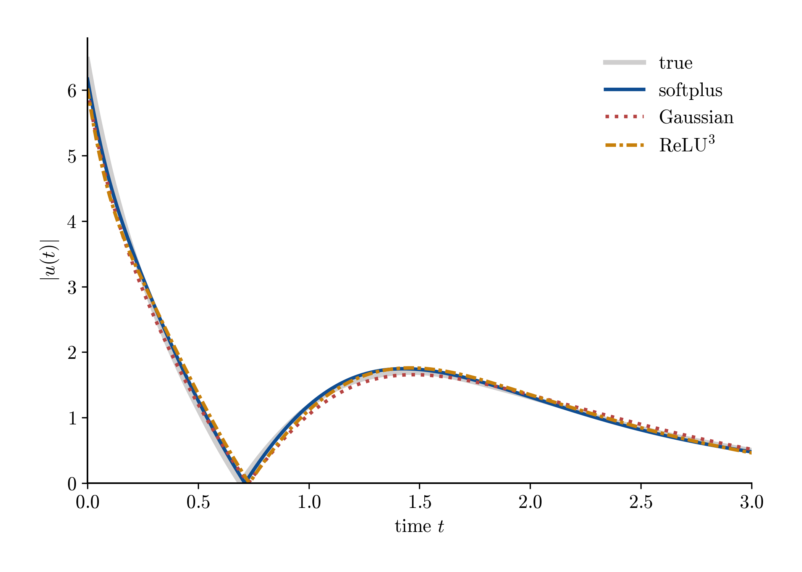
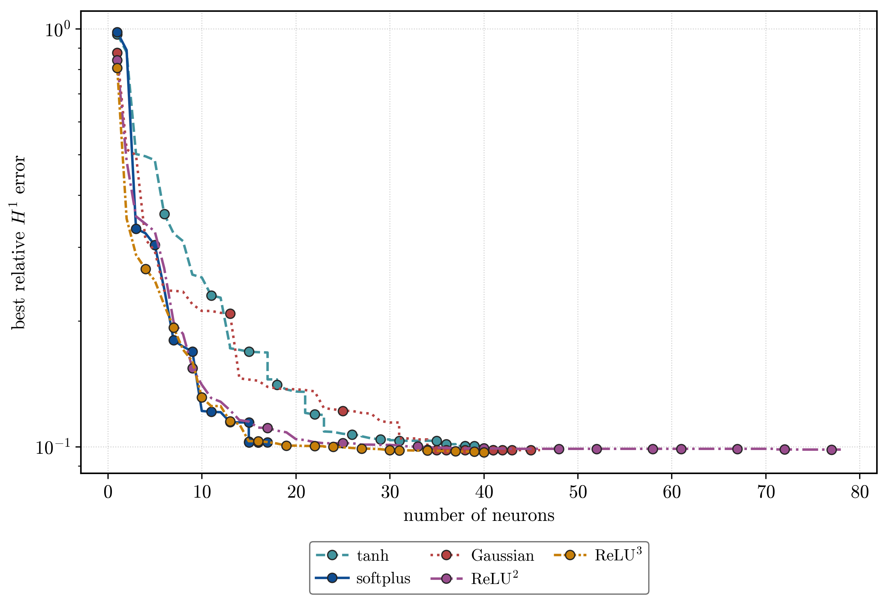
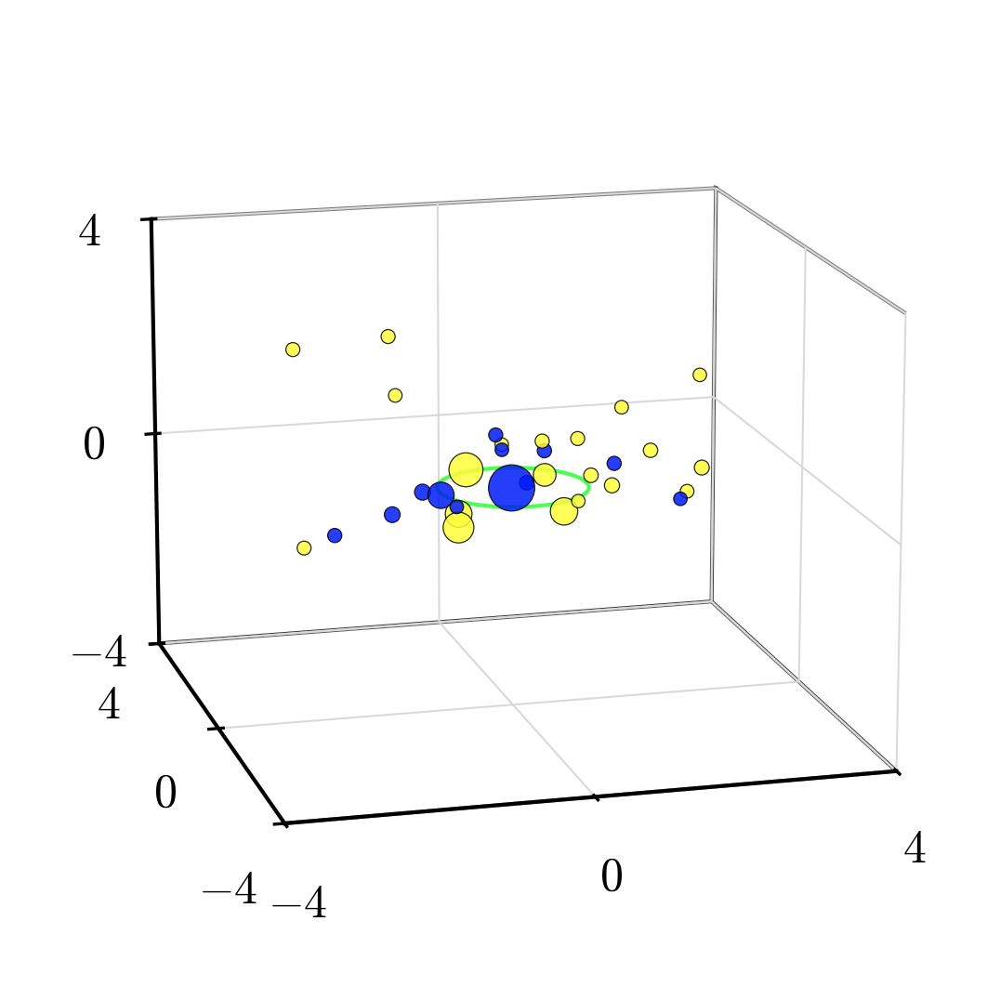
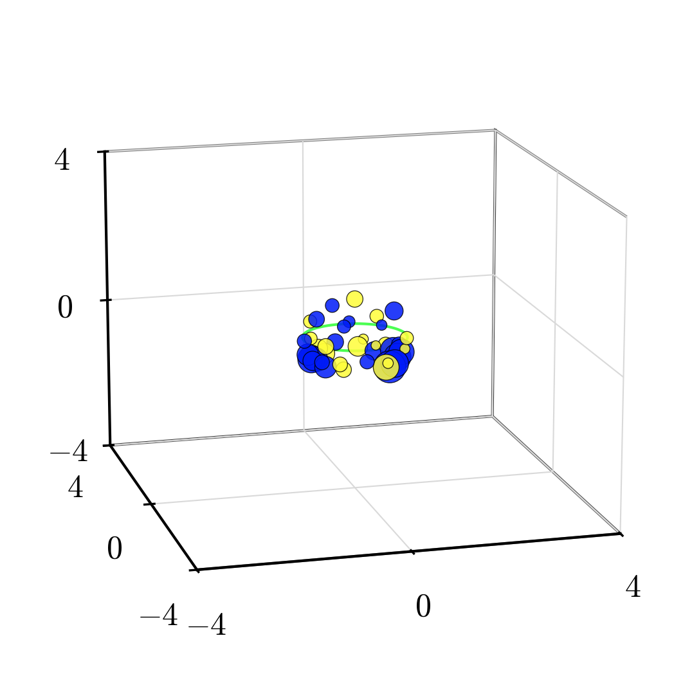
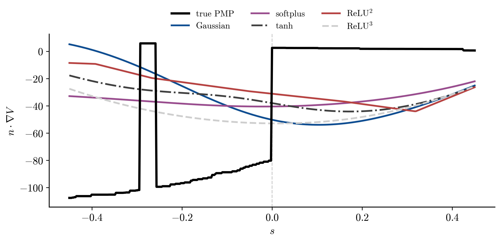

# Sparse neural networks for optimal feedback control

[](https://github.com/KeWu5678/sparse-nn-hjb/actions/workflows/ci.yml)

**A 16-neuron softplus network stabilizes the Van der Pol system at
near-reference cost (6.48 vs 6.48), while a 40-neuron
ReLU<sup>3</sup> network reaches relative \(H^1\) error 0.097.**

| closed-loop state $\|y(t)\|$ | control $u(t)$ |
| --- | --- |
|  |  |

Closed-loop rollout of the Van der Pol oscillator from \(y_0=(2,1)\):
feedback laws synthesized from learned value functions beside the reference
law. All displayed variants stabilize; they differ in support size and
gradient accuracy.

## The problem

Optimal feedback control has a classical answer: solve the
Hamilton–Jacobi–Bellman (HJB) equation for the value function $V(x)$, and the
optimal controller falls out as a function of its gradient, e.g.
\(\hat u(x)=-\partial_{x_2}\hat V(x)/(2\eta)\). The catch is that \(V\) is expensive to compute globally —
and if you learn it from data instead, the controller quality depends on
$\nabla \hat V$, not on $\hat V$. A model with excellent mean-squared fit and a mediocre
gradient field produces a controller that oscillates, saturates, or diverges.

This repository learns $V$ from open-loop trajectory data (value + gradient
samples along optimal trajectories, generated via Pontryagin's principle) with
shallow networks $\sum_k c_k \sigma(a_k \cdot x + b_k)$, fitted in Sobolev ($H^1$) loss so the
gradient is a first-class training target. Sparsity is not post-hoc pruning:
neurons are inserted greedily (a Primal-Dual Active Point method, PDAP, over
the measure-space relaxation of the network) and selected by **non-convex
penalties** — log penalty $\varphi_\gamma$ and fractional powers $|c|^q$ — that, unlike $\ell^1$,
detect and merge redundant neurons clustering in the same direction. The
resulting outer-weight problem is nonsmooth and non-convex. It is corrected
with a guarded **semismooth Newton normal-map method implemented as a native
PyTorch optimizer**. For the fractional penalties used in the paper, the
scalar global proximal maps are evaluated in closed form and the normal map is
scaled from the insertion warm start. The correction is retained only when it
does not increase the objective.

## Main result: accuracy per neuron

Representative Van der Pol runs from the paper-facing sweeps:

| activation | penalty | neurons | rel. $H^1$ error | stabilizes | closed-loop cost |
| --- | --- | --- | --- | --- | --- |
| softplus | normalized log penalty | **16** | 0.103 | yes | **6.48** |
| gaussian | normalized log penalty | 34 | 0.098 | yes | 6.50 |
| tanh | normalized log penalty | 38 | 0.101 | yes | 6.50 |
| ReLU<sup>2</sup> | $|c|^{2/3}$ | 75 | 0.098 | — | — |
| ReLU<sup>3</sup> | $|c|^{1/2}$ | 40 | **0.097** | yes | 6.50 |

(true optimal cost: 6.48)



Insertion trajectories show the running-best \(H^1\) error against support
size. The nonhomogeneous models reach the 0.10 error scale with 16–38 atoms;
ReLU<sup>3</sup> reaches a slightly lower error with 40. The traditional
ReLU+\(\ell^1\) baseline eventually reaches a lower error, but only overtakes
both sparse formulations after 121 atoms.

The two algorithm families also leave a visible structural signature on the
learned weights — the $|c|^q$ formulation constrains atoms to the unit sphere,
the log-penalty family does not:

| gaussian (normalized log penalty) | ReLU<sup>3</sup> (\(q=1/2\)) |
| --- | --- |
|  |  |

Learned inner weights $(a_1, a_2, b)$, dot size $\propto$ outer weight, color = sign.

The paper-facing tables and figures are regenerated from validated run records
by `make paper-artifacts`. Full findings: [`experiments/01_vdp`](experiments/01_vdp).

## Probing the limit: value functions with nonsmooth gradients

The Van der Pol value function is smooth. Real HJB value functions usually are
not — they are only semiconcave, with **gradient jumps across switching sets**
(states where the optimal strategy changes branch discontinuously). The
pendulum swing-up benchmark was built to hit this regime deliberately: its
switching curve separates "brake to the upright at $\theta = 0$" from "swing over the
top to $\theta = 2\pi$", and the training data is constructed two-sided so the gradient
jump is *in-sample*, not an extrapolation artifact
([`experiments/02_pendulum/paper_log_penalty`](experiments/02_pendulum/paper_log_penalty)).

The findings are sharp:

- **Every reported model has larger error in the switching tube than away
  from it**, and adding samples near the tube gives no systematic or material
  reduction at the tested widths.
- **No model reproduces the gradient jump's magnitude.** ReLU<sup>2</sup>
  develops the sharpest change of slope, while smooth activations interpolate
  through the discontinuity:



Normal gradient $n\cdot\nabla V$ along a cross-section of the switching curve:
the true lower-envelope gradient (black) jumps at $s=0$; ReLU<sup>2</sup>
develops the sharpest fitted kink, while the smooth activations smooth the
jump away.

- **Regional error and feedback quality rank the models differently.** The
  Gaussian has the smallest regional errors, but fails from the harder start.
  ReLU<sup>2</sup> gives the rollout closest to the reference and softplus also
  reaches an upright from both starts; Gaussian, tanh, and ReLU<sup>3</sup>
  succeed only from the easier start.

A parallel theory program asks *why* semiconcavity-adapted atoms should need
fewer neurons on such targets: [`docs/research/OVERVIEW.md`](docs/research/OVERVIEW.md),
with a proved/refuted/open claims registry in
[`docs/research/CLAIMS.md`](docs/research/CLAIMS.md).

## Reproduce it

```bash
uv sync --extra dev          # install (Python ≥ 3.12)
uv run pytest                # test suite
make help                    # list experiment targets
```

The current manuscript studies are Hydra sweeps with a strict artifact
preflight. From a clean record root, the main entry points are:

```bash
make paper-sweep EXPERIMENT=vdp/paper_log_penalty PAPER_MODE=sequential
make paper-algorithm2-refresh
make paper-artifacts
```

### Under the hood

- **`src/SSN/` — a semismooth Newton optimizer in PyTorch**: a
  `torch.optim.Optimizer` subclass with matrix-free CG for the Newton system
  and proximal handling of the non-convex penalties. Algorithm 2 uses the
  closed-form global scalar proximal maps for q in {1/2, 2/3, 1}, while the
  outer acceptance guard prevents a local coefficient correction from
  increasing the objective
  ([ADR-0004](docs/adr/0004-model-trainer-eval-separation.md)).
- **Golden-output tests** guard the PDAP solver: refactors of the numerical
  core are checked against stored reference solutions, not just unit
  assertions (`tests/`).
- **Runs are records**: each training run writes a JSON run record under
  `rawdata/logs/multirun/`; `make mlflow-backfill` publishes them to an MLflow
  tracking server whose full stack is defined as Terraform in
  [`deploy/`](deploy) — see [docs/adr/mlflow.md](docs/adr/mlflow.md).
- **Results are code**: the current manuscript reports and figures are emitted
  by the validated pipeline under `scripts/paper/`, so findings stay in sync
  with the runs that produced them.
- CI runs the test suite and `ruff` on every push.

## Repository layout

| Path | Contents |
| --- | --- |
| `src/` | Library code: `models/` (signed/semiconcave nets), `PDAP/`, `SSN/`, data/eval/plotting |
| `conf/` | Hydra configs: data, model, eval, experiment sweeps |
| `scripts/` | Training entrypoint (`train.py`), dataset generators, MLflow backfill |
| `experiments/` | Curated studies — `00_openloop` (data) → `01_vdp` (smooth benchmark) → `02_pendulum` (switching set); each with `README.md` (scope), `analysis.py`, `results.md` (findings), `figures/` |
| `tests/` | pytest suite incl. golden-output solver tests |
| `docs/` | Research program & claims registry, ADRs, MLflow guide |
| `deploy/` | Terraform for the MLflow tracking server |
| `vault/` | Deeper implementation notes (algorithm map, model internals, benchmarks) |
