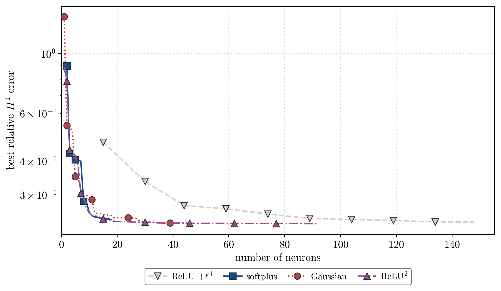

# Sparse neural networks for optimal feedback control

[](https://github.com/KeWu5678/sparse-nn-hjb/actions/workflows/ci.yml)

**An 18-neuron softplus network stabilizes the Van der Pol system at a
closed-loop cost of 6.68, against 6.48 for an interpolated reference controller.**

Learning a value function is easy to score and easy to get wrong. This project
learns one from trajectory data and then *flies* it — the reported result is the
behaviour of the closed loop, not a regression error.

## The problem

Optimal feedback control has a classical answer: solve the
Hamilton–Jacobi–Bellman equation for the value function $V(x)$, and read the
optimal controller off its gradient — for the Van der Pol system,
$\hat u(x) = -\partial_{x_2}\hat V(x)/(2\eta)$.

Two things make that hard. $V$ is expensive to compute globally, and if it is
learned from data instead, **controller quality depends on $\nabla\hat V$, not on
$\hat V$**. A model with an excellent value fit and a mediocre gradient field
produces a controller that oscillates, saturates, or diverges. Most of the
engineering here follows from taking that second point seriously.

The approach: sample value *and* gradient data from open-loop solves via
Pontryagin's principle, then fit a shallow network
$\sum_k c_k\sigma(a_k\cdot x + b_k)$ under an $H^1$ loss, so the gradient is a
first-class training target. Width is not fixed in advance and sparsity is not
post-hoc pruning — neurons are **inserted one at a time** by a Primal–Dual Active
Point method over a measure-space formulation, each insertion certified to
decrease the objective.

## Result

<p align="center">
  
</p>

Accuracy against width on Van der Pol. The displayed sparse nonconvex models
reach lower error with fewer neurons. The conventional ReLU + $\ell^1$ network
approaches their error as its support grows, but remains above them through
the plotted budget of 150 neurons.

Representative $H^1$-trained checkpoints, selected by minimum training
objective:

| activation | penalty | neurons | rel. $H^1$ error |
| --- | --- | ---: | ---: |
| softplus | normalized log penalty | **18** | 0.243 |
| tanh | normalized log penalty | 33 | 0.237 |
| Gaussian | normalized log penalty | 39 | 0.236 |
| ReLU<sup>2</sup> | $\sum_i \lvert c_i\rvert^{2/3}$ | 53 | 0.235 |
| ReLU<sup>3</sup> | $\sum_i \lvert c_i\rvert^{1/2}$ | 26 | **0.235** |

The first three use $\alpha=10^{-4}$, $\gamma=10$, and $p=2.01$; the
fractional-power fits use $\alpha=10^{-5}$.

Errors are relative $H^1$ in original coordinates — the fitted $V$ and its
gradient with respect to the original state variables, after undoing the
training normalization.

Closed-loop rollout from $y_0 = (2,1)$ over $T=12$. The ReLU<sup>3</sup>
controller uses a separate $\alpha=10^{-6}$ checkpoint:

| controller | neurons | stabilizes | cost |
| --- | ---: | :---: | ---: |
| interpolated reference | — | yes | 6.48 |
| softplus | 18 | yes | 6.68 |
| Gaussian | 39 | yes | 6.49 |
| ReLU<sup>3</sup> | 36 | yes | 6.50 |

The reference interpolates the dataset's time-zero costates with a stationary
Clough–Tocher interpolant. The data horizon is $T=3$, so the reference rollout
cost is not an exact finite-horizon optimum for this $T=12$ comparison.

## Engineering

**A semismooth Newton optimizer, written as a native PyTorch optimizer.** The
outer-weight problem is nonsmooth and nonconvex. `src/SSN/` is a
`torch.optim.Optimizer` subclass implementing a normal-map semismooth Newton
method with matrix-free CG for the Newton system, closed-form global proximal
maps for the fractional penalties $q\in\{1/2,\ 2/3,\ 1\}$, and a guard that
discards a correction which increases the objective — the property that keeps
the outer loop monotone.

**Golden-output tests.** Refactors of the numerical core are checked against
stored reference solutions, not just unit assertions. A change in solver
behaviour shows up as a diff in neuron counts and errors, not as a silently
different answer. The suite is 216 tests and runs on every push alongside
`ruff`.

**Runs are records.** Every completed training run writes a self-describing JSON
record — full resolved config, summary metrics, artifact paths — next to its
checkpoint. Per-iteration history stays in the checkpoint. Records are the
source of truth; when tracking is configured, completed records are published
to MLflow after they are written locally. The dashboard can be rebuilt from
disk at any time. The tracking server is a container in [`deploy/`](deploy).

**Experiments are configs, not scripts.** Each study is one tracked Hydra file
declaring its own sweep axes and its own output layout, so a sweep is a single
command and the record tree is self-organizing:

```bash
make sweep EXPERIMENT=log_penalty        # 448 runs across two datasets
```

Records land under `rawdata/logs/multirun/<dataset>/<experiment>/<axis>/<job>/`.
The target refuses to start if that subtree already holds records, and aborts
immediately if the tracking server is unreachable rather than training for hours
unpublished.

**Reproducibility is checked, not assumed.** Runs are deterministic under a
fixed seed — re-running a completed configuration reproduces its metrics to
seven digits. Solver changes that move results are recorded as ADRs in
[`docs/adr/`](docs/adr) with an explicit instruction to re-run affected studies.

## Reproduce

```bash
uv sync --extra dev          # Python >= 3.12
uv run pytest
make help
```

Training requires the existing benchmark datasets, which are not included in
the repository. Place them under `rawdata/data/` at the paths specified by
[`conf/data/`](conf/data). Pendulum runs also require the evaluation pool and
distance caches named in [`conf/eval/region_split.yaml`](conf/eval/region_split.yaml).
With those inputs available, a single run picks a model family and a dataset:

```bash
uv run python scripts/train.py +model=profile +data=vdp model.activation=softplus
```

With the existing benchmark data and pendulum raw PMP paths available,
regenerate the reference-data figures with:

```bash
make openloop
```

This command reads existing data; it does not generate the datasets.

## Layout

| Path | Contents |
| --- | --- |
| `src/` | Library: shallow networks, `PDAP/` insertion, `SSN/` optimizer, data/eval/plotting |
| `conf/` | Hydra configs — model families, datasets, evaluation, experiment sweeps |
| `scripts/` | `train.py` entry point, dataset generators, MLflow importer |
| `experiments/` | Study definitions and curated results |
| `tests/` | pytest suite, including golden-output solver tests |
| `docs/` | ADRs, MLflow guide, research notes |
| `deploy/` | Containerized MLflow tracking server |
| `vault/` | Deeper implementation notes |

Generated run records, figures, and reports are written to ignored local paths.
