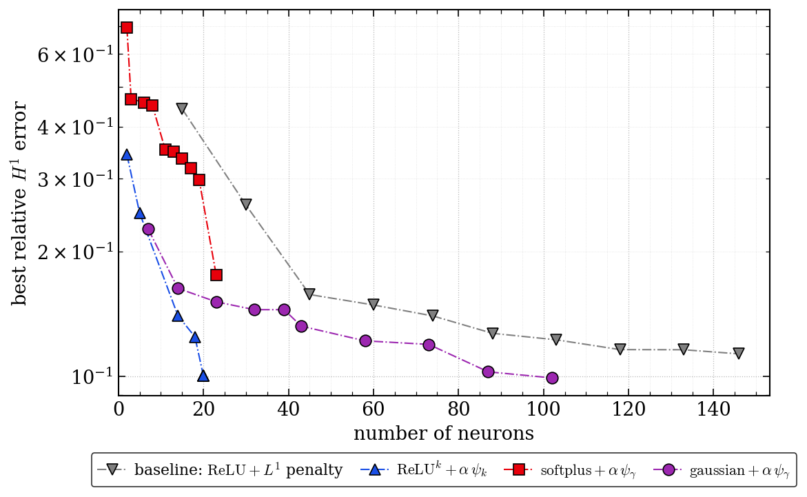

# neuron_h1_frontier Results (vdp)

Best achievable relative H1 error vs. network size (number of neurons), vdp data, **signed** model, H1 loss, **finite_step** insertion, fixed **alpha = 1e-5** for all series. The two log-penalty series use **gamma = 10**. Each curve is the per-run growth trajectory reduced to its lower envelope (cumulative-min H1 per neuron count). The available curves in the current local run records are:

1. **baseline: ReLU + L1** — relu, power=1, gamma=0 (convex L1).
2. **ReLU^k + alpha*psi_k** — penaltypowers, relu, power=k (k=3), gamma=0 (fractional penalty, finite_step).
3. **softplus + alpha*phi_gamma** — activationsearch, softplus, gamma=10 (non-convex log); best classical/monotone activation.
4. **gaussian + alpha*phi_gamma** — activationsearch, gaussian, gamma=10 (non-convex log); a radial kernel activation (same family as the thesis's Matern 5/2).

