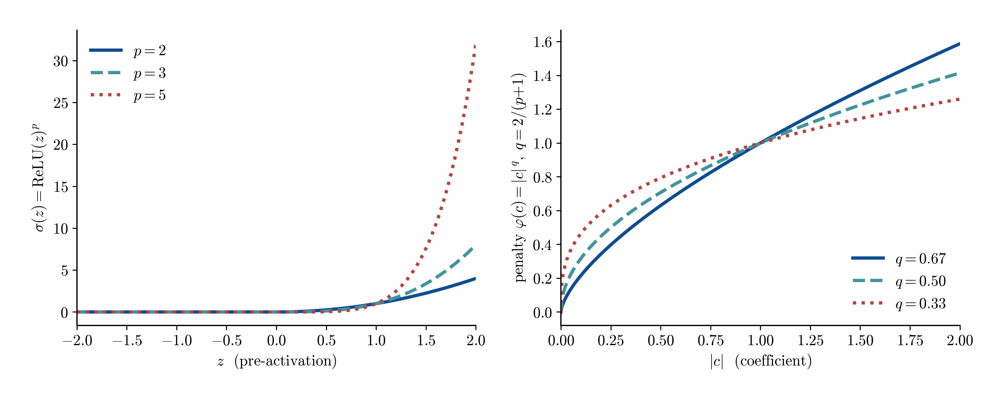
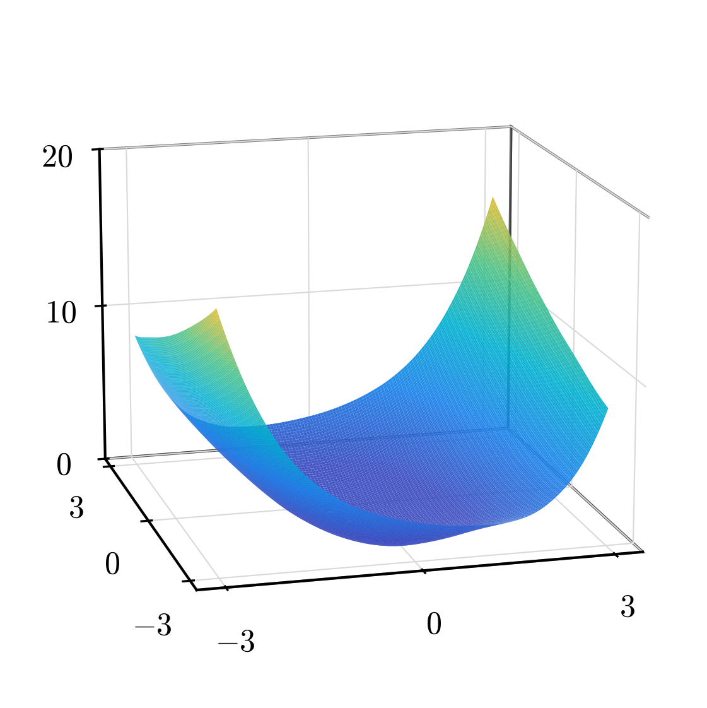
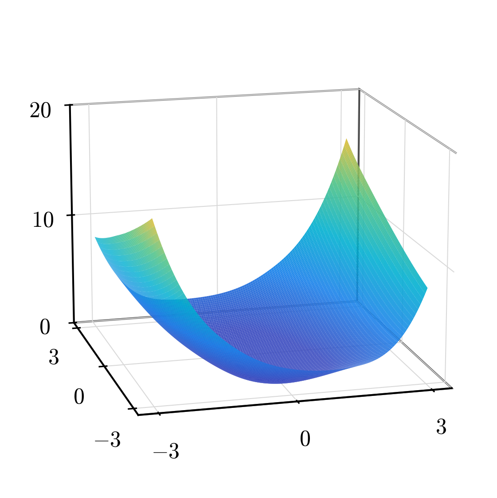
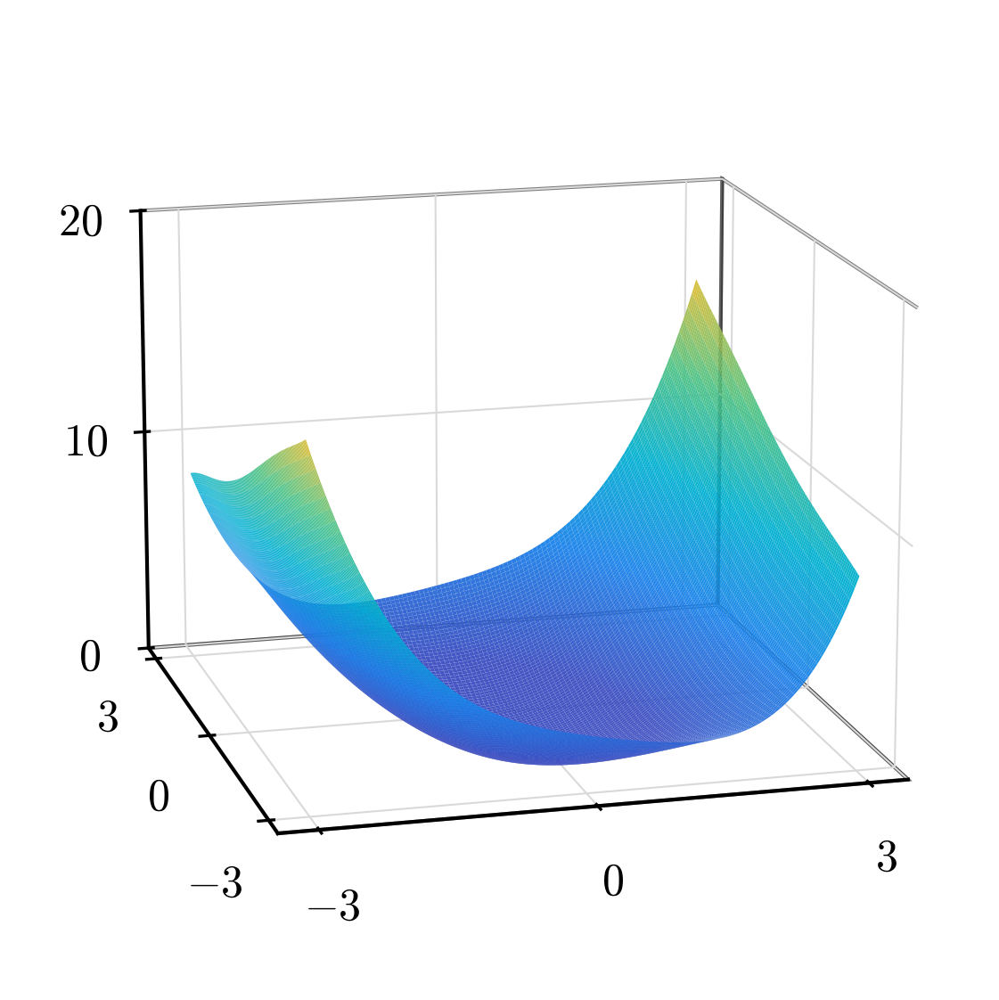
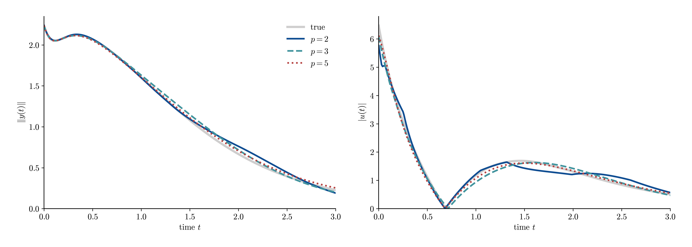
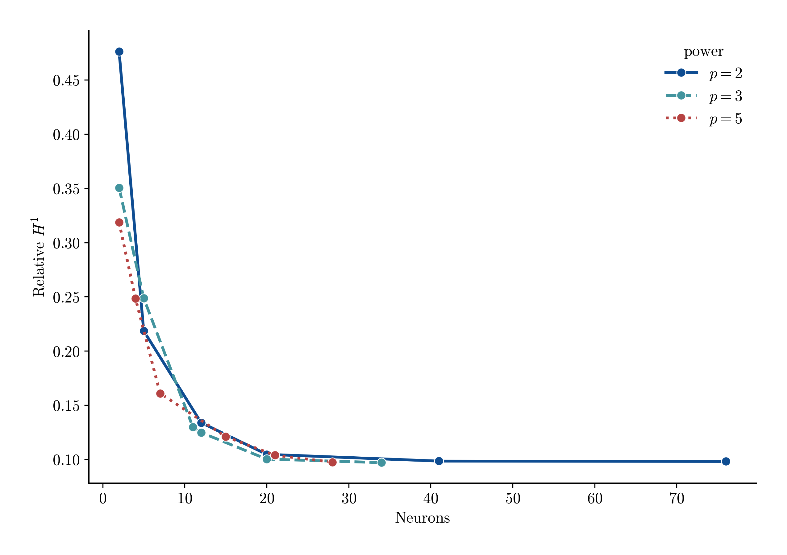

# penaltypowers — vdp (smooth)

How the **power** of the ReLU^p atom — equivalently the nonconvex penalty exponent
`q = 2/(p+1)` — trades accuracy against sparsity on the **smooth** Van der Pol value
function. Method and sweep axes are in `README.md`; this file reports the findings,
with ReLU at powers {2, 3, 5} as representatives. The penalty is the *pure* power
penalty `α·Σ|c|^q` (the Algorithm-1 log term is off). The value-fit is compared at one
fixed operating point (**alpha = 1e-5**); alpha is swept only for the frontier. This is
the smooth counterpart of `../../02_pendulum/frac_exp_penalty`, where the same power knob behaves in the
**opposite** way — the reversal is the point.

## Key finding

The coefficient penalty is `α·Σ |c|^q` with `q = 2/(power+1)`: raising the atom
power lowers `q`, making the penalty more concave and the selection more
aggressively sparse. On a smooth target this is **free sparsity** — at a fixed
`alpha` higher power keeps the same accuracy with far fewer neurons.

### Penalty & atom shape

Left: the atom `σ(z)=ReLU(z)^p` sharpens at the origin as `p` grows. Right: the
coefficient penalty `φ(c)=|c|^q` becomes more concave as `q=2/(p+1)` shrinks
(`q = 0.67, 0.50, 0.33` for `p = 2, 3, 5`) — a stronger sparsity prior.

### Fitted value surfaces

The learned `V̂(x)` at the fixed operating point (alpha=1e-5) for each power. On the
smooth VDP bowl all powers reconstruct the value well; they differ in neuron count.

| ReLU $p=2$ · 41 neurons · rel $H^1$=0.10 | ReLU $p=3$ · 20 neurons · rel $H^1$=0.10 | ReLU $p=5$ · 21 neurons · rel $H^1$=0.10 |
| --- | --- | --- |
|  |  |  |

### Value-fit at the fixed operating point (alpha=1e-5)

ReLU^p H1 fit per power at the fixed operating point (alpha=1e-5)

| power | q=2/(p+1) | neurons | rel L2 | rel H1 |
| ----- | --------- | ------- | ------ | ------ |
| 2     | 0.67      | 41      | 0.416  | 0.098  |
| 2.01  | 0.66      | 42      | 0.417  | 0.099  |
| 3     | 0.50      | 20      | 0.417  | 0.100  |
| 4     | 0.40      | 22      | 0.416  | 0.100  |
| 5     | 0.33      | 21      | 0.414  | 0.104  |

At a fixed penalty weight the gradient accuracy is essentially flat across powers
(`rel H1 ≈ 0.10`), while the neuron count drops sharply with power: `p=2` needs ~41
atoms, `p=3`/`p=4`/`p=5` only ~20. Raising the power buys sparsity for free on this
smooth target — no `p=3` "sweet spot" and no high-power collapse; the ordering is
monotone in `p`.

### Synthesized feedback vs true control

The VDP value induces the static feedback `u(x) = −∂_{x₂}V(x)/(2β)` (`g=[0,1]ᵀ`,
cost `β u²` — Azmi–Kalise–Kunisch). We synthesize û from each fitted ReLU^p `V̂` and
roll it out in the true dynamics from x=(2, 1), beside the true control (smooth C¹
interpolant of the costate). Plots ‖y(t)‖ and |u(t)| after Azmi–Kalise–Kunisch Fig. 8.

Closed-loop stabilization from y₀=(2, 1)

| controller | neurons | stabilizes? | closed-loop cost |
| ---------- | ------- | ----------- | ---------------- |
| true       | —       | yes         | 6.48             |
| ReLU p=2   | 41      | yes         | 6.52             |
| ReLU p=3   | 20      | yes         | 6.65             |
| ReLU p=5   | 21      | yes         | 6.49             |

Every power yields a working stabilizing feedback at essentially the true optimal
cost — on a smooth problem the power knob is purely a **sparsity** lever, not a
control-viability one. (Contrast `../../02_pendulum/frac_exp_penalty`, where high power destroys the fit and
the controller with it.)

## Parameter discussion (power, alpha)

The **power** is the headline lever above; **alpha** moves each power along its own
sparsity–accuracy frontier.

ReLU H1: sparsity-accuracy frontier over alpha, per power

| power | alpha  | neurons | rel H1 |
| ----- | ------ | ------- | ------ |
| 2     | 0.1    | 2       | 0.476  |
| 2     | 0.01   | 5       | 0.219  |
| 2     | 0.001  | 12      | 0.134  |
| 2     | 0.0001 | 20      | 0.105  |
| 2     | 1e-05  | 41      | 0.098  |
| 2     | 1e-06  | 76      | 0.098  |
| 2.01  | 0.1    | 2       | 0.475  |
| 2.01  | 0.01   | 5       | 0.219  |
| 2.01  | 0.001  | 10      | 0.128  |
| 2.01  | 0.0001 | 21      | 0.104  |
| 2.01  | 1e-05  | 42      | 0.099  |
| 2.01  | 1e-06  | 78      | 0.098  |
| 3     | 0.1    | 2       | 0.351  |
| 3     | 0.01   | 5       | 0.249  |
| 3     | 0.001  | 11      | 0.130  |
| 3     | 0.0001 | 12      | 0.125  |
| 3     | 1e-05  | 20      | 0.100  |
| 3     | 1e-06  | 34      | 0.097  |
| 4     | 0.1    | 2       | 0.287  |
| 4     | 0.01   | 2       | 0.283  |
| 4     | 0.001  | 10      | 0.159  |
| 4     | 0.0001 | 15      | 0.119  |
| 4     | 1e-05  | 22      | 0.100  |
| 4     | 1e-06  | 28      | 0.098  |
| 5     | 0.1    | 2       | 0.319  |
| 5     | 0.01   | 4       | 0.248  |
| 5     | 0.001  | 7       | 0.161  |
| 5     | 0.0001 | 15      | 0.121  |
| 5     | 1e-05  | 21      | 0.104  |
| 5     | 1e-06  | 28      | 0.097  |

Each power's curve is its frontier as `alpha` varies (smaller `alpha` → more neurons,
lower error). Higher power sits **below and to the left** — fewer neurons at the same
accuracy — so the power knob shifts the whole frontier rather than moving along it.

## Full result

The complete relu × power × alpha grid, both losses. `rel L2`/`rel H1` are global
relative errors; no score is used to pick a "best" run — the frontier is shown in full
so the sparsity–accuracy trade is explicit.

### H1 (gradient-augmented) loss

VDP H1 fit — relu power x alpha

| power | alpha  | neurons | rel L2 | rel H1 |
| ----- | ------ | ------- | ------ | ------ |
| 2     | 0.1    | 2       | 0.967  | 0.476  |
| 2     | 0.01   | 5       | 0.507  | 0.219  |
| 2     | 0.001  | 12      | 0.431  | 0.134  |
| 2     | 0.0001 | 20      | 0.422  | 0.105  |
| 2     | 1e-05  | 41      | 0.416  | 0.098  |
| 2     | 1e-06  | 76      | 0.415  | 0.098  |
| 2.01  | 0.1    | 2       | 0.967  | 0.475  |
| 2.01  | 0.01   | 5       | 0.507  | 0.219  |
| 2.01  | 0.001  | 10      | 0.434  | 0.128  |
| 2.01  | 0.0001 | 21      | 0.421  | 0.104  |
| 2.01  | 1e-05  | 42      | 0.417  | 0.099  |
| 2.01  | 1e-06  | 78      | 0.415  | 0.098  |
| 3     | 0.1    | 2       | 0.812  | 0.351  |
| 3     | 0.01   | 5       | 0.556  | 0.249  |
| 3     | 0.001  | 11      | 0.430  | 0.130  |
| 3     | 0.0001 | 12      | 0.428  | 0.125  |
| 3     | 1e-05  | 20      | 0.417  | 0.100  |
| 3     | 1e-06  | 34      | 0.416  | 0.097  |
| 4     | 0.1    | 2       | 0.621  | 0.287  |
| 4     | 0.01   | 2       | 0.682  | 0.283  |
| 4     | 0.001  | 10      | 0.492  | 0.159  |
| 4     | 0.0001 | 15      | 0.415  | 0.119  |
| 4     | 1e-05  | 22      | 0.416  | 0.100  |
| 4     | 1e-06  | 28      | 0.417  | 0.098  |
| 5     | 0.1    | 2       | 0.485  | 0.319  |
| 5     | 0.01   | 4       | 0.525  | 0.248  |
| 5     | 0.001  | 7       | 0.430  | 0.161  |
| 5     | 0.0001 | 15      | 0.410  | 0.121  |
| 5     | 1e-05  | 21      | 0.414  | 0.104  |
| 5     | 1e-06  | 28      | 0.416  | 0.097  |

### L2 (value-only) loss

VDP L2 fit — relu power x alpha

| power | alpha  | neurons | rel L2 | rel H1 |
| ----- | ------ | ------- | ------ | ------ |
| 2     | 0.01   | 1       | 0.603  | 0.985  |
| 2     | 0.001  | 5       | 0.123  | 0.612  |
| 2     | 0.0001 | 6       | 0.111  | 0.587  |
| 2     | 1e-05  | 14      | 0.051  | 0.483  |
| 2     | 1e-06  | 26      | 0.022  | 0.410  |
| 2.01  | 0.01   | 1       | 0.603  | 0.985  |
| 2.01  | 0.001  | 5       | 0.123  | 0.612  |
| 2.01  | 0.0001 | 6       | 0.111  | 0.586  |
| 2.01  | 1e-05  | 14      | 0.048  | 0.481  |
| 2.01  | 1e-06  | 34      | 0.013  | 0.403  |
| 3     | 0.01   | 2       | 0.402  | 0.839  |
| 3     | 0.001  | 2       | 0.392  | 0.828  |
| 3     | 0.0001 | 7       | 0.109  | 0.546  |
| 3     | 1e-05  | 12      | 0.060  | 0.494  |
| 3     | 1e-06  | 22      | 0.012  | 0.412  |
| 4     | 0.01   | 2       | 0.313  | 0.699  |
| 4     | 0.001  | 4       | 0.191  | 0.647  |
| 4     | 0.0001 | 7       | 0.121  | 0.545  |
| 4     | 1e-05  | 12      | 0.055  | 0.461  |
| 4     | 1e-06  | 16      | 0.022  | 0.396  |
| 5     | 0.01   | 1       | 0.803  | 0.879  |
| 5     | 0.001  | 4       | 0.217  | 0.592  |
| 5     | 0.0001 | 6       | 0.139  | 0.555  |
| 5     | 1e-05  | 10      | 0.048  | 0.404  |
| 5     | 1e-06  | 17      | 0.027  | 0.377  |
