# activationsearch — vdp (smooth)

Which activations best fit a **smooth** value function (Van der Pol stabilization),
under sparsity. Method, sweep axes, and the activation list are in `README.md`;
this file reports the findings. Three representatives span the smooth-fitting
spectrum — `softplus` (broad monotone ridge), `tanh` (saturating S), `gaussian`
(localized RBF) — all under the `signed` model. This is the smooth counterpart of
`../../02_pendulum/log_penalty` (the switching-set case); the contrast is the point.

## Openloop data

The VDP open-loop dataset is a filled grid over the state plane. The data
visualisations (value scatter, gradient arrows, value surface) are centralised in
[`experiments/00_openloop/vdp`](../../00_openloop/vdp) — the single source for the
open-loop training data.

| value samples | value and gradient |
| --- | --- |
| 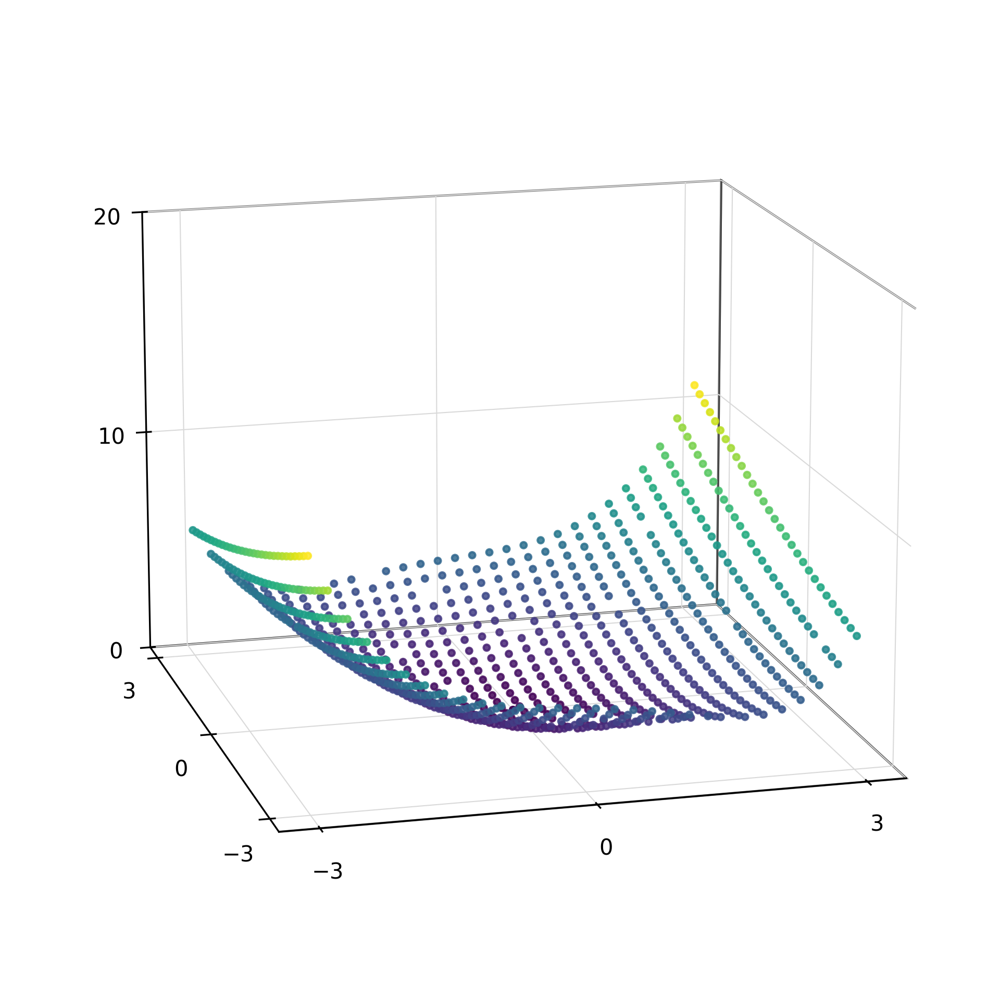 | 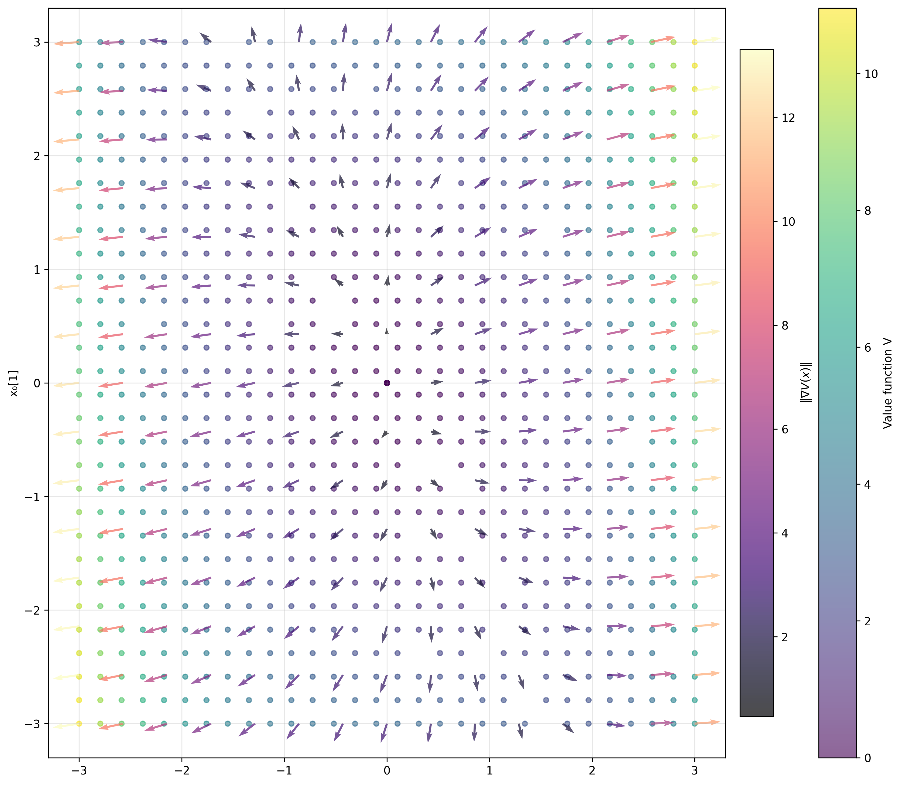 |

## Key finding

Under the gradient-augmented (H1) loss each neuron contributes σ to V and
**w·σ′ to ∇V**, so the activation *derivative* σ′ is the basis that reconstructs
the gradient field. The VDP gradient is **smooth**, so the question is not whether
σ′ can break (as at a switching set) but how *economically* a smooth σ′ tiles a
smooth field.

### Activation shape

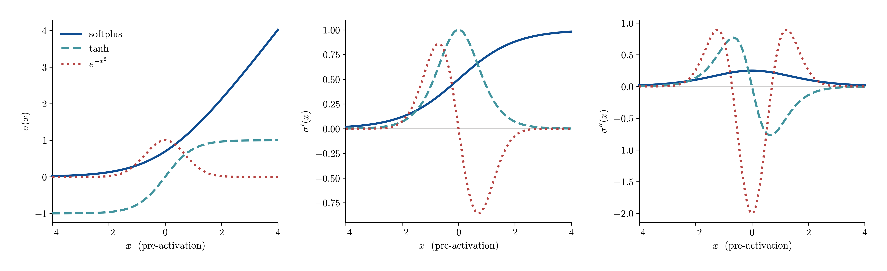

`softplus′` is a broad, monotone, single-signed ridge — every neuron is a coherent
gradient channel, so few atoms cover a smooth ∇V. `tanh′` saturates on **both**
tails (a narrow channel → many neurons). The Gaussian derivative is a localized
sign-changing bump — accurate where it sits, but it must be tiled densely.

### Gradient-kernel columns (σ′ distribution)

The gradient-kernel column for neuron n at data point x_m is σ′(a·x_m + b)·a, so the
distribution of σ′(z) over all (neuron, data-point) pairs — at the fixed point α=1e-5,
γ=1 — measures how many columns are *dead* (near-zero, contributing no gradient basis).

| $\tanh$ · 66 neurons · 65% with |σ′| < 0.05 | $\mathrm{softplus}$ · 27 neurons · 30% with |σ′| < 0.05 | $e^{-x^2}$ · 113 neurons · 27% with |σ′| < 0.05 |
| --- | --- | --- |
| 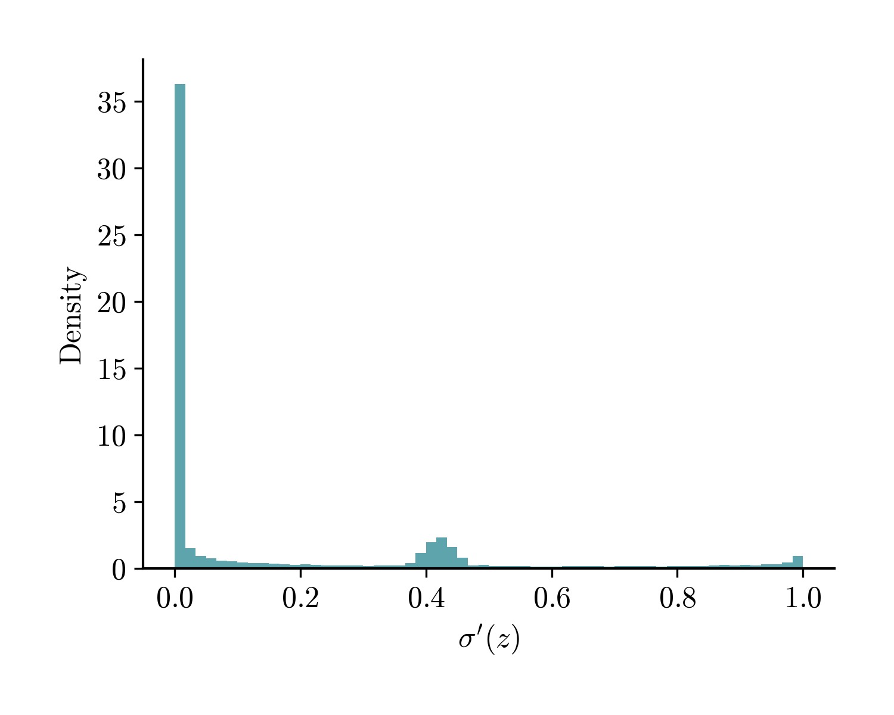 | 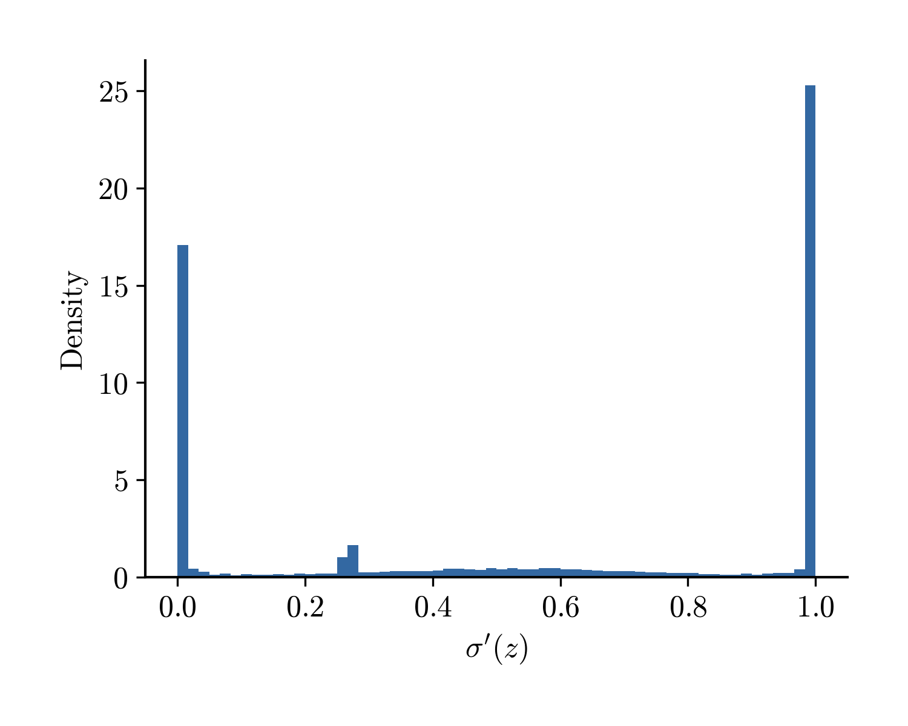 | 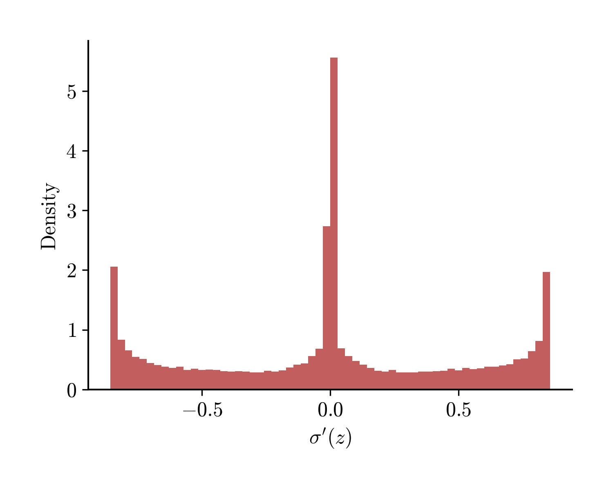 |

**tanh** saturates most: **65%** of its σ′ values are near zero, so it reaches
its gradient fit only by inserting the most neurons. **softplus** (30% near
zero) keeps single-signed coherent columns and fits with far fewer. The **Gaussian**
(27% near zero) has a sign-changing derivative spanning both signs — the
most diverse columns and the best gradient accuracy, though it pays in neuron count.

### Fitted value surfaces

The learned V̂(x) of each representative, as surfaces over the state plane, all at the
**same operating point α=1e-5, γ=1** (matching the thesis tables — a like-for-like
comparison, not each activation's sweep-best). All three capture the smooth bowl; they
differ in how many neurons it takes.

| $\mathrm{softplus}$ · 27 neurons · rel $H^1$=0.29 | $\tanh$ · 66 neurons · rel $H^1$=0.31 | $e^{-x^2}$ · 113 neurons · rel $H^1$=0.10 |
| --- | --- | --- |
| 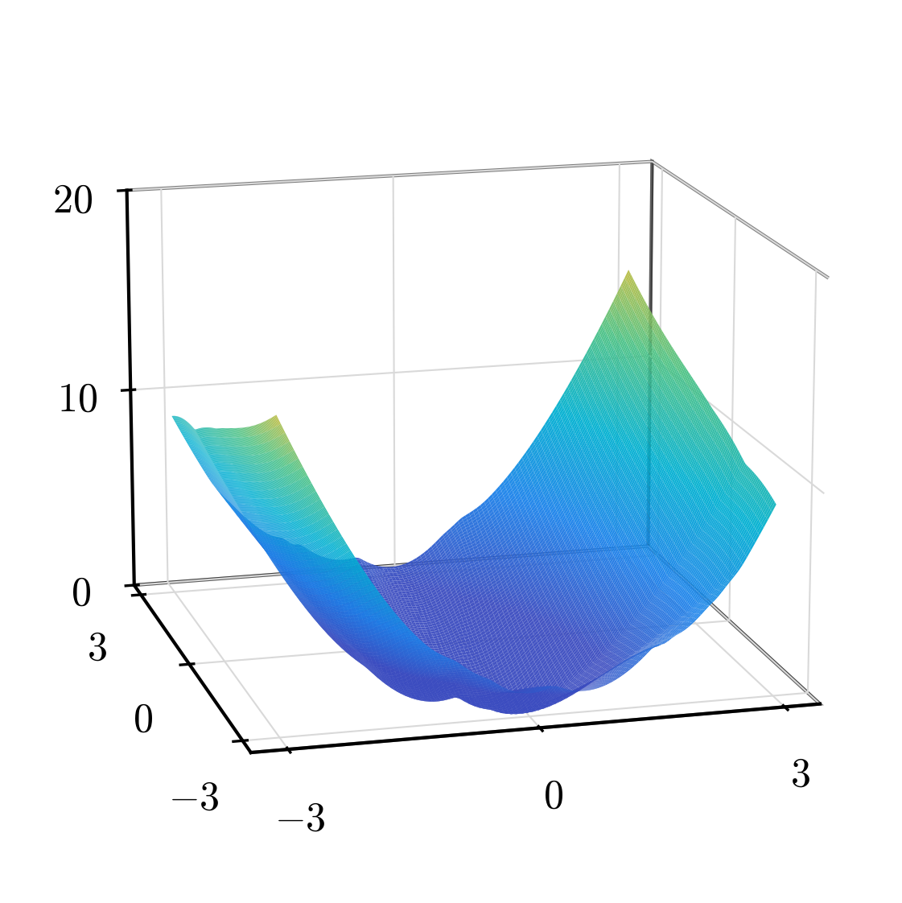 | 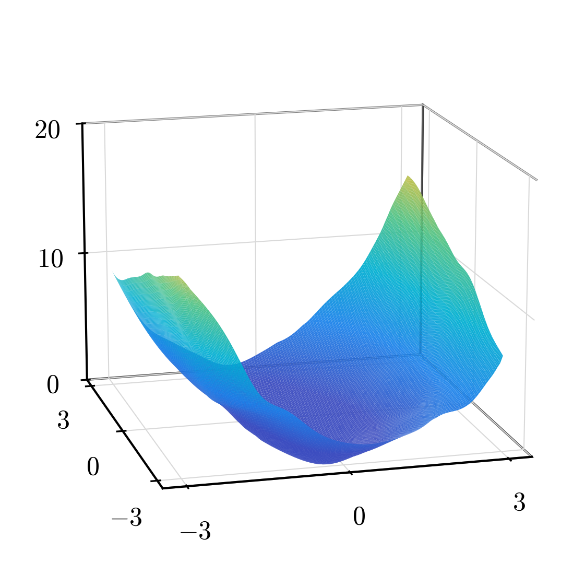 | 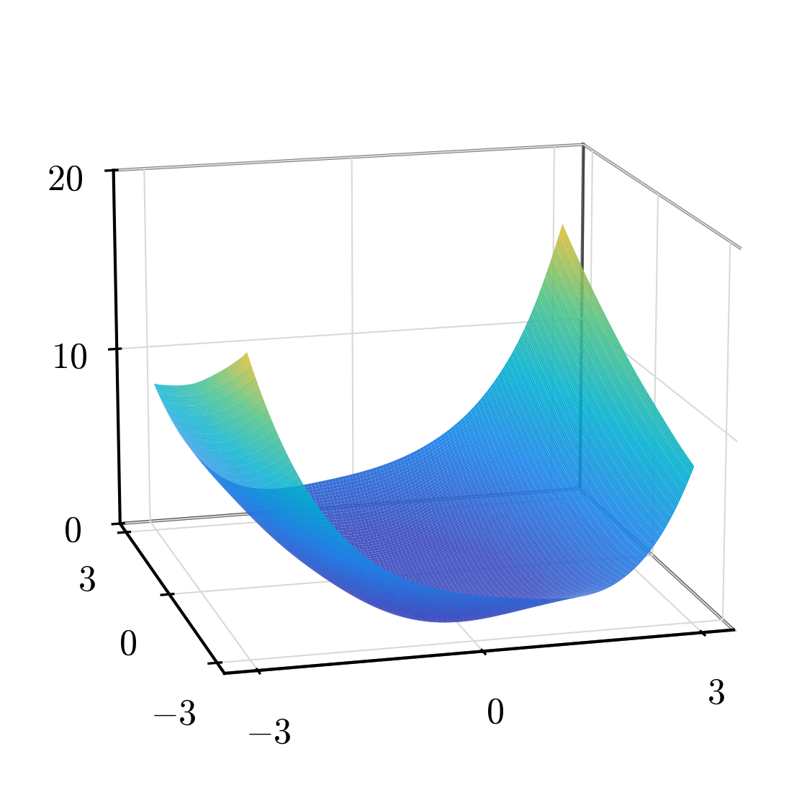 |

### Metrics at the fixed comparison point (α=1e-5, γ=1)

Signed H1 fit per representative at the fixed comparison point (α=1e-5, γ=1)

| activation | neurons | rel H1 | rel L2 | score |
| ---------- | ------- | ------ | ------ | ----- |
| softplus   | 27      | 0.292  | 0.519  | 7.88  |
| tanh       | 66      | 0.314  | 0.476  | 20.70 |
| gaussian   | 113     | 0.099  | 0.416  | 11.23 |

`rel H1`/`rel L2` are the global relative errors (VDP is smooth and filled, so —
unlike the pendulum — they are *not* confounded and need no region split). `score`
= rel H1 × neurons (sparsity-aware, lower is better). Held at the uniform α=1e-5, γ=1,
the smooth-fitting story is in the spread: **`softplus` is the sparse champion** (lowest
score — accurate enough at a small neuron count), **`gaussian` is the most accurate**
(lowest rel H1) but pays in neurons, and **`tanh` is dominated** (its two-sided-dead
derivative needs more neurons for no accuracy gain). No kink is needed — the target is
smooth. Each activation's sweep-best is in the Parameter-discussion tables below.

### Sparsity and the insertion dynamics

The gaussian and softplus fits differ sharply in size — 113 vs 27 neurons, a factor of ~4.2 — even though gaussian is the *more* accurate of the two. Tracking the profile insertion neuron-by-neuron shows why: gaussian adds neurons in large batches (7–15 per iteration) while softplus adds only 1–5, and each gaussian neuron buys a far smaller drop in the objective `J = L(μ) + α·Φ(μ)`.

| iter | gaussian N | ins | ΔJ/n | softplus N | ins | ΔJ/n |
| --- | --- | --- | --- | --- | --- | --- |
| 1 | 7 | 7 | — | 2 | 2 | — |
| 2 | 14 | 7 | 2.8e-03 | 3 | 1 | 1.7e-01 |
| 3 | 24 | 10 | 5.6e-04 | 6 | 3 | 5.2e-03 |
| 4 | 34 | 10 | 1.0e-04 | 8 | 2 | 3.6e-03 |
| 5 | 42 | 8 | 1.8e-04 | 11 | 3 | 1.9e-02 |
| 6 | 57 | 15 | 5.9e-05 | 13 | 2 | 1.1e-03 |
| 7 | 72 | 15 | 1.6e-04 | 15 | 2 | 1.2e-03 |
| 8 | 86 | 14 | 2.2e-04 | 18 | 3 | 1.4e-03 |
| 9 | 99 | 13 | 6.6e-05 | 22 | 4 | 2.8e-04 |
| 10 | 113 | 14 | 2.0e-05 | 27 | 5 | 9.3e-04 |
| final | 113 | | | 27 | | |

`N` = support size after SSN and pruning; `ins` = neurons added that iteration; `ΔJ/n` = decrease of `J` per neuron added (relative to the previous iterate; iteration 1 has no predecessor).

The mechanism is the dual variable: the insertion score `p_t(ω) = ⟨σ(·;ω), g_t⟩` scores a candidate direction ω against the current residual `g_t`. The gaussian is **localized** (a bump concentrated near the hyperplane a·x + b ≈ 0), so `p_t` is sensitive to local residual pockets and a fresh batch of atoms clears the threshold α every iteration, each correcting only a small local portion of the residual. Softplus has **global support**, so `p_t` averages the residual over the whole domain — positive and negative contributions cancel, fewer ω exceed α, but each admitted atom removes a global component.

### Synthesized feedback vs true control

The VDP value induces the static feedback `u(x) = −∂_{x₂}V(x)/(2β)`
(`g=[0,1]ᵀ`, cost `β u²` — Azmi–Kalise–Kunisch). We synthesize û from each fitted
V̂ and **roll it out in the true dynamics** from the initial state x=(2, 1) (the
paper's test point), beside the true control (a smooth C¹ interpolant of the
costate samples). The figure plots ‖y(t)‖ and |u(t)| over the horizon, after
Azmi–Kalise–Kunisch Fig. 8.

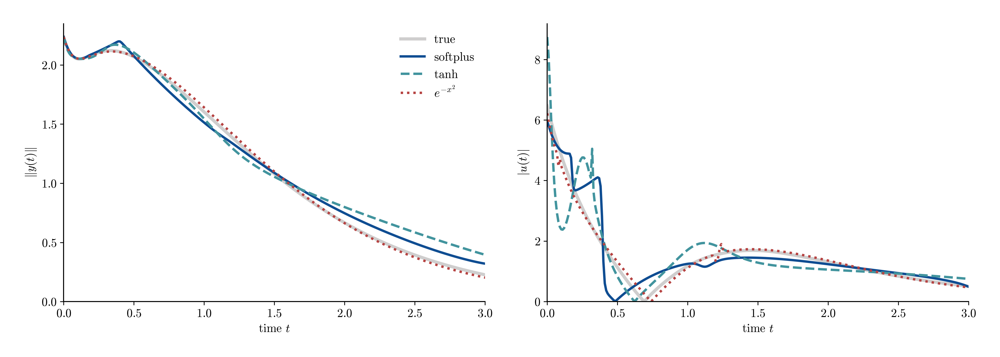

Closed-loop stabilization from y₀=(2, 1)

| controller | neurons | stabilizes? | closed-loop cost |
| ---------- | ------- | ----------- | ---------------- |
| true       | —       | yes         | 6.48             |
| softplus   | 27      | yes         | 6.68             |
| tanh       | 66      | yes         | 6.74             |
| gaussian   | 113     | yes         | 6.51             |

**Every smooth activation yields a working stabilizing feedback** — all three drive
‖y(t)‖ to the origin and their synthesized |u(t)| closely tracks the true smooth
optimal control (right panel), at essentially the true optimal cost (≈ 6.5). This is
the sharp contrast with the switching-set case (`../../02_pendulum/log_penalty`), where the activation
*determined whether the controller worked at all* (only the kink stabilized). On a
smooth problem the value gradient is well-behaved everywhere the closed loop visits,
so the choice of (smooth) activation is a question of **fit sparsity, not control
viability** — softplus simply reaches the same controller with fewer neurons.

## Parameter discussion (α, γ)

The nonconvex penalty `α·Σ φ(|c|)`: **α** scales the penalty (the sparsity lever)
and **γ** controls the log-term nonconvexity. The tables take the three signed reps,
find each activation's best achieved run by relative H1, then sweep one parameter
while holding the other fixed at that best run's value.

Effect of alpha (gamma fixed at each activation's best run), signed H1

| activation | alpha  | gamma | neurons | rel H1 |
| ---------- | ------ | ----- | ------- | ------ |
| softplus   | 1e-05  | 10    | 23      | 0.176  |
| softplus   | 0.0001 | 10    | 25      | 0.168  |
| softplus   | 0.001  | 10    | 14      | 0.279  |
| softplus   | 0.01   | 10    | 10      | 0.378  |
| tanh       | 1e-05  | 10    | 70      | 0.220  |
| tanh       | 0.0001 | 10    | 60      | 0.242  |
| tanh       | 0.001  | 10    | 32      | 0.400  |
| tanh       | 0.01   | 10    | 18      | 0.407  |
| gaussian   | 1e-05  | 10    | 119     | 0.099  |
| gaussian   | 0.0001 | 10    | 80      | 0.102  |
| gaussian   | 0.001  | 10    | 33      | 0.128  |
| gaussian   | 0.01   | 10    | 19      | 0.206  |

Effect of gamma (alpha fixed at each activation's best run), signed H1

| activation | gamma | alpha  | neurons | rel H1 |
| ---------- | ----- | ------ | ------- | ------ |
| softplus   | 0     | 0.0001 | 20      | 0.324  |
| softplus   | 0.1   | 0.0001 | 21      | 0.324  |
| softplus   | 1     | 0.0001 | 20      | 0.323  |
| softplus   | 10    | 0.0001 | 25      | 0.168  |
| tanh       | 0     | 1e-05  | 32      | 0.376  |
| tanh       | 0.1   | 1e-05  | 68      | 0.259  |
| tanh       | 1     | 1e-05  | 66      | 0.314  |
| tanh       | 10    | 1e-05  | 70      | 0.220  |
| gaussian   | 0     | 1e-05  | 91      | 0.103  |
| gaussian   | 0.1   | 1e-05  | 100     | 0.101  |
| gaussian   | 1     | 1e-05  | 113     | 0.099  |
| gaussian   | 10    | 1e-05  | 119     | 0.099  |

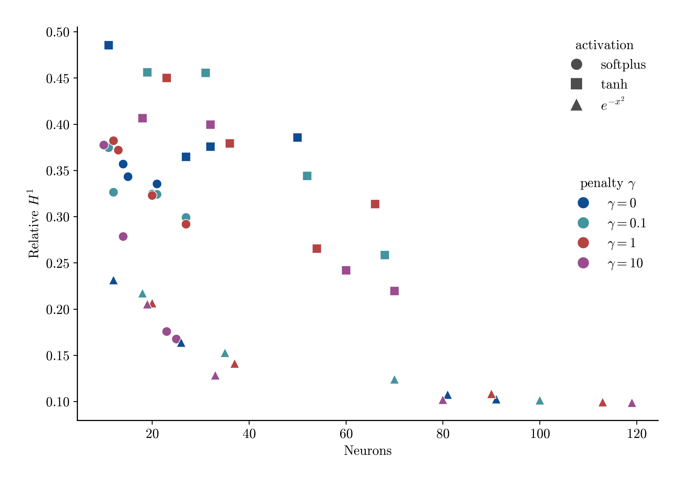

The scatter places every signed-H1 run on the neurons-vs-accuracy plane (marker =
activation, colour = γ): `softplus` sits at low neuron count, `gaussian` at low rel
H1 (high neurons), `tanh` in between but dominated. The penalty parameters move a
model *along* its activation's frontier (sparsity ↔ accuracy); on this smooth target
all of them stay accurate, so the lever mostly trades neurons.

## Full result

Best sparsity-aware `score = rel H1 × neurons` per (model, activation), profile
insertion, ranked best-first; both model kinds, all activations.

### H1 (gradient-augmented) loss

VDP H1 fit — best score per model/activation

| kind        | activation   | gamma | alpha  | neurons | rel H1 | rel L2 | score |
| ----------- | ------------ | ----- | ------ | ------- | ------ | ------ | ----- |
| semiconcave | softplus     | 0.1   | 1e-05  | 2       | 0.275  | 0.561  | 0.55  |
| semiconcave | snake_b0_25  | 0.1   | 0.01   | 3       | 0.269  | 0.557  | 0.81  |
| semiconcave | lisht        | 0     | 0.0001 | 4       | 0.223  | 0.484  | 0.89  |
| semiconcave | gaussian     | 0     | 0.001  | 15      | 0.112  | 0.419  | 1.67  |
| semiconcave | gausscent_1  | 10    | 0.01   | 9       | 0.211  | 0.449  | 1.90  |
| semiconcave | matern52     | 1     | 1e-05  | 17      | 0.113  | 0.425  | 1.93  |
| semiconcave | silu_squared | 0.1   | 0.0001 | 14      | 0.144  | 0.440  | 2.02  |
| semiconcave | gelu_squared | 0.1   | 0.001  | 18      | 0.120  | 0.426  | 2.16  |
| signed      | snake_b0_25  | 10    | 0.001  | 19      | 0.137  | 0.442  | 2.60  |
| signed      | gelu_squared | 0     | 0.01   | 25      | 0.110  | 0.426  | 2.75  |
| signed      | gaussian     | 0     | 0.01   | 12      | 0.231  | 0.460  | 2.78  |
| signed      | silu_squared | 10    | 0.01   | 24      | 0.127  | 0.431  | 3.05  |
| signed      | matern52     | 1     | 0.01   | 15      | 0.228  | 0.480  | 3.42  |
| semiconcave | rcip_2       | 0     | 0.01   | 19      | 0.186  | 0.417  | 3.54  |
| signed      | softplus     | 10    | 0.01   | 10      | 0.378  | 0.590  | 3.78  |
| semiconcave | tanh         | 0.1   | 0.0001 | 29      | 0.140  | 0.446  | 4.07  |
| signed      | lisht        | 1     | 0.001  | 17      | 0.261  | 0.539  | 4.44  |
| signed      | gausscent_1  | 0     | 0.01   | 18      | 0.249  | 0.454  | 4.48  |
| signed      | tanh         | 0     | 0.01   | 11      | 0.486  | 0.515  | 5.34  |
| signed      | rcip_2       | 0.1   | 0.01   | 27      | 0.267  | 0.431  | 7.20  |

### L2 (value-only) loss

VDP L2 fit — best score per model/activation

| kind        | activation   | gamma | alpha  | neurons | rel H1 | rel L2 | score |
| ----------- | ------------ | ----- | ------ | ------- | ------ | ------ | ----- |
| semiconcave | snake_b0_25  | 10    | 0.01   | 1       | 0.598  | 0.173  | 0.60  |
| semiconcave | gausscent_1  | 1     | 0.01   | 1       | 0.688  | 0.288  | 0.69  |
| semiconcave | gaussian     | 10    | 0.01   | 1       | 0.703  | 0.249  | 0.70  |
| semiconcave | matern52     | 10    | 0.01   | 1       | 0.705  | 0.257  | 0.71  |
| semiconcave | rcip_2       | 10    | 0.01   | 1       | 0.706  | 0.276  | 0.71  |
| semiconcave | softplus     | 1     | 1e-05  | 2       | 0.557  | 0.110  | 1.11  |
| semiconcave | lisht        | 10    | 0.001  | 3       | 0.581  | 0.145  | 1.74  |
| signed      | gaussian     | 10    | 0.01   | 2       | 0.879  | 0.377  | 1.76  |
| signed      | matern52     | 10    | 0.01   | 2       | 0.891  | 0.394  | 1.78  |
| semiconcave | silu_squared | 1     | 0.001  | 4       | 0.560  | 0.116  | 2.24  |
| signed      | gausscent_1  | 0     | 0.01   | 3       | 0.835  | 0.300  | 2.50  |
| semiconcave | tanh         | 0     | 0.01   | 4       | 0.690  | 0.241  | 2.76  |
| semiconcave | gelu_squared | 1     | 0.001  | 5       | 0.560  | 0.085  | 2.80  |
| signed      | rcip_2       | 0     | 0.01   | 3       | 0.940  | 0.497  | 2.82  |
| signed      | softplus     | 0.1   | 0.001  | 5       | 0.685  | 0.198  | 3.42  |
| signed      | tanh         | 0.1   | 0.01   | 4       | 0.956  | 0.456  | 3.82  |
| signed      | gelu_squared | 10    | 0.001  | 7       | 0.572  | 0.103  | 4.01  |
| signed      | silu_squared | 0     | 0.01   | 8       | 0.573  | 0.104  | 4.59  |
| signed      | snake_b0_25  | 10    | 0.0001 | 22      | 0.462  | 0.034  | 10.17 |
| signed      | lisht        | 0     | 0.01   | 25      | 0.605  | 0.108  | 15.13 |
