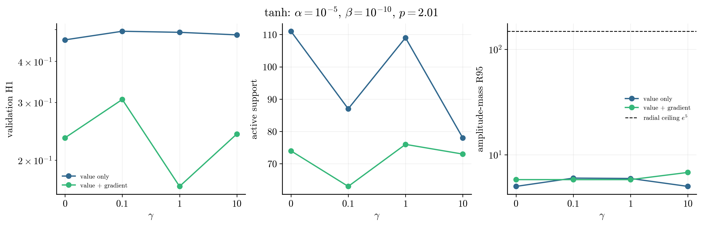
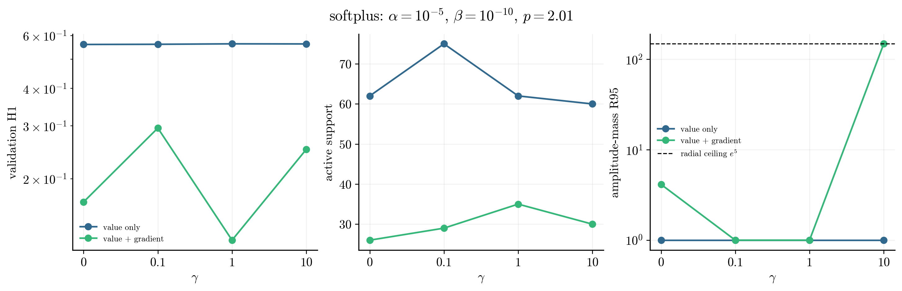
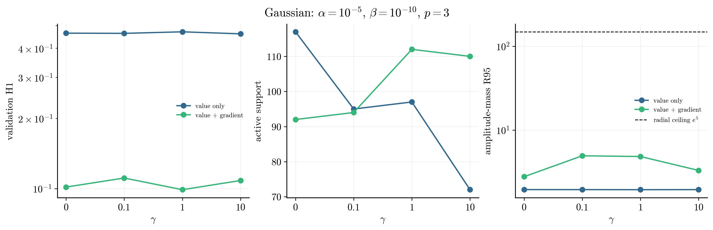
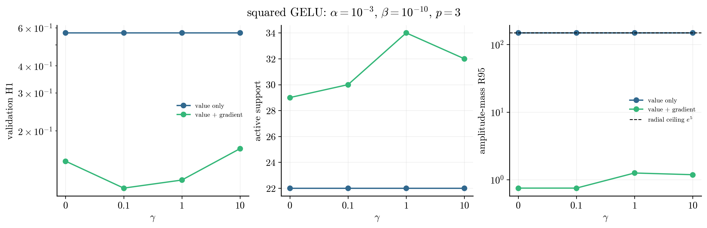
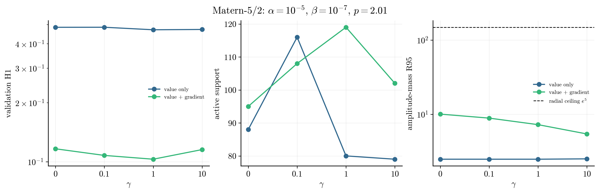

# Van der Pol gamma and loss-channel follow-up

**Status: complete.** 35 new seed-42 records vary gamma and the loss channels at five preselected interior positive-beta configurations. Five existing gamma=1 H1 records are reused.

## Headline

The lowest validation H1 away from the radial search ceiling is 0.0989 for `gaussian` with value + gradient loss and gamma=1; N=112 and R95=4.82.

## Follow-up observations

- Gradient augmentation wins at 5 of 5 selected activations. The best H1-trained error is 0.0989, compared with 0.4616 for the best value-only fit.
- The error-minimizing gamma values by activation are: tanh=1, softplus=1, gaussian=1, gelu_squared=0.1, matern52=1. Gamma is therefore retained as an independent hyperparameter rather than fixed universally.
- 5 new records place R95 at the radial search ceiling and are censored for selection.

## Best gamma/loss choice by activation

| activation | loss | gamma | error | N | R95 |
|---|---|---:|---:|---:|---:|
| tanh | value + gradient | 1 | 0.1665 | 76 | 5.8 |
| softplus | value + gradient | 1 | 0.1247 | 35 | 1 |
| gaussian | value + gradient | 1 | 0.0989 | 112 | 4.82 |
| gelu_squared | value + gradient | 0.1 | 0.1087 | 30 | 0.753 |
| matern52 | value + gradient | 1 | 0.1030 | 119 | 7.25 |

## Per-activation comparisons

### tanh

### softplus

### gaussian

### gelu_squared

### matern52

## New record manifest

| stage | activation | loss | gamma | error | N | R95 |
|---|---|---|---:|---:|---:|---:|
| followup/gaussian_l2 | gaussian | value only | 0 | 0.4647 | 117 | 1.94 |
| followup/gaussian_l2 | gaussian | value only | 0.1 | 0.4638 | 95 | 1.94 |
| followup/gaussian_l2 | gaussian | value only | 1 | 0.4710 | 97 | 1.94 |
| followup/gaussian_l2 | gaussian | value only | 10 | 0.4616 | 72 | 1.94 |
| followup/gaussian_h1 | gaussian | value + gradient | 0 | 0.1015 | 92 | 2.77 |
| followup/gaussian_h1 | gaussian | value + gradient | 0.1 | 0.1110 | 94 | 4.92 |
| followup/gaussian_h1 | gaussian | value + gradient | 10 | 0.1083 | 110 | 3.29 |
| followup/gelu_l2 | gelu_squared | value only | 0 | 0.5688 | 22 | 148 |
| followup/gelu_l2 | gelu_squared | value only | 0.1 | 0.5688 | 22 | 148 |
| followup/gelu_l2 | gelu_squared | value only | 1 | 0.5688 | 22 | 148 |
| followup/gelu_l2 | gelu_squared | value only | 10 | 0.5688 | 22 | 148 |
| followup/gelu_h1 | gelu_squared | value + gradient | 0 | 0.1449 | 29 | 0.753 |
| followup/gelu_h1 | gelu_squared | value + gradient | 0.1 | 0.1087 | 30 | 0.753 |
| followup/gelu_h1 | gelu_squared | value + gradient | 10 | 0.1655 | 32 | 1.19 |
| followup/matern_l2 | matern52 | value only | 0 | 0.4851 | 88 | 2.48 |
| followup/matern_l2 | matern52 | value only | 0.1 | 0.4853 | 116 | 2.48 |
| followup/matern_l2 | matern52 | value only | 1 | 0.4712 | 80 | 2.48 |
| followup/matern_l2 | matern52 | value only | 10 | 0.4729 | 79 | 2.51 |
| followup/matern_h1 | matern52 | value + gradient | 0 | 0.1164 | 95 | 10 |
| followup/matern_h1 | matern52 | value + gradient | 0.1 | 0.1077 | 108 | 8.87 |
| followup/matern_h1 | matern52 | value + gradient | 10 | 0.1153 | 102 | 5.43 |
| followup/tanh_softplus_l2 | softplus | value only | 0 | 0.5605 | 62 | 1 |
| followup/tanh_softplus_l2 | softplus | value only | 0.1 | 0.5613 | 75 | 1 |
| followup/tanh_softplus_l2 | softplus | value only | 1 | 0.5632 | 62 | 1 |
| followup/tanh_softplus_l2 | softplus | value only | 10 | 0.5628 | 60 | 1 |
| followup/tanh_softplus_h1 | softplus | value + gradient | 0 | 0.1673 | 26 | 4.14 |
| followup/tanh_softplus_h1 | softplus | value + gradient | 0.1 | 0.2950 | 29 | 1 |
| followup/tanh_softplus_h1 | softplus | value + gradient | 10 | 0.2504 | 30 | 148 |
| followup/tanh_softplus_l2 | tanh | value only | 0 | 0.4652 | 111 | 5 |
| followup/tanh_softplus_l2 | tanh | value only | 0.1 | 0.4941 | 87 | 6 |
| followup/tanh_softplus_l2 | tanh | value only | 1 | 0.4904 | 109 | 5.95 |
| followup/tanh_softplus_l2 | tanh | value only | 10 | 0.4817 | 78 | 5 |
| followup/tanh_softplus_h1 | tanh | value + gradient | 0 | 0.2341 | 74 | 5.8 |
| followup/tanh_softplus_h1 | tanh | value + gradient | 0.1 | 0.3063 | 63 | 5.8 |
| followup/tanh_softplus_h1 | tanh | value + gradient | 10 | 0.2405 | 73 | 6.79 |
