# Van der Pol full evidence scope with a parameter moment

All Algorithm 1 rows use selected interior positive-beta configurations.
Algorithm 2 rows reuse the unchanged homogeneous experiment.

## Algorithm 1: gradient augmentation

| activation | loss | gamma | rel L2 | rel H1 | N | R95 |
|---|---|---:|---:|---:|---:|---:|
| tanh | l2 | 1 | 0.0446 | 0.4904 | 109 | 5.95 |
| tanh | h1 | 1 | 0.4432 | 0.1665 | 76 | 5.8 |
| softplus | l2 | 1 | 0.0870 | 0.5632 | 62 | 1 |
| softplus | h1 | 1 | 0.4305 | 0.1247 | 35 | 1 |
| gaussian | l2 | 1 | 0.0328 | 0.4710 | 97 | 1.94 |
| gaussian | h1 | 1 | 0.4147 | 0.0989 | 112 | 4.82 |

| softplus | tanh | gaussian |
|---|---|---|
| 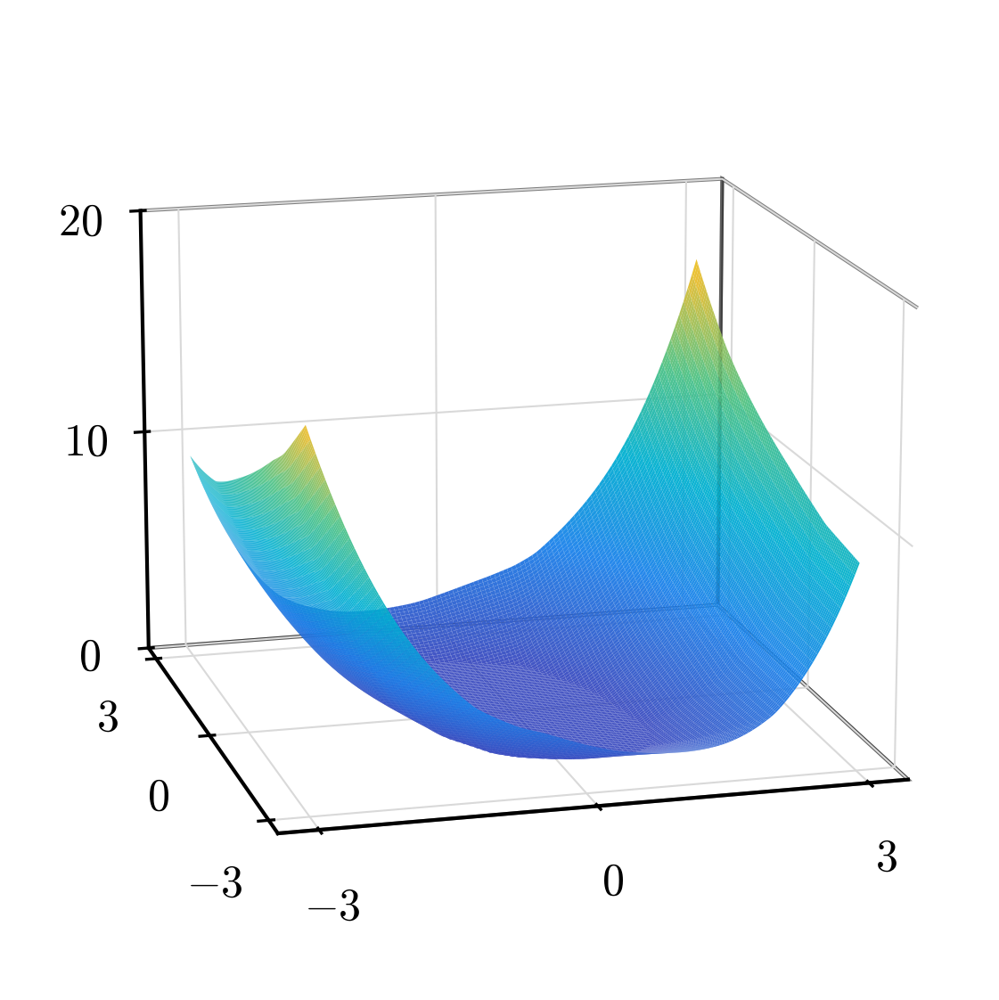 | 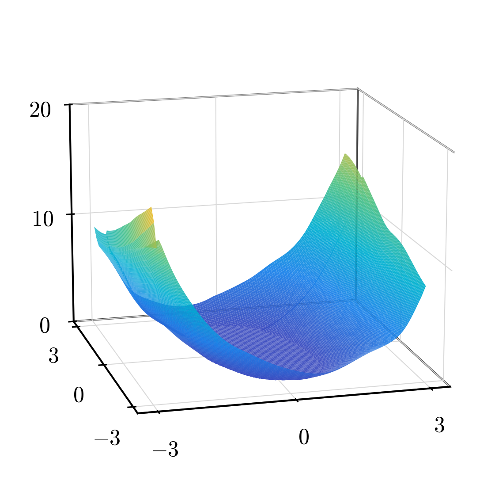 |  |

| tanh | softplus | gaussian |
|---|---|---|
| 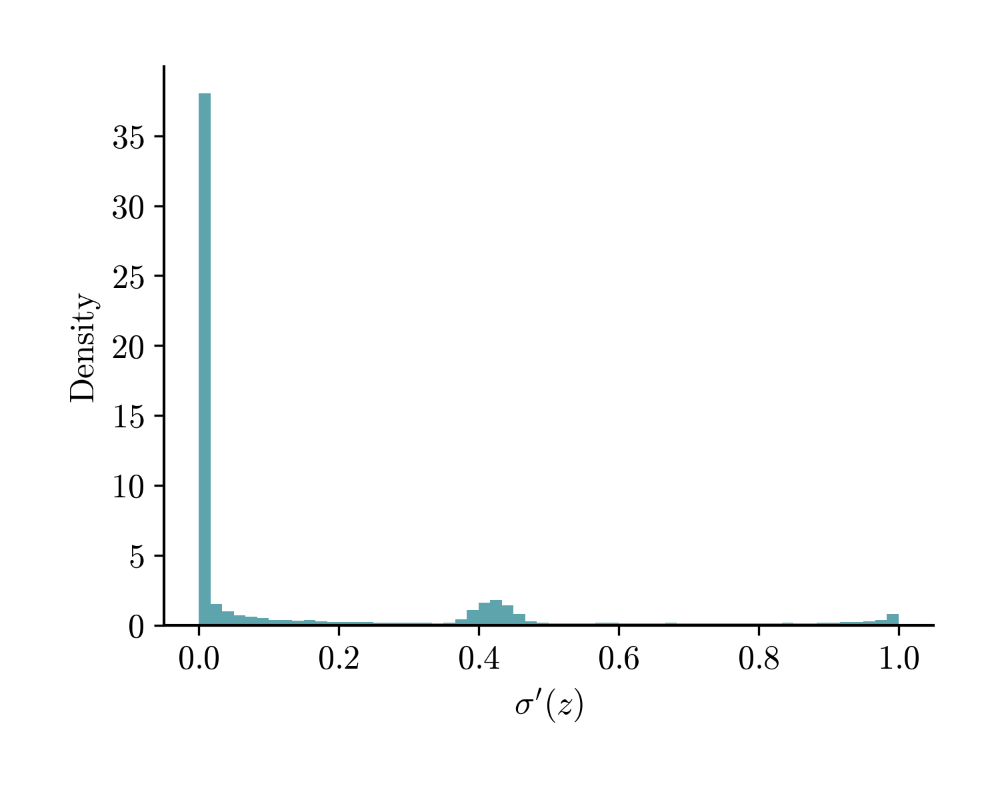 | 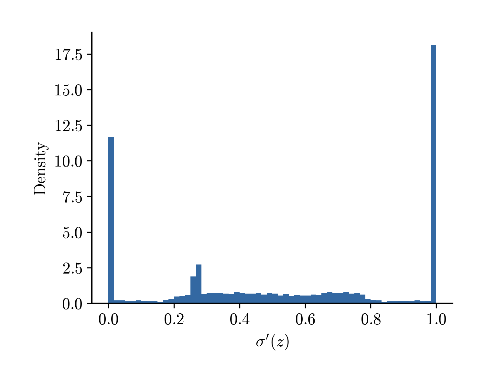 | 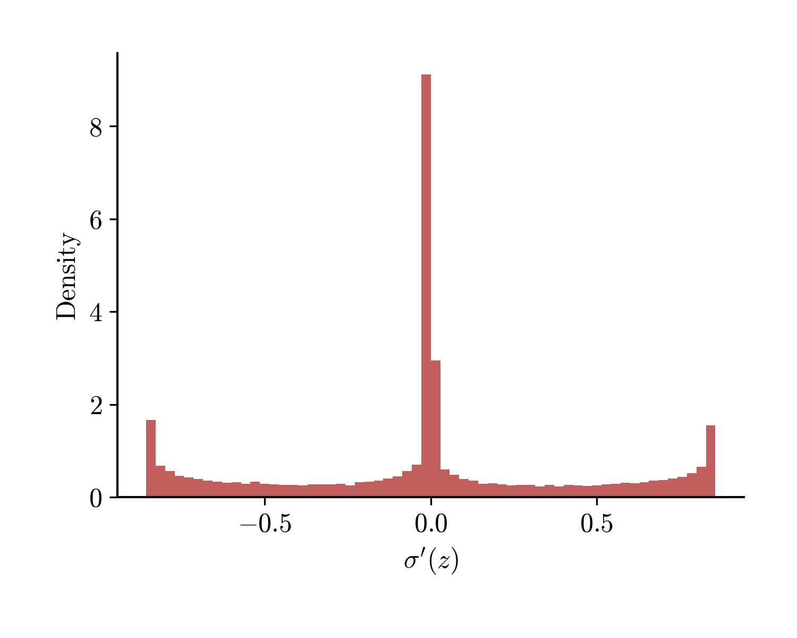 |

### Sparsity and the insertion dynamics

The gaussian and softplus fits differ sharply in size — 112 vs 35 neurons, a factor of ~3.2 — even though gaussian is the *more* accurate of the two. Tracking the profile insertion neuron-by-neuron shows why: gaussian adds neurons in large batches (7–15 per iteration) while softplus adds only 1–8, and each gaussian neuron buys a far smaller drop in the objective `J = L(μ) + α·Φ(μ) + β·Ψ_p(μ)`.

| iter | gaussian N | ins | ΔJ/n | softplus N | ins | ΔJ/n |
| --- | --- | --- | --- | --- | --- | --- |
| 1 | 7 | 7 | — | 2 | 2 | — |
| 2 | 14 | 7 | 2.8e-03 | 3 | 1 | 1.7e-01 |
| 3 | 24 | 10 | 5.6e-04 | 6 | 3 | 5.2e-03 |
| 4 | 34 | 10 | 1.2e-04 | 8 | 2 | 3.6e-03 |
| 5 | 44 | 10 | 2.0e-04 | 11 | 3 | 1.9e-03 |
| 6 | 52 | 8 | 1.9e-04 | 13 | 2 | 2.7e-02 |
| 7 | 67 | 15 | 1.6e-04 | 15 | 2 | 8.1e-04 |
| 8 | 82 | 15 | 5.6e-05 | 20 | 5 | 1.2e-02 |
| 9 | 97 | 15 | 5.0e-05 | 28 | 8 | 2.7e-04 |
| 10 | 112 | 15 | 7.2e-05 | 35 | 7 | 6.4e-04 |
| final | 112 | | | 35 | | |

`N` = support size after SSN and pruning; `ins` = neurons added that iteration; `ΔJ/n` = decrease of `J` per neuron added (relative to the previous iterate; iteration 1 has no predecessor).

The mechanism is the dual variable: the insertion score `p_t(ω) = ⟨σ(·;ω), g_t⟩` scores a candidate direction ω against the current residual `g_t`. The gaussian is **localized** (a bump concentrated near the hyperplane a·x + b ≈ 0), so `p_t` is sensitive to local residual pockets and a fresh batch of atoms clears the weighted insertion threshold every iteration, each correcting only a small local portion of the residual. Softplus has **global support**, so `p_t` averages the residual over the whole domain — positive and negative contributions cancel, fewer ω clear the weighted insertion threshold, but each admitted atom removes a global component.

## Algorithm 1: synthesized feedback

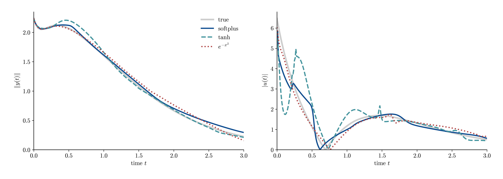

| controller | N | stabilizes | closed-loop cost |
|---|---:|:---:|---:|
| true | — | yes | 6.48 |
| softplus | 35 | yes | 6.63 |
| tanh | 76 | yes | 6.94 |
| gaussian | 112 | yes | 6.58 |

## Algorithm 1 versus Algorithm 2

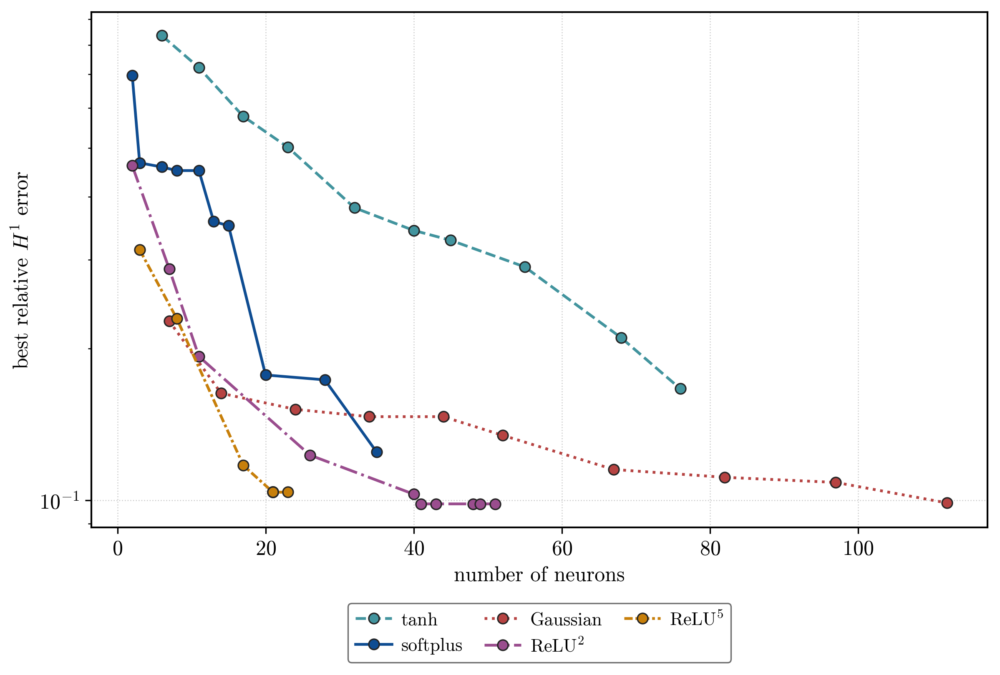

| state norm | control magnitude |
|---|---|
| 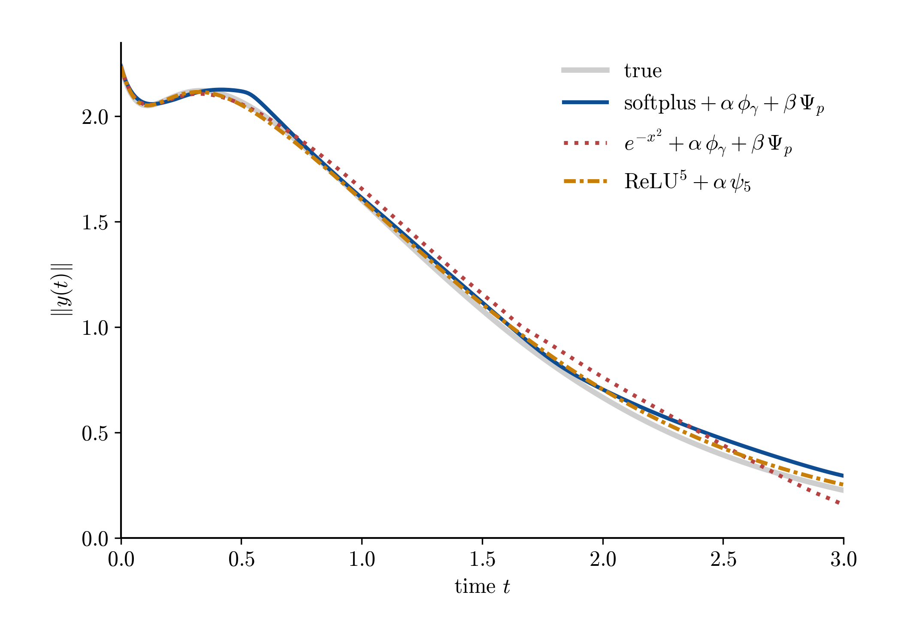 | 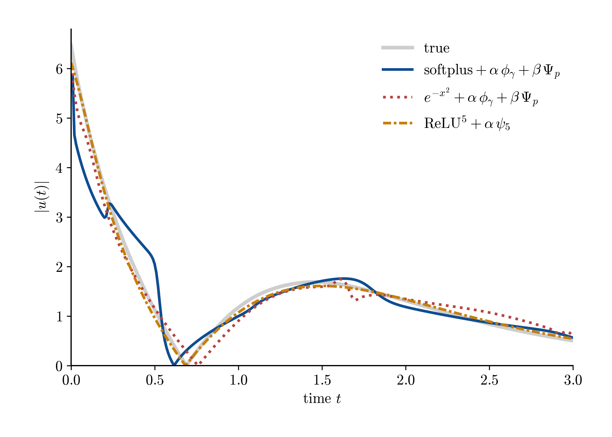 |

| controller | N | stabilizes | closed-loop cost |
|---|---:|:---:|---:|
| true | — | yes | 6.48 |
| softplus | 35 | yes | 6.63 |
| gaussian | 112 | yes | 6.58 |
| relu5 | 21 | yes | 6.49 |

| gaussian | softplus | ReLU5 |
|---|---|---|
| 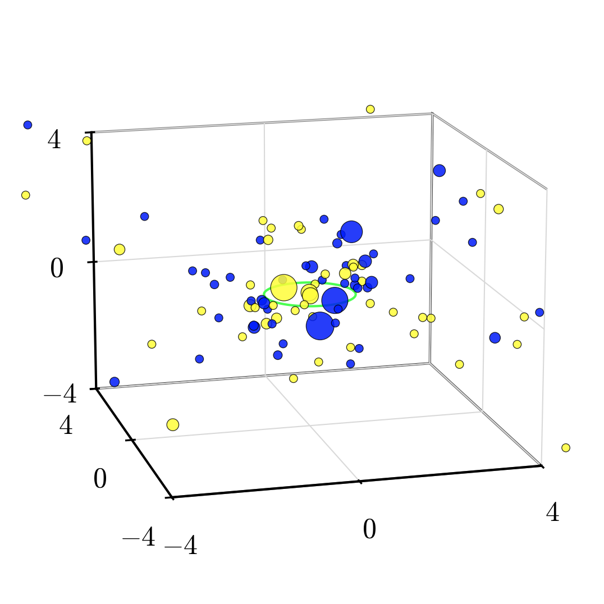 | 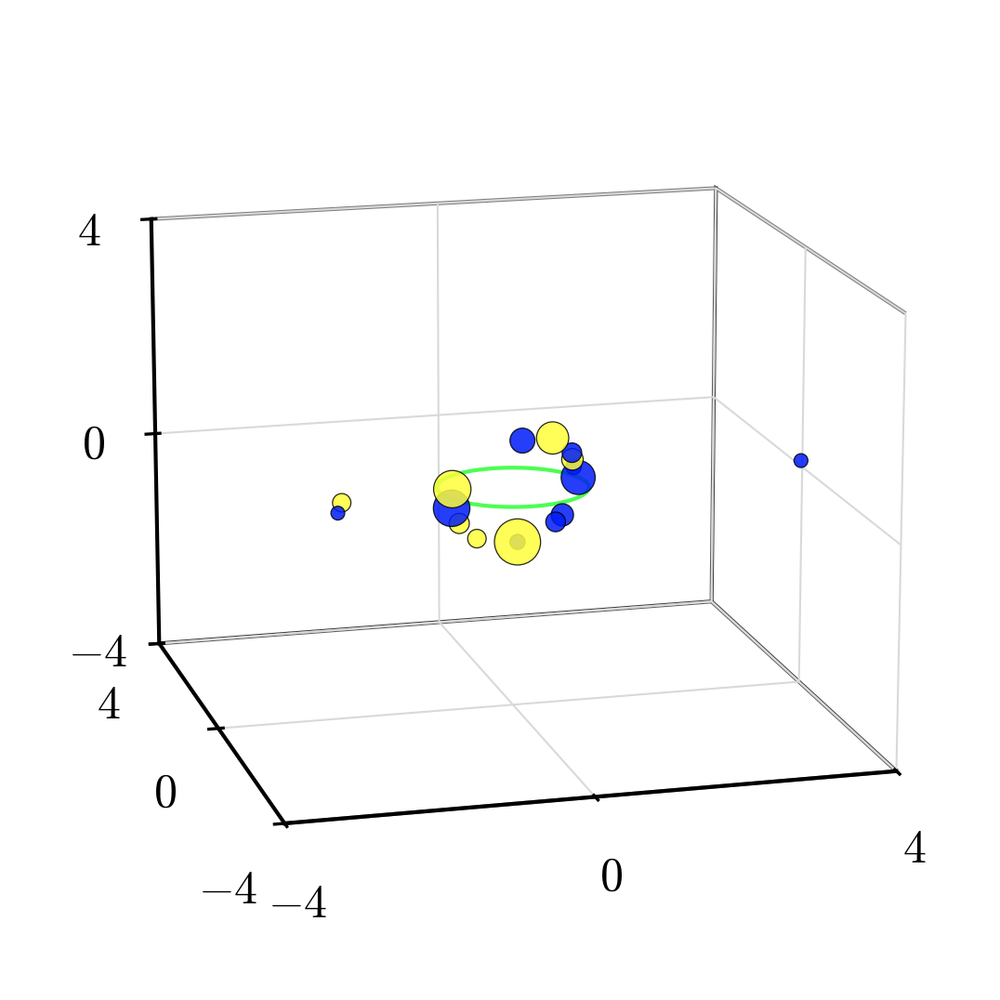 | 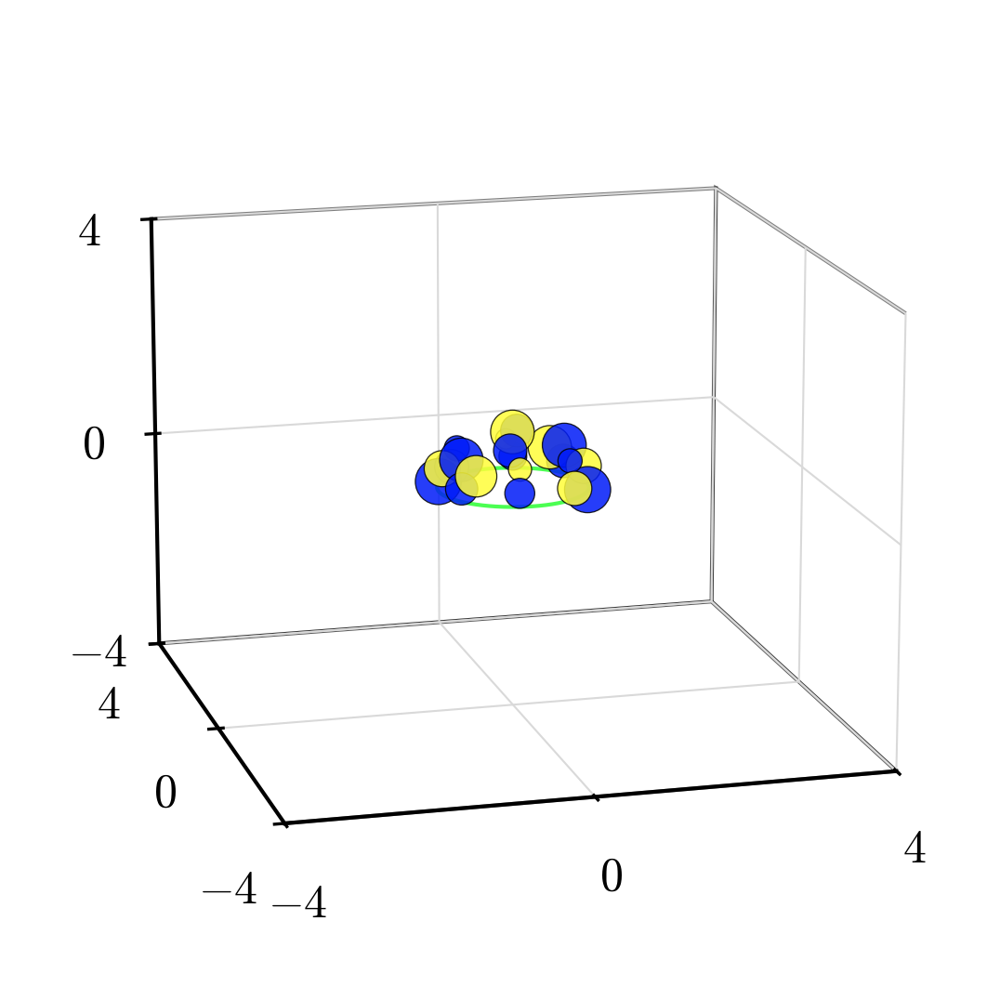 |
