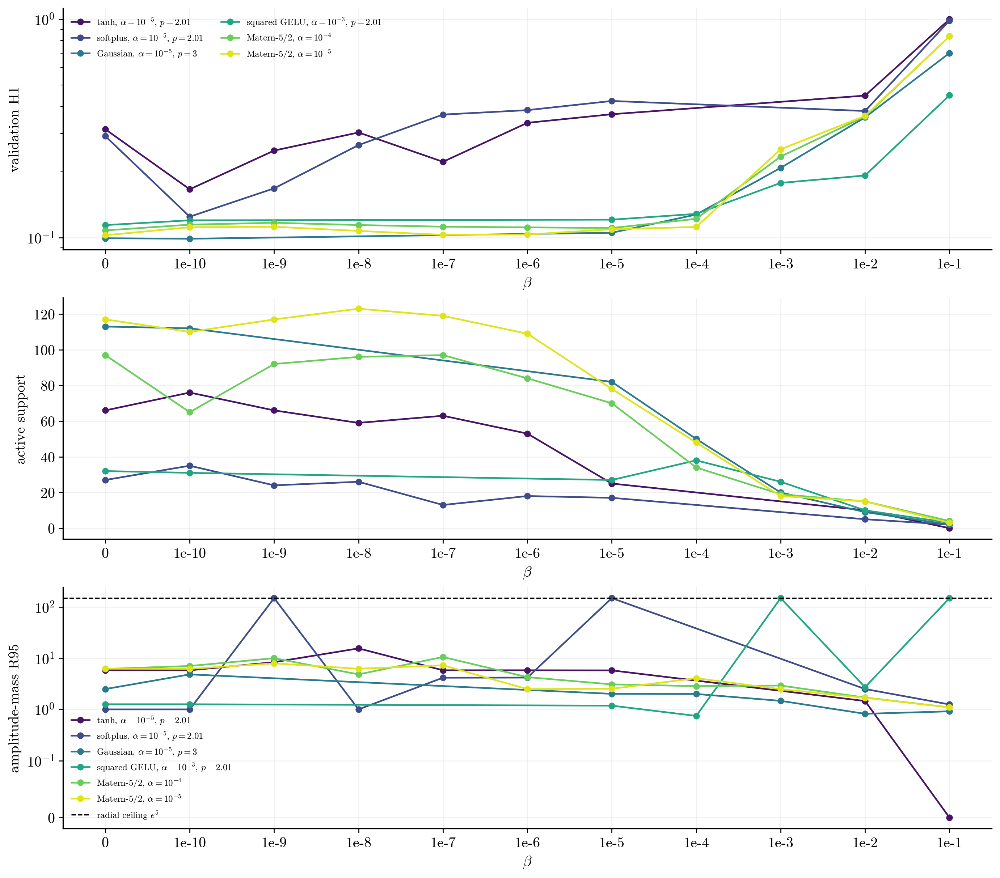

# Van der Pol adaptive moment refinement

**Status: complete.** 34 new seed-42 records fill only the unresolved beta decades and add Matern-5/2. The 272 first-pass records remain unchanged.

## Headline

The lowest positive-beta validation H1 away from the radial search ceiling is 0.0989 for `gaussian` at alpha=1e-5, beta=1e-10, p=3, with N=112 and R95=4.82. Beta=0 remains a plotted reference, not a candidate for the modified narrow-convergence model.

## Best interior positive-beta cell by activation

| activation | p | alpha | beta | error | N | R95 |
|---|---:|---:|---:|---:|---:|---:|
| tanh | 2.01 | 1e-5 | 1e-10 | 0.1665 | 76 | 5.8 |
| softplus | 2.01 | 1e-5 | 1e-10 | 0.1247 | 35 | 1 |
| gaussian | 3 | 1e-5 | 1e-10 | 0.0989 | 112 | 4.82 |
| gelu_squared | 3 | 1e-3 | 1e-10 | 0.1184 | 34 | 1.26 |
| matern52 | 2.01 | 1e-5 | 1e-7 | 0.1030 | 119 | 7.25 |

## Best point on each selected beta slice

| activation | p | alpha | beta | error | N | R95 |
|---|---:|---:|---:|---:|---:|---:|
| tanh | 2.01 | 1e-5 | 1e-10 | 0.1665 | 76 | 5.8 |
| softplus | 2.01 | 1e-5 | 1e-10 | 0.1247 | 35 | 1 |
| gaussian | 3 | 1e-5 | 1e-10 | 0.0989 | 112 | 4.82 |
| gelu_squared | 2.01 | 1e-3 | 1e-10 | 0.1201 | 31 | 1.26 |
| matern52 | 2.01 | 1e-4 | 1e-5 | 0.1107 | 70 | 3.08 |
| matern52 | 2.01 | 1e-5 | 1e-7 | 0.1030 | 119 | 7.25 |

## Refined beta slices

The curves retain alpha and p fixed. Missing markers correspond to decades that the first pass did not identify as part of that row's transition.

2 of the new positive-beta records place R95 at the radial search ceiling and are censored for model selection.

## New record manifest

| stage | activation | p | alpha | beta | error | N | R95 |
|---|---|---:|---:|---:|---:|---:|---:|
| refine/gaussian_late | gaussian | 3 | 1e-5 | 1e-4 | 0.1276 | 50 | 2 |
| refine/gaussian_late | gaussian | 3 | 1e-5 | 1e-3 | 0.2087 | 20 | 1.47 |
| refine/gelu_late | gelu_squared | 2.01 | 1e-3 | 1e-4 | 0.1285 | 38 | 0.746 |
| refine/gelu_late | gelu_squared | 2.01 | 1e-3 | 1e-3 | 0.1782 | 26 | 148 |
| refine/matern_baseline | matern52 | — | 1e-5 | 0 | 0.1026 | 117 | 6.26 |
| refine/matern_positive | matern52 | 2.01 | 1e-5 | 1e-10 | 0.1116 | 110 | 6.18 |
| refine/matern_positive | matern52 | 2.01 | 1e-5 | 1e-9 | 0.1122 | 117 | 7.91 |
| refine/matern_positive | matern52 | 2.01 | 1e-5 | 1e-8 | 0.1074 | 123 | 6.21 |
| refine/matern_positive | matern52 | 2.01 | 1e-5 | 1e-7 | 0.1030 | 119 | 7.25 |
| refine/matern_positive | matern52 | 2.01 | 1e-5 | 1e-6 | 0.1034 | 109 | 2.49 |
| refine/matern_positive | matern52 | 2.01 | 1e-5 | 1e-5 | 0.1093 | 78 | 2.53 |
| refine/matern_positive | matern52 | 2.01 | 1e-5 | 1e-4 | 0.1119 | 48 | 4.06 |
| refine/matern_positive | matern52 | 2.01 | 1e-5 | 1e-3 | 0.2539 | 18 | 2.48 |
| refine/matern_positive | matern52 | 2.01 | 1e-5 | 1e-2 | 0.3612 | 15 | 1.68 |
| refine/matern_positive | matern52 | 2.01 | 1e-5 | 1e-1 | 0.8355 | 3 | 1.1 |
| refine/matern_baseline | matern52 | — | 1e-4 | 0 | 0.1080 | 97 | 6.16 |
| refine/matern_positive | matern52 | 2.01 | 1e-4 | 1e-10 | 0.1147 | 65 | 7.03 |
| refine/matern_positive | matern52 | 2.01 | 1e-4 | 1e-9 | 0.1170 | 92 | 9.97 |
| refine/matern_positive | matern52 | 2.01 | 1e-4 | 1e-8 | 0.1143 | 96 | 4.83 |
| refine/matern_positive | matern52 | 2.01 | 1e-4 | 1e-7 | 0.1123 | 97 | 10.5 |
| refine/matern_positive | matern52 | 2.01 | 1e-4 | 1e-6 | 0.1115 | 84 | 4.26 |
| refine/matern_positive | matern52 | 2.01 | 1e-4 | 1e-5 | 0.1107 | 70 | 3.08 |
| refine/matern_positive | matern52 | 2.01 | 1e-4 | 1e-4 | 0.1220 | 34 | 2.84 |
| refine/matern_positive | matern52 | 2.01 | 1e-4 | 1e-3 | 0.2352 | 19 | 2.92 |
| refine/matern_positive | matern52 | 2.01 | 1e-4 | 1e-2 | 0.3592 | 15 | 1.7 |
| refine/matern_positive | matern52 | 2.01 | 1e-4 | 1e-1 | 0.8358 | 4 | 1.1 |
| refine/softplus_early | softplus | 2.01 | 1e-5 | 1e-9 | 0.1682 | 24 | 148 |
| refine/softplus_early | softplus | 2.01 | 1e-5 | 1e-8 | 0.2655 | 26 | 1 |
| refine/softplus_early | softplus | 2.01 | 1e-5 | 1e-7 | 0.3662 | 13 | 4.15 |
| refine/softplus_early | softplus | 2.01 | 1e-5 | 1e-6 | 0.3837 | 18 | 4.17 |
| refine/tanh_early | tanh | 2.01 | 1e-5 | 1e-9 | 0.2505 | 66 | 8.35 |
| refine/tanh_early | tanh | 2.01 | 1e-5 | 1e-8 | 0.3032 | 59 | 15.5 |
| refine/tanh_early | tanh | 2.01 | 1e-5 | 1e-7 | 0.2226 | 63 | 5.8 |
| refine/tanh_early | tanh | 2.01 | 1e-5 | 1e-6 | 0.3357 | 53 | 5.79 |
