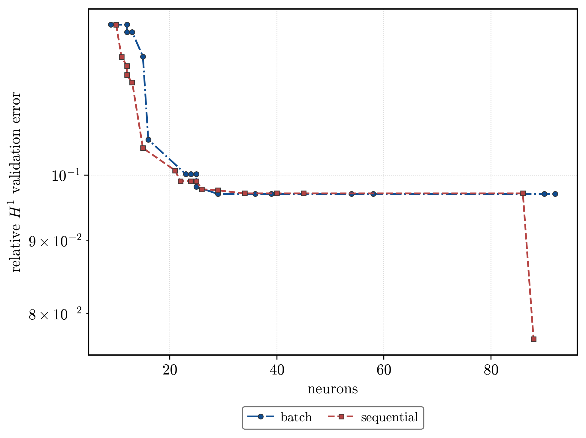

# Results — vdp / paper_frac_exp_penalty

Generated by `analysis.py`. Scope, sweep axes and what differs from `../frac_exp_penalty` are in `README.md`.

## Key finding

- **batch**: best sparsity-aware cell is `k (power)=4.0`, α=0.001, γ=0 — 9 neurons at relative H¹ 0.1274 (score 1.147).
- **sequential**: best sparsity-aware cell is `k (power)=3.0`, α=0.001, γ=0 — 10 neurons at relative H¹ 0.1274 (score 1.274).

*Running best relative H¹ validation error against neuron count, for the two insertion modes. Batch admits up to `N_ins = 15` atoms per outer iteration against one frozen residual; sequential admits one — the maximizer of `|P_p|` — and runs at `T_out = 150` for a matched neuron budget. All cells at seed 42.*

## Termination

The paper loop stops as soon as no candidate clears the insertion threshold; a run that stops early converged in the algorithm's own terms, one that reaches `T_out` was still finding candidates.

- **batch**: 40/40 cells terminated before `T_out`.
- **sequential**: 40/40 cells terminated before `T_out`.

## Best cell per variant (H¹ loss)

| k (power) | batch N | batch H¹ | batch score | seq N | seq H¹ | seq score |
| --------- | ------- | -------- | ----------- | ----- | ------ | --------- |
| 4         | 9       | 0.1274   | 1.147       | 11    | 0.1210 | 1.331     |
| 5         | 10      | 0.1293   | 1.293       | 10    | 0.1315 | 1.315     |
| 2.01      | 12      | 0.1259   | 1.511       | 13    | 0.1174 | 1.526     |
| 3         | 12      | 0.1310   | 1.572       | 10    | 0.1274 | 1.274     |
| 2         | 13      | 0.1267   | 1.647       | 12    | 0.1192 | 1.431     |

## Full result (H¹ loss)

| k (power) | mode       | α      | γ | neurons | rel L² | rel H¹ | score |
| --------- | ---------- | ------ | - | ------- | ------ | ------ | ----- |
| 2         | batch      | 1e-06  | 0 | 90      | 0.4155 | 0.0976 | 8.788 |
| 2         | batch      | 1e-05  | 0 | 58      | 0.4160 | 0.0986 | 5.717 |
| 2         | batch      | 0.0001 | 0 | 25      | 0.4183 | 0.1009 | 2.522 |
| 2         | batch      | 0.001  | 0 | 13      | 0.4290 | 0.1267 | 1.647 |
| 2         | sequential | 1e-06  | 0 | 86      | 0.4142 | 0.0981 | 8.433 |
| 2         | sequential | 1e-05  | 0 | 40      | 0.4169 | 0.0983 | 3.930 |
| 2         | sequential | 0.0001 | 0 | 24      | 0.4176 | 0.1033 | 2.478 |
| 2         | sequential | 0.001  | 0 | 12      | 0.4247 | 0.1192 | 1.431 |
| 2.01      | batch      | 1e-06  | 0 | 92      | 0.4151 | 0.0979 | 9.009 |
| 2.01      | batch      | 1e-05  | 0 | 54      | 0.4160 | 0.0985 | 5.320 |
| 2.01      | batch      | 0.0001 | 0 | 25      | 0.4190 | 0.1012 | 2.529 |
| 2.01      | batch      | 0.001  | 0 | 12      | 0.4299 | 0.1259 | 1.511 |
| 2.01      | sequential | 1e-06  | 0 | 88      | 0.3136 | 0.0767 | 6.754 |
| 2.01      | sequential | 1e-05  | 0 | 45      | 0.4171 | 0.0975 | 4.386 |
| 2.01      | sequential | 0.0001 | 0 | 24      | 0.4170 | 0.1033 | 2.479 |
| 2.01      | sequential | 0.001  | 0 | 13      | 0.4286 | 0.1174 | 1.526 |
| 3         | batch      | 1e-06  | 0 | 39      | 0.4153 | 0.0973 | 3.794 |
| 3         | batch      | 1e-05  | 0 | 23      | 0.4165 | 0.1002 | 2.304 |
| 3         | batch      | 0.0001 | 0 | 16      | 0.4121 | 0.1059 | 1.694 |
| 3         | batch      | 0.001  | 0 | 12      | 0.4065 | 0.1310 | 1.572 |
| 3         | sequential | 1e-06  | 0 | 34      | 0.4160 | 0.0971 | 3.301 |
| 3         | sequential | 1e-05  | 0 | 25      | 0.4156 | 0.0994 | 2.484 |
| 3         | sequential | 0.0001 | 0 | 15      | 0.4154 | 0.1045 | 1.567 |
| 3         | sequential | 0.001  | 0 | 10      | 0.4100 | 0.1274 | 1.274 |
| 4         | batch      | 1e-06  | 0 | 36      | 0.4160 | 0.0972 | 3.499 |
| 4         | batch      | 1e-05  | 0 | 25      | 0.4156 | 0.0981 | 2.454 |
| 4         | batch      | 0.0001 | 0 | 16      | 0.4151 | 0.1169 | 1.871 |
| 4         | batch      | 0.001  | 0 | 9       | 0.4329 | 0.1274 | 1.147 |
| 4         | sequential | 1e-06  | 0 | 26      | 0.4167 | 0.0977 | 2.541 |
| 4         | sequential | 1e-05  | 0 | 22      | 0.4183 | 0.0990 | 2.178 |
| 4         | sequential | 0.0001 | 0 | 12      | 0.4170 | 0.1175 | 1.410 |
| 4         | sequential | 0.001  | 0 | 11      | 0.4368 | 0.1210 | 1.331 |
| 5         | batch      | 1e-06  | 0 | 29      | 0.4156 | 0.0970 | 2.813 |
| 5         | batch      | 1e-05  | 0 | 24      | 0.4131 | 0.1014 | 2.434 |
| 5         | batch      | 0.0001 | 0 | 15      | 0.4106 | 0.1211 | 1.816 |
| 5         | batch      | 0.001  | 0 | 10      | 0.4329 | 0.1293 | 1.293 |
| 5         | sequential | 1e-06  | 0 | 29      | 0.4150 | 0.0976 | 2.830 |
| 5         | sequential | 1e-05  | 0 | 21      | 0.4138 | 0.1007 | 2.116 |
| 5         | sequential | 0.0001 | 0 | 13      | 0.4151 | 0.1161 | 1.509 |
| 5         | sequential | 0.001  | 0 | 10      | 0.4466 | 0.1315 | 1.315 |
