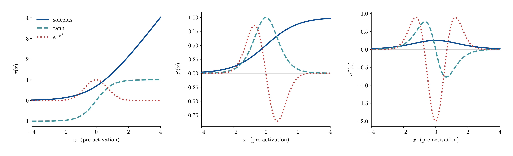
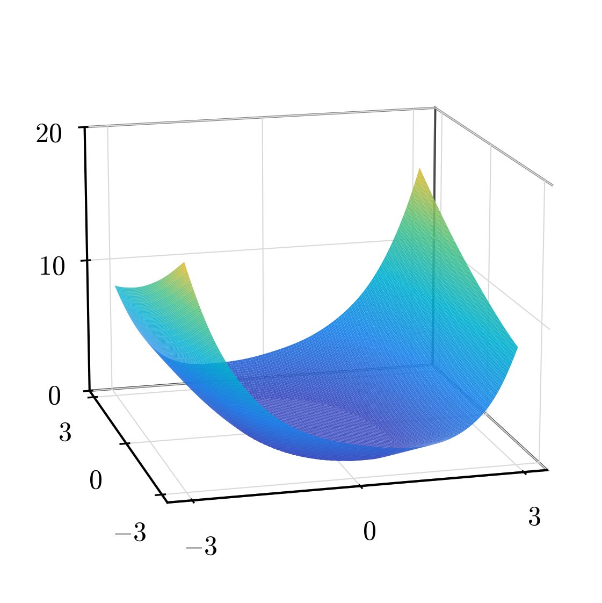
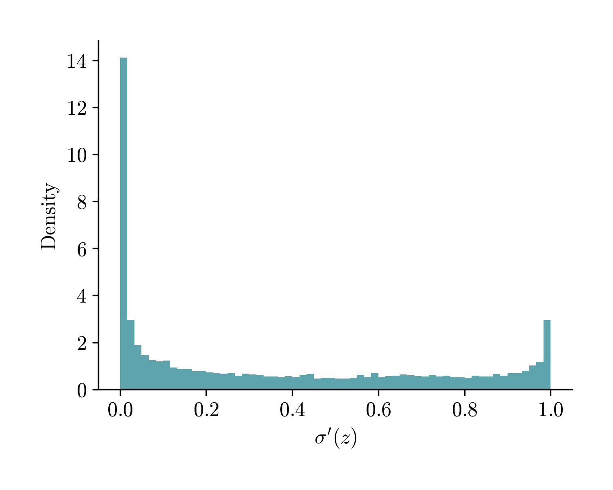
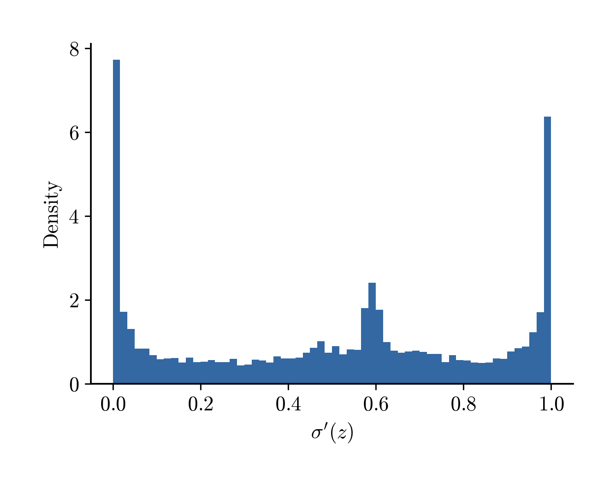
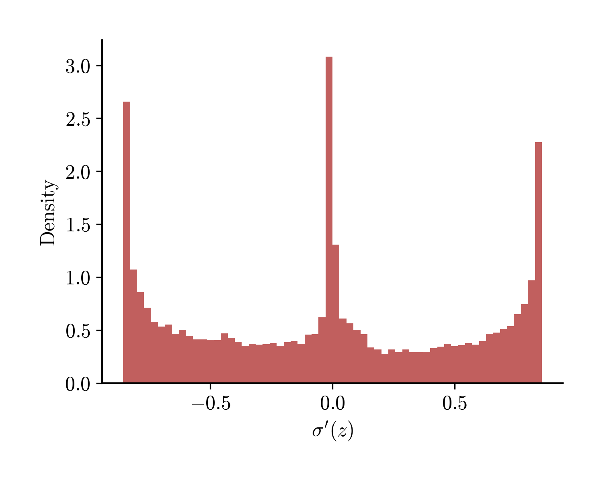
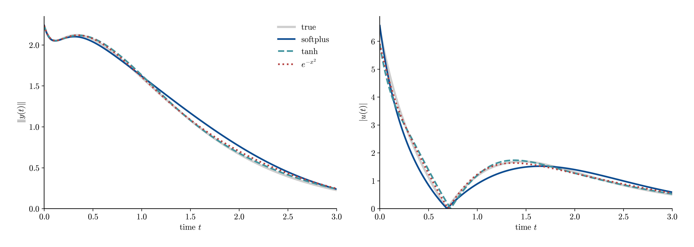
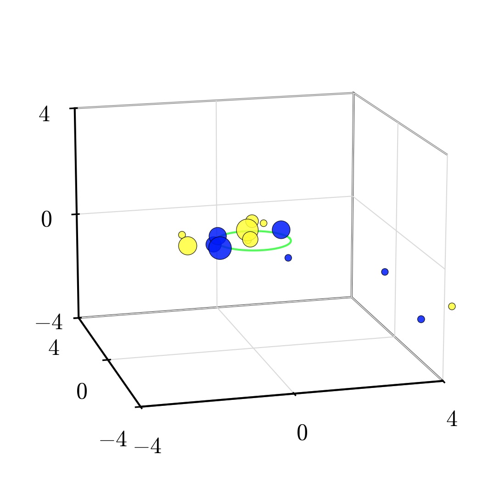
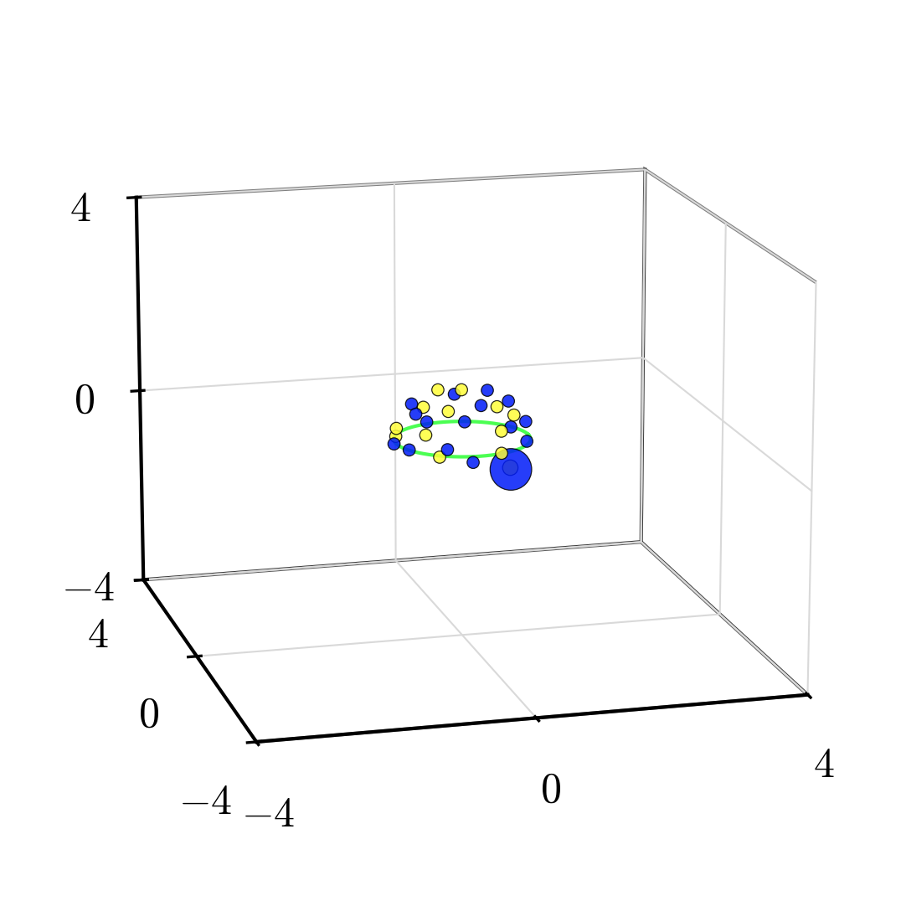

# Van der Pol full evidence scope with a parameter moment

All Algorithm 1 rows use shared parameters (alpha=1e-04, gamma=10, p=2.01), so the cross-activation comparison is not confounded with per-activation tuning.
Algorithm 2 rows reuse the unchanged homogeneous experiment.

## Algorithm 1: gradient augmentation

| activation | loss | gamma | rel L2 | rel H1 | N | R95 |
|---|---|---:|---:|---:|---:|---:|
| tanh | l2 | 1 | 0.1108 | 0.6183 | 8 | 1 |
| tanh | h1 | 1 | 0.4239 | 0.1070 | 23 | 2.94 |
| softplus | l2 | 1 | 0.1059 | 0.5850 | 6 | 2.19 |
| softplus | h1 | 1 | 0.4374 | 0.1311 | 15 | 1.91 |
| gaussian | l2 | 1 | 0.0663 | 0.5419 | 10 | 2.07 |
| gaussian | h1 | 1 | 0.4221 | 0.1053 | 32 | 1.42 |

| softplus | tanh | gaussian |
|---|---|---|
|  |  |  |

| tanh | softplus | gaussian |
|---|---|---|
|  |  |  |

### Sparsity and the insertion dynamics

The gaussian and softplus fits differ sharply in size — 32 vs 15 neurons, a factor of ~2.1 — even though gaussian is the *more* accurate of the two. Tracking insertion neuron-by-neuron shows why: gaussian adds neurons in large batches (-1–1 per iteration) while softplus adds only 0–1, and each gaussian neuron buys a far smaller drop in the additive-moment comparator objective `J_add = L(μ) + α·Φ_φ(μ) + β‖μ‖_{M_p}`.

| iter | gaussian N | ins | ΔJ/n | softplus N | ins | ΔJ/n |
| --- | --- | --- | --- | --- | --- | --- |
| 1 | 1 | 1 | — | 1 | 1 | — |
| 2 | 2 | 1 | 6.9e-01 | 2 | 1 | 1.7e-01 |
| 3 | 3 | 1 | 3.9e-02 | 3 | 1 | 9.3e-01 |
| 4 | 4 | 1 | 2.7e-02 | 4 | 1 | 5.9e-03 |
| 5 | 5 | 1 | 1.0e-01 | 5 | 1 | 2.5e-02 |
| 6 | 6 | 1 | 1.1e-02 | 6 | 1 | 8.1e-04 |
| 7 | 7 | 1 | 4.6e-03 | 7 | 1 | 4.4e-02 |
| 8 | 8 | 1 | 1.4e-01 | 8 | 1 | 7.1e-03 |
| 9 | 9 | 1 | 5.0e-03 | 9 | 1 | 1.9e-03 |
| 10 | 10 | 1 | 8.3e-03 | 10 | 1 | 2.2e-02 |
| 11 | 11 | 1 | 4.9e-04 | 11 | 1 | 5.4e-03 |
| 12 | 12 | 1 | 1.5e-03 | 12 | 1 | 9.1e-04 |
| 13 | 13 | 1 | 3.4e-04 | 13 | 1 | 5.8e-03 |
| 14 | 14 | 1 | 2.0e-04 | 14 | 1 | 5.4e-04 |
| 15 | 15 | 1 | 9.7e-04 | 15 | 1 | 1.1e-03 |
| 16 | 16 | 1 | 6.9e-04 | 15 | 0 | — |
| 17 | 17 | 1 | 3.9e-04 | 15 | 0 | — |
| 18 | 18 | 1 | 5.3e-04 |  |  |  |
| 19 | 18 | 0 | — |  |  |  |
| 20 | 19 | 1 | 8.2e-04 |  |  |  |
| 21 | 20 | 1 | 1.1e-03 |  |  |  |
| 22 | 21 | 1 | 4.8e-04 |  |  |  |
| 23 | 22 | 1 | 4.6e-04 |  |  |  |
| 24 | 22 | 0 | — |  |  |  |
| 25 | 23 | 1 | 6.7e-05 |  |  |  |
| 26 | 24 | 1 | 5.4e-05 |  |  |  |
| 27 | 25 | 1 | 4.2e-04 |  |  |  |
| 28 | 24 | -1 | — |  |  |  |
| 29 | 25 | 1 | 2.0e-04 |  |  |  |
| 30 | 26 | 1 | 2.6e-03 |  |  |  |
| 31 | 26 | 0 | — |  |  |  |
| 32 | 27 | 1 | 1.1e-04 |  |  |  |
| 33 | 26 | -1 | — |  |  |  |
| 34 | 27 | 1 | 3.7e-05 |  |  |  |
| 35 | 27 | 0 | — |  |  |  |
| 36 | 27 | 0 | — |  |  |  |
| 37 | 27 | 0 | — |  |  |  |
| 38 | 28 | 1 | 4.7e-05 |  |  |  |
| 39 | 29 | 1 | 2.5e-05 |  |  |  |
| 40 | 30 | 1 | 7.5e-05 |  |  |  |
| 41 | 29 | -1 | — |  |  |  |
| 42 | 29 | 0 | — |  |  |  |
| 43 | 30 | 1 | 4.3e-05 |  |  |  |
| 44 | 30 | 0 | — |  |  |  |
| 45 | 31 | 1 | 5.9e-06 |  |  |  |
| 46 | 30 | -1 | — |  |  |  |
| 47 | 31 | 1 | 3.7e-06 |  |  |  |
| 48 | 32 | 1 | 3.0e-06 |  |  |  |
| 49 | 33 | 1 | 2.5e-05 |  |  |  |
| 50 | 34 | 1 | 6.3e-07 |  |  |  |
| 51 | 34 | 0 | — |  |  |  |
| 52 | 33 | -1 | — |  |  |  |
| 53 | 32 | -1 | — |  |  |  |
| 54 | 32 | 0 | — |  |  |  |
| 55 | 32 | 0 | — |  |  |  |
| 56 | 32 | 0 | — |  |  |  |
| 57 | 32 | 0 | — |  |  |  |
| final | 32 | | | 15 | | |

`N` = support size after SSN and pruning; `ins` = neurons added that iteration; `ΔJ/n` = decrease of `J` per neuron added (relative to the previous iterate; iteration 1 has no predecessor).

The mechanism is the function representing the empirical fidelity derivative: `P^M_{μ_t}(ω)=⟨K(ω),r_{μ_t}⟩` scores a candidate direction `ω` against the current residual. The gaussian is **localized** (a bump concentrated near the hyperplane `a·x+b≈0`), so this derivative is sensitive to local residual pockets and a fresh batch of atoms clears the weighted insertion threshold every iteration, each correcting only a small local portion of the residual. Softplus has **global support**, so its derivative averages the residual over the whole domain—positive and negative contributions cancel, fewer `ω` clear the weighted insertion threshold, but each admitted atom removes a global component.

## Algorithm 1: synthesized feedback

| controller | N | stabilizes | closed-loop cost |
|---|---:|:---:|---:|
| true | — | yes | 6.48 |
| softplus | 15 | yes | 6.54 |
| tanh | 23 | yes | 6.50 |
| gaussian | 32 | yes | 6.50 |

## Algorithm 1 versus Algorithm 2

| state norm | control magnitude |
|---|---|
|  |  |

| controller | N | stabilizes | closed-loop cost |
|---|---:|:---:|---:|
| true | — | yes | 6.48 |
| softplus | 15 | yes | 6.54 |
| gaussian | 32 | yes | 6.50 |
| relu5 | 29 | yes | 6.50 |

| gaussian | softplus | ReLU5 |
|---|---|---|
|  |  |  |
