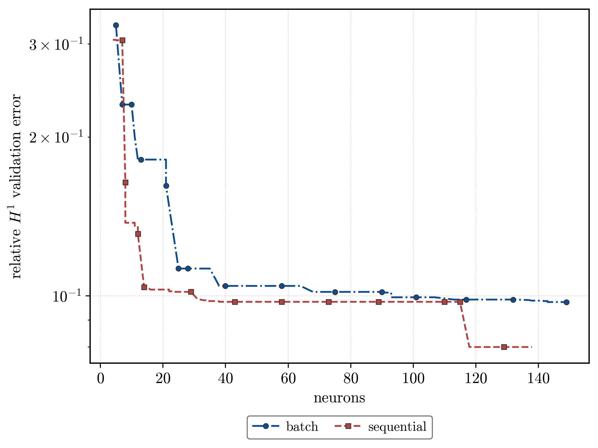

# Results — vdp / paper_log_penalty

Generated by `analysis.py`. Scope, sweep axes and what differs from `../log_penalty` are in `README.md`.

## Key finding

- **batch**: sparsest good fit is `activation=gelu_squared`, α=0.01, γ=1 — 8 neurons at relative H¹ 0.1654 (score 1.324). Most accurate fit is `activation=gelu_squared`, α=1e-05, γ=10 — relative H¹ 0.0970 at 93 neurons.
- **sequential**: sparsest good fit is `activation=gelu_squared`, α=0.01, γ=1 — 8 neurons at relative H¹ 0.1557 (score 1.246). Most accurate fit is `activation=leaky_relu`, α=0.0001, γ=10 — relative H¹ 0.0774 at 101 neurons.

The score `H¹ × neurons` rewards very sparse fits, so it and the accuracy envelope pick different cells; both are reported rather than one standing in for the other.

*Running best relative H¹ validation error against neuron count, for the two insertion modes. Batch admits up to `N_ins = 15` atoms per outer iteration against one frozen residual; sequential admits one — the maximizer of `|P_p|` — and runs at `T_out = 150` for a matched neuron budget. All cells at seed 42.*

## Termination

The paper loop stops as soon as no candidate clears the insertion threshold; a run that stops early converged in the algorithm's own terms, one that reaches `T_out` was still finding candidates.

- **batch**: 74/224 cells terminated before `T_out = 10`; median 10 iterations, max 10.
- **sequential**: 194/224 cells terminated before `T_out = 150`; median 27.5 iterations, max 150.

## Versus `../log_penalty`

Relative errors are ratios of norms, so the metric itself is unaffected by the fidelity renormalization. The **α grid is not**: this study's `l^M` divides by `M` where the comparator's divides by `M·d`, so at equal α *label* a cell here carries `1/d` the effective regularization and therefore tends to buy more neurons. Comparing best-per-α across the two studies would read that head start as an improvement.

The comparison below is therefore made at a **matched neuron budget** — the best relative H¹ reachable with at most N neurons — which is free of both the α shift and any capacity difference.

| ≤ N neurons | ../log_penalty | paper batch | paper sequential |
| ----------- | -------------- | ----------- | ---------------- |
| 10          | 0.2110         | 0.1623      | 0.1557           |
| 20          | 0.1034         | 0.1623      | 0.1118           |
| 40          | 0.1034         | 0.1131      | 0.0972           |
| 80          | 0.1021         | 0.0979      | 0.0971           |
| 120         | 0.0976         | 0.0970      | 0.0774           |
| 160         | 0.0976         | 0.0970      | 0.0774           |

Cell counts are asymmetric and favour the comparator: it draws on 640 H¹ cells against this study's 112 per mode, so it has more chances to find a good one.

### Best-per-variant envelope (α grids not comparable)

Retained for reference only. Each column is the best relative H¹ anywhere in that study's own α/γ grid, so the α shift described above applies and this table flatters the paper columns.

Not covered by the comparator's stored records, so absent below: leaky_relu.

| activation   | ../log_penalty | paper batch | paper sequential |
| ------------ | -------------- | ----------- | ---------------- |
| gausscent_1  | 0.0976         | 0.0975      | 0.0974           |
| gaussian     | 0.0988         | 0.0976      | 0.0971           |
| matern52     | 0.1017         | 0.0977      | 0.0974           |
| gelu_squared | 0.1090         | 0.0970      | 0.0972           |
| tanh         | 0.1402         | 0.0986      | 0.1002           |
| softplus     | 0.1677         | 0.1139      | 0.1229           |

## Best cell per variant (H¹ loss)

| activation   | batch N | batch H¹ | batch score | seq N | seq H¹ | seq score |
| ------------ | ------- | -------- | ----------- | ----- | ------ | --------- |
| gelu_squared | 8       | 0.1654   | 1.324       | 8     | 0.1557 | 1.246     |
| softplus     | 5       | 0.3340   | 1.670       | 5     | 0.3085 | 1.542     |
| gausscent_1  | 9       | 0.2231   | 2.008       | 7     | 0.2164 | 1.515     |
| tanh         | 8       | 0.2566   | 2.053       | 13    | 0.1603 | 2.084     |
| matern52     | 12      | 0.2576   | 3.091       | 7     | 0.2350 | 1.645     |
| gaussian     | 14      | 0.2260   | 3.164       | 8     | 0.2025 | 1.620     |
| leaky_relu   | 21      | 0.1652   | 3.468       | 20    | 0.1642 | 3.283     |

## Moment order p

`p` sets the weight `w_p(ω) = 1 + |ω|^p` inside the penalty, so it is live under this objective even at `β = 0`. It also drives the theorem search radius through the exponent `1/(p − s₁)`; on this data the radius binds inside the `exp(5)` clamp only at `p = 4` (see the `docs/adr/0006` amendment).

| activation   | p    | neurons | rel H¹ | score  |
| ------------ | ---- | ------- | ------ | ------ |
| gaussian     | 2.01 | 100     | 0.1104 | 11.037 |
| gaussian     | 2.5  | 104     | 0.1012 | 10.521 |
| gaussian     | 3    | 112     | 0.0976 | 10.931 |
| gaussian     | 4    | 106     | 0.1012 | 10.725 |
| gelu_squared | 2.01 | 67      | 0.0979 | 6.561  |
| gelu_squared | 2.5  | 49      | 0.0982 | 4.810  |
| gelu_squared | 3    | 61      | 0.1008 | 6.152  |
| gelu_squared | 4    | 63      | 0.1014 | 6.387  |
| softplus     | 2.01 | 31      | 0.1246 | 3.862  |
| softplus     | 2.5  | 21      | 0.1277 | 2.682  |
| softplus     | 3    | 47      | 0.1356 | 6.372  |
| softplus     | 4    | 50      | 0.1158 | 5.788  |
| tanh         | 2.01 | 90      | 0.1173 | 10.555 |
| tanh         | 2.5  | 81      | 0.1108 | 8.974  |
| tanh         | 3    | 88      | 0.1096 | 9.649  |
| tanh         | 4    | 89      | 0.1078 | 9.598  |

## Full result (H¹ loss)

| activation   | mode       | α      | γ   | neurons | rel L² | rel H¹ | score  |
| ------------ | ---------- | ------ | --- | ------- | ------ | ------ | ------ |
| gausscent_1  | batch      | 1e-05  | 0   | 112     | 0.4172 | 0.0982 | 10.998 |
| gausscent_1  | batch      | 1e-05  | 0.1 | 110     | 0.4172 | 0.0981 | 10.787 |
| gausscent_1  | batch      | 1e-05  | 1   | 113     | 0.4164 | 0.0975 | 11.014 |
| gausscent_1  | batch      | 1e-05  | 10  | 108     | 0.4169 | 0.0975 | 10.535 |
| gausscent_1  | batch      | 0.0001 | 0   | 100     | 0.4226 | 0.1076 | 10.756 |
| gausscent_1  | batch      | 0.0001 | 0.1 | 98      | 0.4226 | 0.1079 | 10.574 |
| gausscent_1  | batch      | 0.0001 | 1   | 101     | 0.4203 | 0.1063 | 10.733 |
| gausscent_1  | batch      | 0.0001 | 10  | 87      | 0.4219 | 0.1052 | 9.156  |
| gausscent_1  | batch      | 0.001  | 0   | 51      | 0.4342 | 0.1322 | 6.743  |
| gausscent_1  | batch      | 0.001  | 0.1 | 57      | 0.4366 | 0.1508 | 8.595  |
| gausscent_1  | batch      | 0.001  | 1   | 44      | 0.4324 | 0.1294 | 5.695  |
| gausscent_1  | batch      | 0.001  | 10  | 54      | 0.4293 | 0.1239 | 6.693  |
| gausscent_1  | batch      | 0.01   | 0   | 9       | 0.4677 | 0.2286 | 2.057  |
| gausscent_1  | batch      | 0.01   | 0.1 | 9       | 0.4670 | 0.2231 | 2.008  |
| gausscent_1  | batch      | 0.01   | 1   | 13      | 0.4716 | 0.2415 | 3.140  |
| gausscent_1  | batch      | 0.01   | 10  | 12      | 0.4553 | 0.2033 | 2.440  |
| gausscent_1  | sequential | 1e-05  | 0   | 39      | 0.4174 | 0.0979 | 3.817  |
| gausscent_1  | sequential | 1e-05  | 0.1 | 36      | 0.4172 | 0.0977 | 3.516  |
| gausscent_1  | sequential | 1e-05  | 1   | 36      | 0.4169 | 0.0974 | 3.505  |
| gausscent_1  | sequential | 1e-05  | 10  | 35      | 0.4170 | 0.0974 | 3.410  |
| gausscent_1  | sequential | 0.0001 | 0   | 33      | 0.4213 | 0.1060 | 3.499  |
| gausscent_1  | sequential | 0.0001 | 0.1 | 31      | 0.4206 | 0.1014 | 3.144  |
| gausscent_1  | sequential | 0.0001 | 1   | 28      | 0.4202 | 0.1019 | 2.853  |
| gausscent_1  | sequential | 0.0001 | 10  | 29      | 0.4191 | 0.1001 | 2.904  |
| gausscent_1  | sequential | 0.001  | 0   | 17      | 0.4350 | 0.1427 | 2.425  |
| gausscent_1  | sequential | 0.001  | 0.1 | 19      | 0.4303 | 0.1227 | 2.331  |
| gausscent_1  | sequential | 0.001  | 1   | 15      | 0.4360 | 0.1445 | 2.167  |
| gausscent_1  | sequential | 0.001  | 10  | 19      | 0.4338 | 0.1305 | 2.480  |
| gausscent_1  | sequential | 0.01   | 0   | 8       | 0.4668 | 0.2206 | 1.764  |
| gausscent_1  | sequential | 0.01   | 0.1 | 7       | 0.4680 | 0.2164 | 1.515  |
| gausscent_1  | sequential | 0.01   | 1   | 8       | 0.4630 | 0.2190 | 1.752  |
| gausscent_1  | sequential | 0.01   | 10  | 8       | 0.4667 | 0.2105 | 1.684  |
| gaussian     | batch      | 1e-05  | 0   | 126     | 0.4169 | 0.0977 | 12.312 |
| gaussian     | batch      | 1e-05  | 0.1 | 121     | 0.4171 | 0.0977 | 11.822 |
| gaussian     | batch      | 1e-05  | 1   | 119     | 0.4169 | 0.0976 | 11.613 |
| gaussian     | batch      | 1e-05  | 10  | 118     | 0.4172 | 0.0980 | 11.565 |
| gaussian     | batch      | 0.0001 | 0   | 101     | 0.4247 | 0.1093 | 11.040 |
| gaussian     | batch      | 0.0001 | 0.1 | 112     | 0.4205 | 0.1029 | 11.523 |
| gaussian     | batch      | 0.0001 | 1   | 100     | 0.4216 | 0.1104 | 11.037 |
| gaussian     | batch      | 0.0001 | 10  | 100     | 0.4201 | 0.1027 | 10.275 |
| gaussian     | batch      | 0.001  | 0   | 47      | 0.4418 | 0.1661 | 7.807  |
| gaussian     | batch      | 0.001  | 0.1 | 66      | 0.4335 | 0.1268 | 8.366  |
| gaussian     | batch      | 0.001  | 1   | 47      | 0.4330 | 0.1438 | 6.760  |
| gaussian     | batch      | 0.001  | 10  | 42      | 0.4348 | 0.1457 | 6.119  |
| gaussian     | batch      | 0.01   | 0   | 18      | 0.4552 | 0.2428 | 4.370  |
| gaussian     | batch      | 0.01   | 0.1 | 15      | 0.4593 | 0.2460 | 3.690  |
| gaussian     | batch      | 0.01   | 1   | 14      | 0.4653 | 0.2260 | 3.164  |
| gaussian     | batch      | 0.01   | 10  | 15      | 0.4622 | 0.2136 | 3.204  |
| gaussian     | sequential | 1e-05  | 0   | 79      | 0.4168 | 0.0975 | 7.700  |
| gaussian     | sequential | 1e-05  | 0.1 | 54      | 0.4168 | 0.0971 | 5.245  |
| gaussian     | sequential | 1e-05  | 1   | 38      | 0.4168 | 0.0979 | 3.721  |
| gaussian     | sequential | 1e-05  | 10  | 42      | 0.4166 | 0.0980 | 4.115  |
| gaussian     | sequential | 0.0001 | 0   | 30      | 0.4208 | 0.1089 | 3.268  |
| gaussian     | sequential | 0.0001 | 0.1 | 27      | 0.4227 | 0.1089 | 2.940  |
| gaussian     | sequential | 0.0001 | 1   | 29      | 0.4222 | 0.1076 | 3.120  |
| gaussian     | sequential | 0.0001 | 10  | 32      | 0.4221 | 0.1053 | 3.369  |
| gaussian     | sequential | 0.001  | 0   | 22      | 0.4344 | 0.1490 | 3.278  |
| gaussian     | sequential | 0.001  | 0.1 | 18      | 0.4365 | 0.1457 | 2.622  |
| gaussian     | sequential | 0.001  | 1   | 15      | 0.4356 | 0.1470 | 2.206  |
| gaussian     | sequential | 0.001  | 10  | 18      | 0.4291 | 0.1159 | 2.087  |
| gaussian     | sequential | 0.01   | 0   | 8       | 0.4664 | 0.2430 | 1.944  |
| gaussian     | sequential | 0.01   | 0.1 | 9       | 0.4652 | 0.2361 | 2.125  |
| gaussian     | sequential | 0.01   | 1   | 8       | 0.4726 | 0.2335 | 1.868  |
| gaussian     | sequential | 0.01   | 10  | 8       | 0.4589 | 0.2025 | 1.620  |
| gelu_squared | batch      | 1e-05  | 0   | 101     | 0.4170 | 0.0972 | 9.819  |
| gelu_squared | batch      | 1e-05  | 0.1 | 101     | 0.4174 | 0.0976 | 9.857  |
| gelu_squared | batch      | 1e-05  | 1   | 104     | 0.4168 | 0.0974 | 10.127 |
| gelu_squared | batch      | 1e-05  | 10  | 93      | 0.4161 | 0.0970 | 9.019  |
| gelu_squared | batch      | 0.0001 | 0   | 65      | 0.4186 | 0.0988 | 6.421  |
| gelu_squared | batch      | 0.0001 | 0.1 | 62      | 0.4201 | 0.1006 | 6.236  |
| gelu_squared | batch      | 0.0001 | 1   | 67      | 0.4181 | 0.0979 | 6.561  |
| gelu_squared | batch      | 0.0001 | 10  | 50      | 0.4204 | 0.1000 | 4.999  |
| gelu_squared | batch      | 0.001  | 0   | 37      | 0.4306 | 0.1281 | 4.739  |
| gelu_squared | batch      | 0.001  | 0.1 | 26      | 0.4299 | 0.1131 | 2.941  |
| gelu_squared | batch      | 0.001  | 1   | 27      | 0.4247 | 0.1244 | 3.359  |
| gelu_squared | batch      | 0.001  | 10  | 30      | 0.4239 | 0.1165 | 3.495  |
| gelu_squared | batch      | 0.01   | 0   | 9       | 0.4657 | 0.1628 | 1.465  |
| gelu_squared | batch      | 0.01   | 0.1 | 8       | 0.4697 | 0.1720 | 1.376  |
| gelu_squared | batch      | 0.01   | 1   | 8       | 0.4641 | 0.1654 | 1.324  |
| gelu_squared | batch      | 0.01   | 10  | 9       | 0.4575 | 0.1623 | 1.461  |
| gelu_squared | sequential | 1e-05  | 0   | 48      | 0.4161 | 0.0972 | 4.666  |
| gelu_squared | sequential | 1e-05  | 0.1 | 38      | 0.4161 | 0.0974 | 3.700  |
| gelu_squared | sequential | 1e-05  | 1   | 38      | 0.4161 | 0.0972 | 3.693  |
| gelu_squared | sequential | 1e-05  | 10  | 38      | 0.4164 | 0.0972 | 3.693  |
| gelu_squared | sequential | 0.0001 | 0   | 30      | 0.4188 | 0.0997 | 2.990  |
| gelu_squared | sequential | 0.0001 | 0.1 | 30      | 0.4180 | 0.0984 | 2.953  |
| gelu_squared | sequential | 0.0001 | 1   | 29      | 0.4176 | 0.0989 | 2.868  |
| gelu_squared | sequential | 0.0001 | 10  | 30      | 0.4178 | 0.0995 | 2.986  |
| gelu_squared | sequential | 0.001  | 0   | 20      | 0.4269 | 0.1158 | 2.316  |
| gelu_squared | sequential | 0.001  | 0.1 | 17      | 0.4274 | 0.1157 | 1.967  |
| gelu_squared | sequential | 0.001  | 1   | 18      | 0.4269 | 0.1182 | 2.128  |
| gelu_squared | sequential | 0.001  | 10  | 19      | 0.4266 | 0.1132 | 2.150  |
| gelu_squared | sequential | 0.01   | 0   | 10      | 0.4640 | 0.1641 | 1.641  |
| gelu_squared | sequential | 0.01   | 0.1 | 9       | 0.4657 | 0.1657 | 1.492  |
| gelu_squared | sequential | 0.01   | 1   | 8       | 0.4533 | 0.1557 | 1.246  |
| gelu_squared | sequential | 0.01   | 10  | 10      | 0.4702 | 0.1724 | 1.724  |
| leaky_relu   | batch      | 1e-05  | 0   | 146     | 0.4053 | 0.1102 | 16.087 |
| leaky_relu   | batch      | 1e-05  | 0.1 | 147     | 0.3728 | 0.2991 | 43.969 |
| leaky_relu   | batch      | 1e-05  | 1   | 149     | 0.4107 | 0.1104 | 16.453 |
| leaky_relu   | batch      | 1e-05  | 10  | 146     | 0.4038 | 0.1107 | 16.169 |
| leaky_relu   | batch      | 0.0001 | 0   | 125     | 0.4100 | 0.1125 | 14.058 |
| leaky_relu   | batch      | 0.0001 | 0.1 | 120     | 0.4149 | 0.1089 | 13.064 |
| leaky_relu   | batch      | 0.0001 | 1   | 127     | 0.4107 | 0.1132 | 14.377 |
| leaky_relu   | batch      | 0.0001 | 10  | 121     | 0.4103 | 0.1130 | 13.670 |
| leaky_relu   | batch      | 0.001  | 0   | 97      | 0.4053 | 0.1105 | 10.715 |
| leaky_relu   | batch      | 0.001  | 0.1 | 99      | 0.4104 | 0.1084 | 10.735 |
| leaky_relu   | batch      | 0.001  | 1   | 95      | 0.4052 | 0.1082 | 10.278 |
| leaky_relu   | batch      | 0.001  | 10  | 97      | 0.4089 | 0.1127 | 10.935 |
| leaky_relu   | batch      | 0.01   | 0   | 78      | 0.4156 | 0.1789 | 13.955 |
| leaky_relu   | batch      | 0.01   | 0.1 | 53      | 0.4085 | 0.1726 | 9.149  |
| leaky_relu   | batch      | 0.01   | 1   | 23      | 0.4165 | 0.1624 | 3.735  |
| leaky_relu   | batch      | 0.01   | 10  | 21      | 0.4187 | 0.1652 | 3.468  |
| leaky_relu   | sequential | 1e-05  | 0   | 136     | 0.2747 | 0.0899 | 12.224 |
| leaky_relu   | sequential | 1e-05  | 0.1 | 131     | 0.2284 | 0.2049 | 26.846 |
| leaky_relu   | sequential | 1e-05  | 1   | 134     | 0.2356 | 0.3550 | 47.574 |
| leaky_relu   | sequential | 1e-05  | 10  | 134     | 0.2932 | 0.3217 | 43.108 |
| leaky_relu   | sequential | 0.0001 | 0   | 131     | 0.2587 | 0.0779 | 10.199 |
| leaky_relu   | sequential | 0.0001 | 0.1 | 123     | 0.3129 | 0.2433 | 29.920 |
| leaky_relu   | sequential | 0.0001 | 1   | 106     | 0.2440 | 0.2495 | 26.451 |
| leaky_relu   | sequential | 0.0001 | 10  | 101     | 0.2581 | 0.0774 | 7.816  |
| leaky_relu   | sequential | 0.001  | 0   | 120     | 0.4003 | 0.1045 | 12.543 |
| leaky_relu   | sequential | 0.001  | 0.1 | 109     | 0.4008 | 0.1086 | 11.835 |
| leaky_relu   | sequential | 0.001  | 1   | 95      | 0.3974 | 0.1046 | 9.934  |
| leaky_relu   | sequential | 0.001  | 10  | 69      | 0.4050 | 0.1130 | 7.795  |
| leaky_relu   | sequential | 0.01   | 0   | 115     | 0.4013 | 0.1652 | 18.994 |
| leaky_relu   | sequential | 0.01   | 0.1 | 64      | 0.4088 | 0.1657 | 10.603 |
| leaky_relu   | sequential | 0.01   | 1   | 24      | 0.4151 | 0.1751 | 4.203  |
| leaky_relu   | sequential | 0.01   | 10  | 20      | 0.4218 | 0.1642 | 3.283  |
| matern52     | batch      | 1e-05  | 0   | 141     | 0.4165 | 0.0977 | 13.779 |
| matern52     | batch      | 1e-05  | 0.1 | 142     | 0.4167 | 0.0992 | 14.085 |
| matern52     | batch      | 1e-05  | 1   | 143     | 0.4168 | 0.0983 | 14.063 |
| matern52     | batch      | 1e-05  | 10  | 134     | 0.4166 | 0.0981 | 13.146 |
| matern52     | batch      | 0.0001 | 0   | 110     | 0.4211 | 0.1030 | 11.329 |
| matern52     | batch      | 0.0001 | 0.1 | 108     | 0.4210 | 0.1025 | 11.071 |
| matern52     | batch      | 0.0001 | 1   | 123     | 0.4203 | 0.1025 | 12.613 |
| matern52     | batch      | 0.0001 | 10  | 125     | 0.4181 | 0.1019 | 12.744 |
| matern52     | batch      | 0.001  | 0   | 57      | 0.4289 | 0.1229 | 7.007  |
| matern52     | batch      | 0.001  | 0.1 | 41      | 0.4332 | 0.1408 | 5.774  |
| matern52     | batch      | 0.001  | 1   | 57      | 0.4364 | 0.1420 | 8.095  |
| matern52     | batch      | 0.001  | 10  | 46      | 0.4240 | 0.1094 | 5.032  |
| matern52     | batch      | 0.01   | 0   | 27      | 0.4581 | 0.2596 | 7.010  |
| matern52     | batch      | 0.01   | 0.1 | 18      | 0.4694 | 0.2576 | 4.638  |
| matern52     | batch      | 0.01   | 1   | 12      | 0.4679 | 0.2576 | 3.091  |
| matern52     | batch      | 0.01   | 10  | 15      | 0.4695 | 0.2337 | 3.506  |
| matern52     | sequential | 1e-05  | 0   | 49      | 0.4160 | 0.0979 | 4.799  |
| matern52     | sequential | 1e-05  | 0.1 | 69      | 0.4156 | 0.0975 | 6.729  |
| matern52     | sequential | 1e-05  | 1   | 41      | 0.4164 | 0.0974 | 3.994  |
| matern52     | sequential | 1e-05  | 10  | 41      | 0.4167 | 0.0978 | 4.008  |
| matern52     | sequential | 0.0001 | 0   | 34      | 0.4202 | 0.1020 | 3.467  |
| matern52     | sequential | 0.0001 | 0.1 | 28      | 0.4175 | 0.1000 | 2.800  |
| matern52     | sequential | 0.0001 | 1   | 31      | 0.4194 | 0.1000 | 3.101  |
| matern52     | sequential | 0.0001 | 10  | 30      | 0.4201 | 0.1014 | 3.043  |
| matern52     | sequential | 0.001  | 0   | 14      | 0.4302 | 0.1235 | 1.729  |
| matern52     | sequential | 0.001  | 0.1 | 14      | 0.4318 | 0.1249 | 1.748  |
| matern52     | sequential | 0.001  | 1   | 17      | 0.4303 | 0.1300 | 2.211  |
| matern52     | sequential | 0.001  | 10  | 17      | 0.4271 | 0.1118 | 1.900  |
| matern52     | sequential | 0.01   | 0   | 10      | 0.4713 | 0.2596 | 2.596  |
| matern52     | sequential | 0.01   | 0.1 | 7       | 0.4568 | 0.2399 | 1.680  |
| matern52     | sequential | 0.01   | 1   | 7       | 0.4601 | 0.2388 | 1.672  |
| matern52     | sequential | 0.01   | 10  | 7       | 0.4629 | 0.2350 | 1.645  |
| softplus     | batch      | 1e-05  | 0   | 110     | 0.4227 | 0.1217 | 13.392 |
| softplus     | batch      | 1e-05  | 0.1 | 92      | 0.4226 | 0.1186 | 10.914 |
| softplus     | batch      | 1e-05  | 1   | 79      | 0.4224 | 0.1147 | 9.060  |
| softplus     | batch      | 1e-05  | 10  | 72      | 0.4214 | 0.1139 | 8.202  |
| softplus     | batch      | 0.0001 | 0   | 64      | 0.4409 | 0.1276 | 8.167  |
| softplus     | batch      | 0.0001 | 0.1 | 29      | 0.4341 | 0.1234 | 3.579  |
| softplus     | batch      | 0.0001 | 1   | 31      | 0.4368 | 0.1246 | 3.862  |
| softplus     | batch      | 0.0001 | 10  | 25      | 0.4306 | 0.1219 | 3.047  |
| softplus     | batch      | 0.001  | 0   | 8       | 0.5740 | 0.2760 | 2.208  |
| softplus     | batch      | 0.001  | 0.1 | 8       | 0.5699 | 0.2743 | 2.195  |
| softplus     | batch      | 0.001  | 1   | 9       | 0.5285 | 0.2158 | 1.943  |
| softplus     | batch      | 0.001  | 10  | 9       | 0.5266 | 0.2128 | 1.915  |
| softplus     | batch      | 0.01   | 0   | 7       | 0.5017 | 0.3137 | 2.196  |
| softplus     | batch      | 0.01   | 0.1 | 6       | 0.5377 | 0.3406 | 2.043  |
| softplus     | batch      | 0.01   | 1   | 5       | 0.5519 | 0.3355 | 1.677  |
| softplus     | batch      | 0.01   | 10  | 5       | 0.5548 | 0.3340 | 1.670  |
| softplus     | sequential | 1e-05  | 0   | 66      | 0.4265 | 0.1229 | 8.112  |
| softplus     | sequential | 1e-05  | 0.1 | 18      | 0.4258 | 0.1230 | 2.213  |
| softplus     | sequential | 1e-05  | 1   | 19      | 0.4259 | 0.1230 | 2.337  |
| softplus     | sequential | 1e-05  | 10  | 18      | 0.4255 | 0.1232 | 2.218  |
| softplus     | sequential | 0.0001 | 0   | 13      | 0.4517 | 0.1368 | 1.778  |
| softplus     | sequential | 0.0001 | 0.1 | 13      | 0.4392 | 0.1340 | 1.742  |
| softplus     | sequential | 0.0001 | 1   | 14      | 0.4370 | 0.1289 | 1.805  |
| softplus     | sequential | 0.0001 | 10  | 15      | 0.4374 | 0.1311 | 1.966  |
| softplus     | sequential | 0.001  | 0   | 7       | 0.5719 | 0.2763 | 1.934  |
| softplus     | sequential | 0.001  | 0.1 | 6       | 0.5753 | 0.2757 | 1.654  |
| softplus     | sequential | 0.001  | 1   | 7       | 0.5793 | 0.2710 | 1.897  |
| softplus     | sequential | 0.001  | 10  | 7       | 0.5766 | 0.2662 | 1.863  |
| softplus     | sequential | 0.01   | 0   | 7       | 0.5027 | 0.3159 | 2.212  |
| softplus     | sequential | 0.01   | 0.1 | 6       | 0.5180 | 0.3124 | 1.875  |
| softplus     | sequential | 0.01   | 1   | 5       | 0.5415 | 0.3085 | 1.542  |
| softplus     | sequential | 0.01   | 10  | 6       | 0.5419 | 0.3053 | 1.832  |
| tanh         | batch      | 1e-05  | 0   | 113     | 0.4173 | 0.1013 | 11.444 |
| tanh         | batch      | 1e-05  | 0.1 | 116     | 0.4184 | 0.1012 | 11.735 |
| tanh         | batch      | 1e-05  | 1   | 108     | 0.4176 | 0.0987 | 10.656 |
| tanh         | batch      | 1e-05  | 10  | 97      | 0.4179 | 0.0986 | 9.568  |
| tanh         | batch      | 0.0001 | 0   | 97      | 0.4262 | 0.1205 | 11.687 |
| tanh         | batch      | 0.0001 | 0.1 | 76      | 0.4232 | 0.1114 | 8.467  |
| tanh         | batch      | 0.0001 | 1   | 90      | 0.4251 | 0.1173 | 10.555 |
| tanh         | batch      | 0.0001 | 10  | 79      | 0.4195 | 0.1055 | 8.335  |
| tanh         | batch      | 0.001  | 0   | 52      | 0.4512 | 0.1767 | 9.190  |
| tanh         | batch      | 0.001  | 0.1 | 48      | 0.4389 | 0.1472 | 7.068  |
| tanh         | batch      | 0.001  | 1   | 40      | 0.4425 | 0.1534 | 6.136  |
| tanh         | batch      | 0.001  | 10  | 31      | 0.4404 | 0.1471 | 4.559  |
| tanh         | batch      | 0.01   | 0   | 14      | 0.4805 | 0.3522 | 4.930  |
| tanh         | batch      | 0.01   | 0.1 | 10      | 0.5262 | 0.3764 | 3.764  |
| tanh         | batch      | 0.01   | 1   | 14      | 0.4895 | 0.3163 | 4.428  |
| tanh         | batch      | 0.01   | 10  | 8       | 0.4803 | 0.2566 | 2.053  |
| tanh         | sequential | 1e-05  | 0   | 52      | 0.4197 | 0.1009 | 5.249  |
| tanh         | sequential | 1e-05  | 0.1 | 61      | 0.4190 | 0.1006 | 6.135  |
| tanh         | sequential | 1e-05  | 1   | 33      | 0.4194 | 0.1019 | 3.363  |
| tanh         | sequential | 1e-05  | 10  | 41      | 0.4184 | 0.1002 | 4.108  |
| tanh         | sequential | 0.0001 | 0   | 26      | 0.4256 | 0.1085 | 2.821  |
| tanh         | sequential | 0.0001 | 0.1 | 24      | 0.4243 | 0.1083 | 2.599  |
| tanh         | sequential | 0.0001 | 1   | 24      | 0.4241 | 0.1088 | 2.612  |
| tanh         | sequential | 0.0001 | 10  | 23      | 0.4239 | 0.1070 | 2.461  |
| tanh         | sequential | 0.001  | 0   | 14      | 0.4418 | 0.1522 | 2.130  |
| tanh         | sequential | 0.001  | 0.1 | 13      | 0.4470 | 0.1606 | 2.088  |
| tanh         | sequential | 0.001  | 1   | 13      | 0.4447 | 0.1603 | 2.084  |
| tanh         | sequential | 0.001  | 10  | 15      | 0.4406 | 0.1435 | 2.153  |
| tanh         | sequential | 0.01   | 0   | 9       | 0.5109 | 0.3886 | 3.498  |
| tanh         | sequential | 0.01   | 0.1 | 8       | 0.5078 | 0.3415 | 2.732  |
| tanh         | sequential | 0.01   | 1   | 7       | 0.4914 | 0.3019 | 2.113  |
| tanh         | sequential | 0.01   | 10  | 7       | 0.4945 | 0.3015 | 2.111  |
