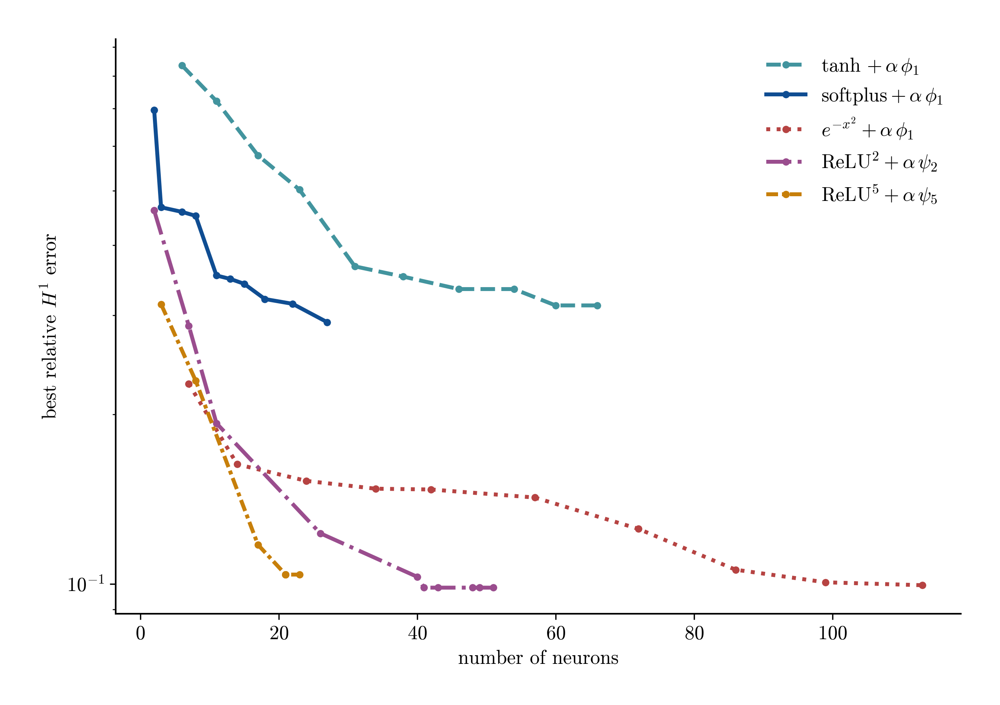
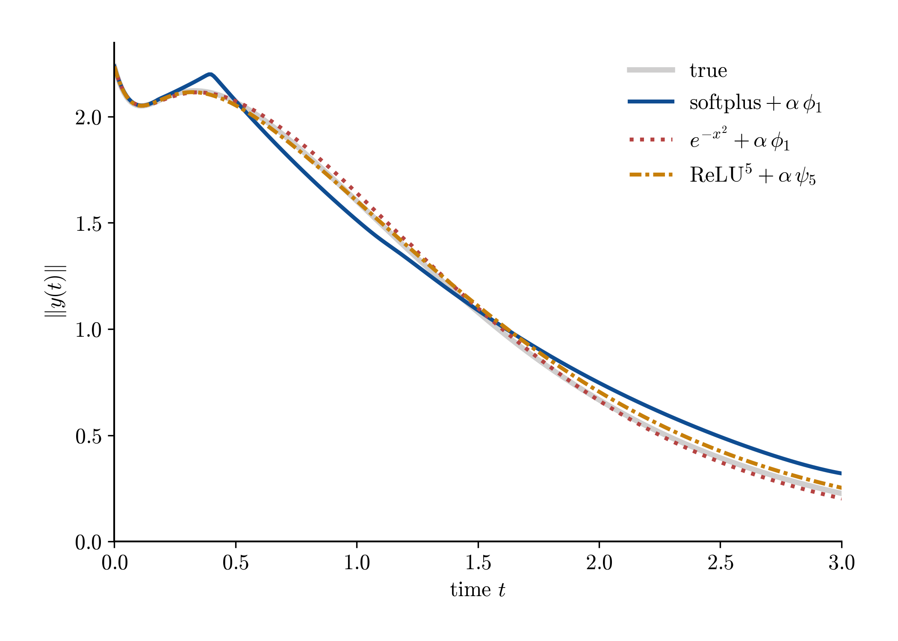
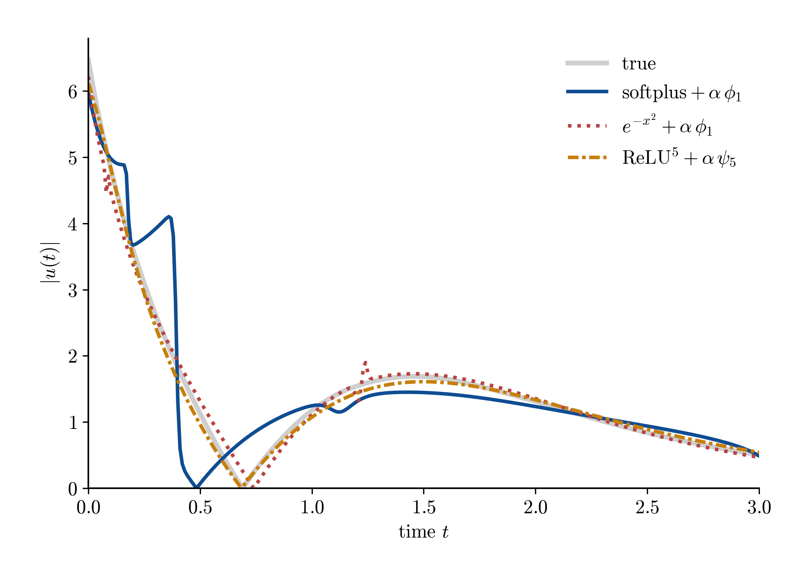
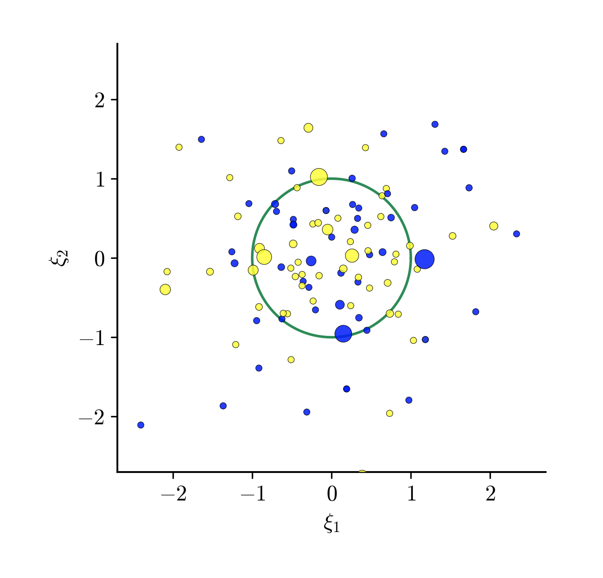
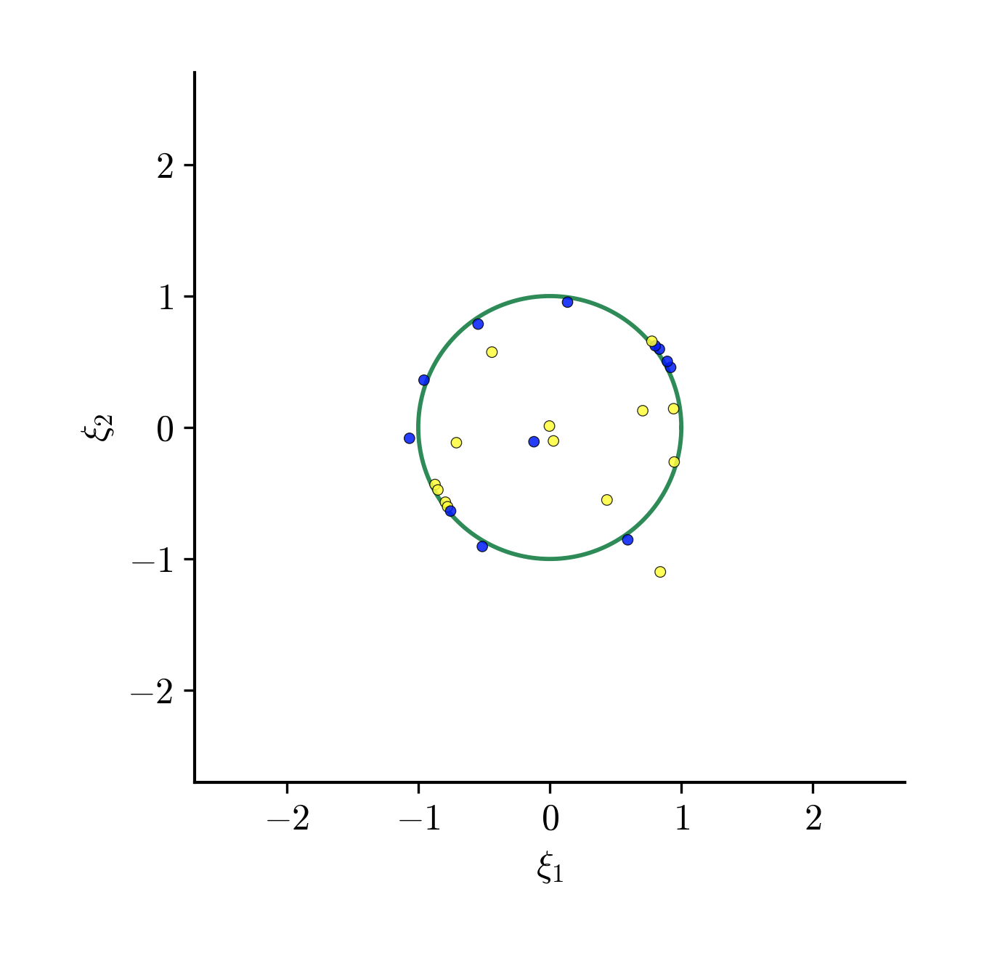
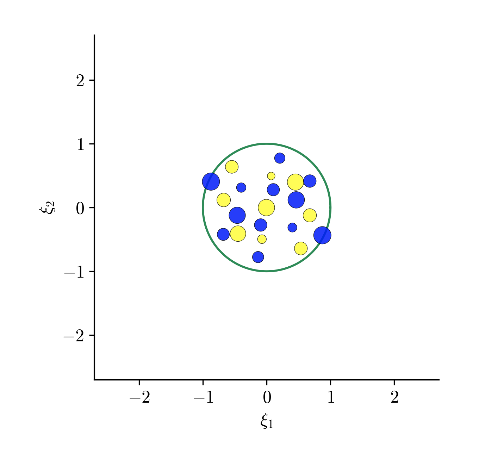
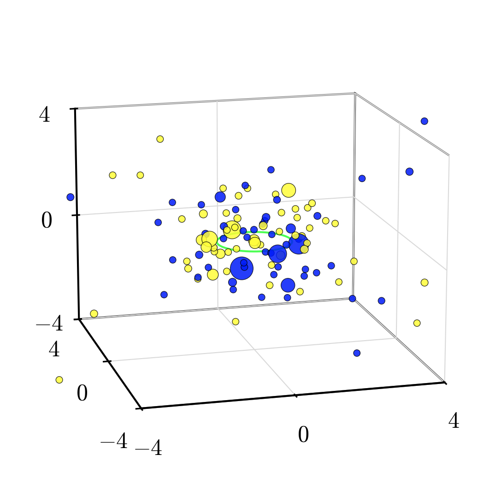
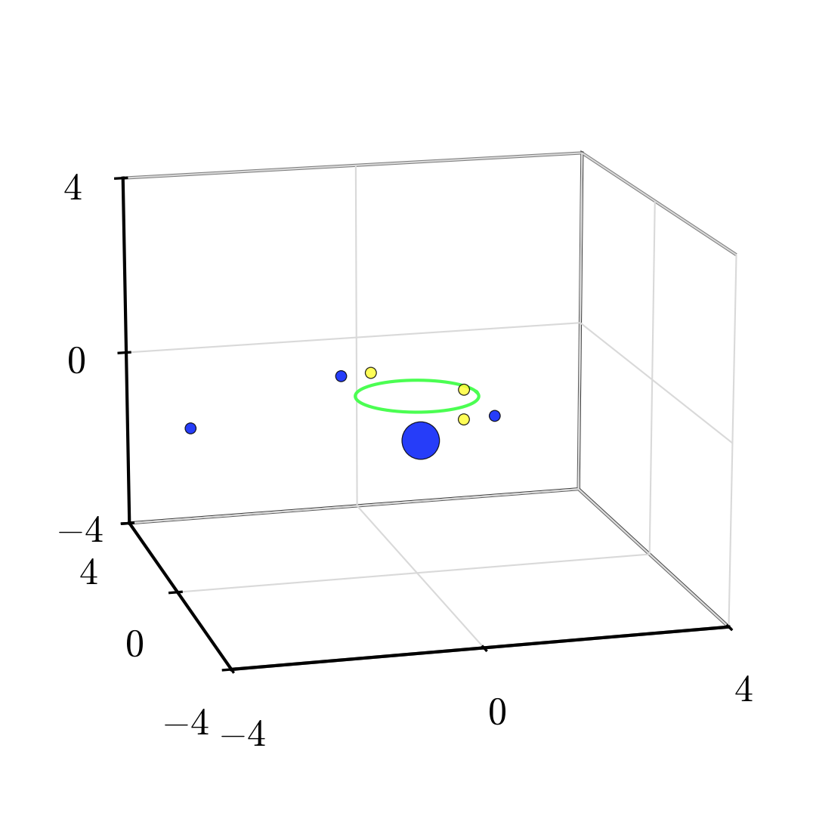
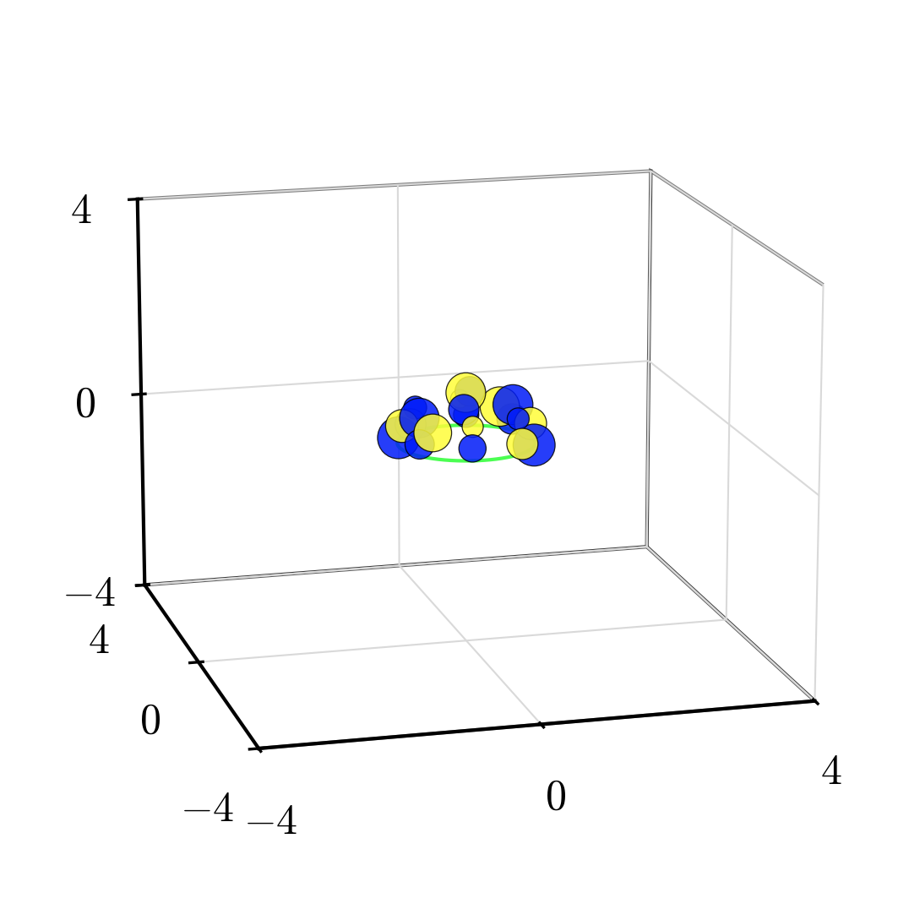

# VDP summary — Algorithm 1 vs Algorithm 2

Cross-experiment summary at the fixed operating point **α = 1e-5**. Algorithm 1 =
profile insertion + log penalty (**γ = 1**), activations tanh/softplus/gaussian
(from `../log_penalty`). Algorithm 2 = finite-step insertion + power penalty
(**γ = 0**), ReLU^2/ReLU^5 (from `../frac_exp_penalty`). Three figures, three claims.

Champion runs (lowest rel-H1 validation error at the fixed point)

| method | algorithm | neurons | rel H1 |
| ------ | --------- | ------- | ------ |
| tanh | Algo 1 (profile, γ=1) | 66 | 0.314 |
| softplus | Algo 1 (profile, γ=1) | 27 | 0.292 |
| gaussian | Algo 1 (profile, γ=1) | 113 | 0.099 |
| ReLU^2 | Algo 2 (finite-step, γ=0) | 41 | 0.098 |
| ReLU^5 | Algo 2 (finite-step, γ=0) | 21 | 0.104 |

## Frontier — sparsity at equal accuracy

Each curve is a champion's insertion growth trajectory (neurons vs cumulative-min
rel-H1). **Algorithm 2 (ReLU^k) reaches the best gradient accuracy (rel H1 ≈ 0.10)
with ~20 neurons**, where the best Algorithm-1 activation (gaussian) needs ~113 for
the same accuracy; softplus/tanh plateau higher. Equal accuracy, a fraction of the
atoms.

## Feedback — both algorithms stabilize

| ‖y(t)‖ | \|u(t)\| |
| --- | --- |
|  |  |

Closed-loop rollout from y₀=(2, 1) under the synthesized feedback û(x) =
−∂_{x₂}V̂/(2β), beside the true control.

| controller | neurons | stabilizes? | closed-loop cost |
| ---------- | ------- | ----------- | ---------------- |
| true | — | yes | 6.48 |
| softplus | 27 | yes | 6.68 |
| gaussian | 113 | yes | 6.51 |
| relu5 | 21 | yes | 6.49 |

Every controller drives ‖y(t)‖ to the origin at ≈ the true optimal cost — sparsity,
not control viability, is what separates the algorithms on this smooth problem.

## Weights — a structural portrait (keep one variant)

The learned atoms differ structurally: Algorithm 2 constrains them to the unit
sphere S², Algorithm 1 does not (gaussian spans a huge norm range). This is a
*portrait*, not the cause of the accuracy/sparsity gap — that mechanism (σ′
diversity, the penalty) is in the previous section. Dot color = sign of the outer
weight, size ∝ |outer weight|.

**Variant A — stereographic projection of S²** (atoms radially projected onto the
sphere; green circle = equator):

| gaussian (φ_log, γ=1) | softplus (φ_log, γ=1) | ReLU^5 (|c|^q, q=1/3) |
| --- | --- | --- |
|  |  |  |

**Variant B — raw (a₁, a₂, b) with unit-sphere wireframe** (ReLU on the sphere,
Algo-1 scattered off it):

| gaussian (φ_log, γ=1) | softplus (φ_log, γ=1) | ReLU^5 (|c|^q, q=1/3) |
| --- | --- | --- |
|  |  |  |
