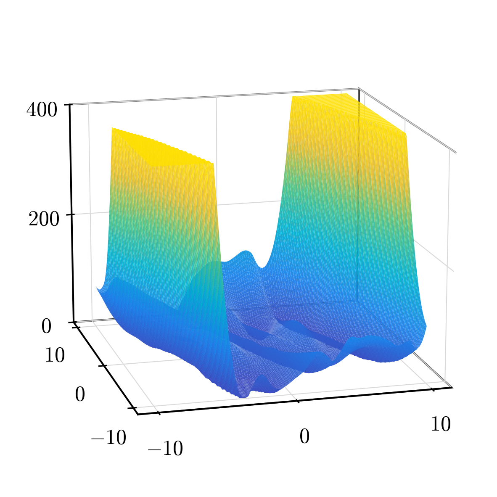
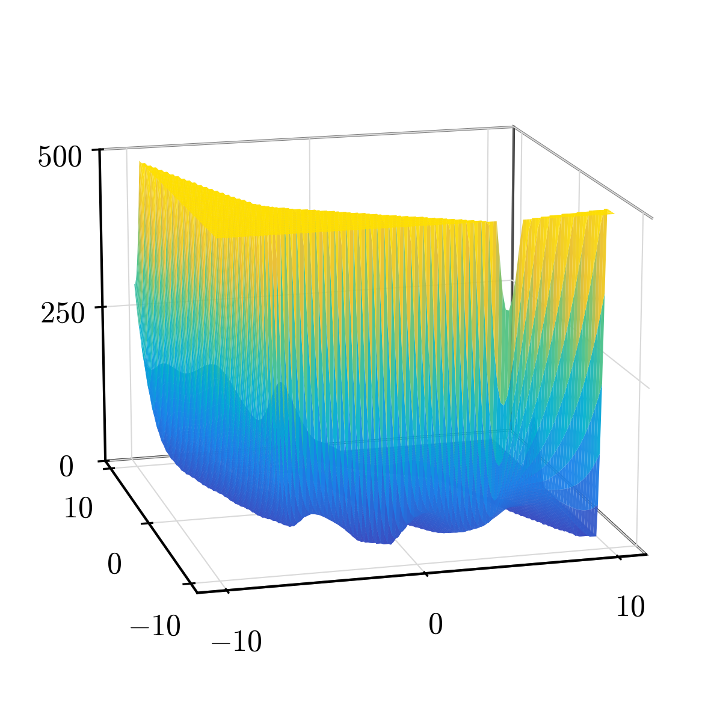
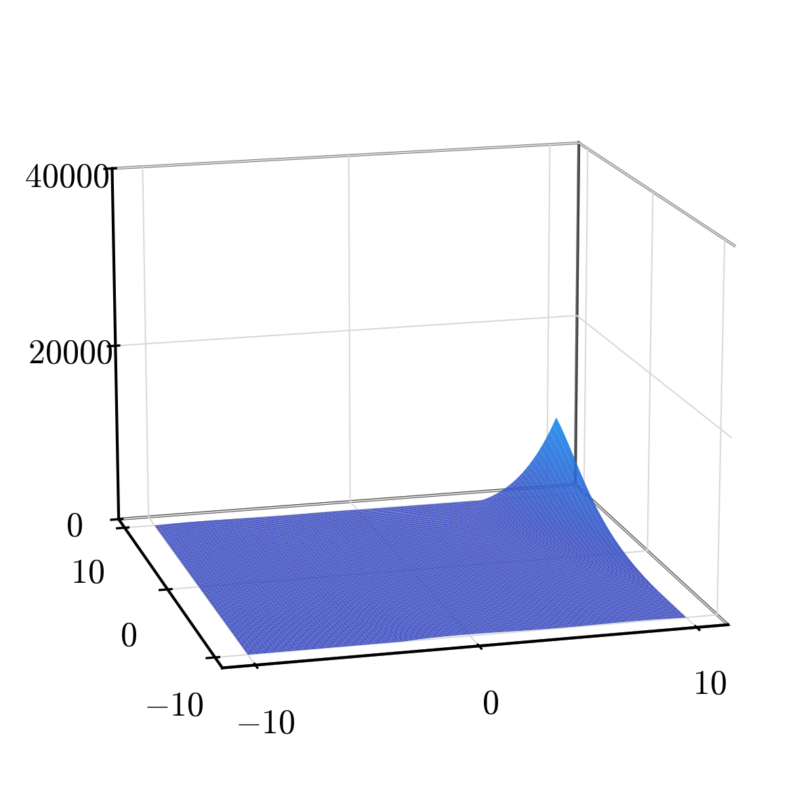
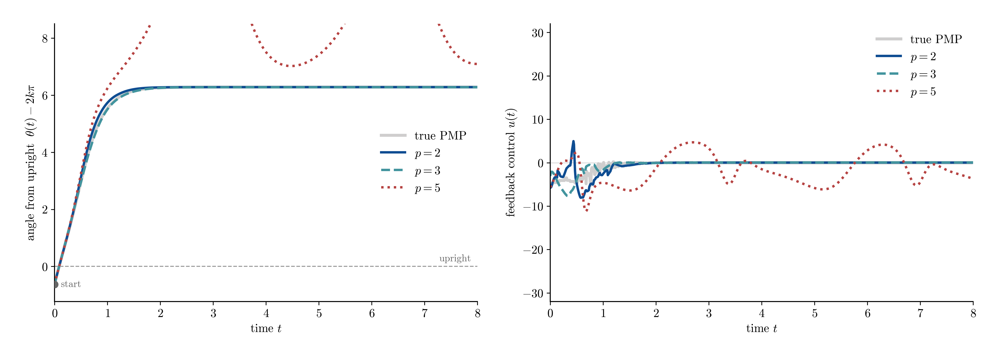
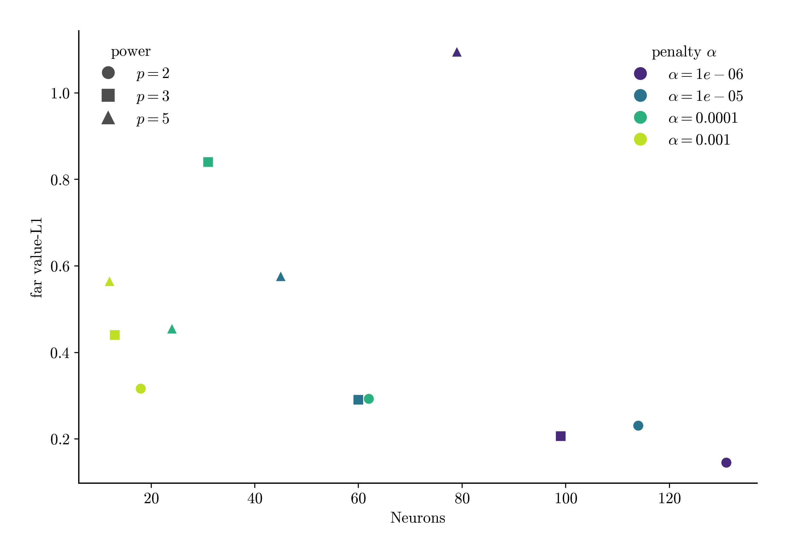

# penaltypowers — pendulum (switching set)

How the **power** of the atom `σ(z)^p` — equivalently the nonconvex penalty exponent
`q = 2/(p+1)` — behaves on a value function with a **gradient jump across the
switching set** (pendulum swing-up). Method and sweep axes are in `README.md`;
this file reports the findings, with ReLU at powers {2, 3, 5} as
representatives. This is the switching-set counterpart of `../../01_vdp/frac_exp_penalty`:
there higher power was free sparsity; **here it is the opposite** — the reversal is the point.

## Key finding

The coefficient penalty is `α·Σ |c|^q`, `q = 2/(power+1)`: higher power ⇒ smaller
`q` ⇒ more aggressive nonconvex pruning. On a smooth target that was free, but a
switching-set value function needs **more, lower-degree** atoms to seat the gradient
discontinuity — so raising the power both over-smooths each atom and over-prunes,
and the fit degrades sharply. On the current **two-sided** data (the pad/collar band
puts the gradient jump in-sample) the reversal is starker than on the earlier
one-sided basin: the band dominates the H1 objective, and only low-power atoms can
spend that error mass usefully.

### Penalty & atom shape

Left: the atom `σ(z)=ReLU(z)^p` sharpens with `p`. Right: the penalty `φ(c)=|c|^q`
grows more concave as `q=2/(p+1)` shrinks. The mildest nonconvex penalty, `p=2`
(`q=0.67`, the ReLU² atom), is the sweet spot here.

### Fitted value surfaces

The learned `V̂(x)` of the best ReLU fit at each power (shared `plot_model_value_surface`
renderer, z **unclipped**). The reconstruction degrades visibly as the power rises: the
multi-well landscape and its switching walls are shaped at `p=2`, but a high-power atom
`σ(z)^p` extrapolates as a degree-`p` polynomial off the data, so by `p=5` the surface
is dominated by a ~10⁴ off-support spike and the true value range (≲65) is squashed
flat — itself a picture of why high power over-fits the boundary and loses the interior.

| ReLU $p=2$ · 131 neurons · far Lv=0.14 | ReLU $p=3$ · 99 neurons · far Lv=0.21 | ReLU $p=5$ · 24 neurons · far Lv=0.46 |
| --- | --- | --- |
|  |  |  |

### Best metrics

Best ReLU^p H1 fit per power (rel H1 + region-split absolute L1)

| power | q=2/(p+1) | α     | neurons | rel H1 | near Lv | far Lv | near Lg | far Lg |
| ----- | --------- | ----- | ------- | ------ | ------- | ------ | ------- | ------ |
| 2     | 0.67      | 1e-06 | 131     | 0.309  | 0.511   | 0.145  | 0.937   | 0.110  |
| 3     | 0.50      | 1e-06 | 99      | 0.428  | 0.712   | 0.207  | 1.420   | 0.182  |
| 5     | 0.33      | 1e-04 | 24      | 0.617  | 1.571   | 0.455  | 2.327   | 0.497  |

`rel H1` is the global relative H1 loss (total value+gradient); `near`/`far` are the
region-split **mean per-sample absolute L1** (`near` = lowest-10% distance to the
switching set, `far` = the smooth rest — absolute, so robust to the V→0 upright
interior). The reversal: **power 2 (ReLU², `q=0.67`) is best on every representative
column** — total H1, both value bands, and both gradient bands worsen as the power
is raised to `p=3` and `p=5`. The `near` columns are the harder
switching-set band and stay above `far` throughout. The aggressive nonconvex penalty
that was free on smooth VDP is *harmful* here, because the kinked target cannot be
tiled by a few high-power atoms.

### Synthesized control vs true feedback

The pendulum is control-affine with cost `r·u²`, so the value induces the **feedback
law** `u(x) = −(1/(2r·ml²)) ∂_θ̇ V(x)` (Han & Yang Eq. 15,
`PendulumSwingUpProblem.feedback_from_gradient`). We synthesize û from each fitted ReLU^p
`V̂` and roll it out in the true dynamics, beside the true PMP feedback. **Start.** The
samples cover the upright basin plus the two-sided switching band (`θ̇∈[−7.7,7.7]`,
`V≲65`); the hanging configuration `θ=π` itself remains at the edge of support (band
samples sit on the switching spiral around it, not at it), so we start from the
**deepest supported state** (the highest cost-to-go sample, here
`x0≈[-6.91, 7.68]`, a fast-moving edge-of-basin state) and drive to the
nearest upright copy. Left is the angle from upright `θ(t)−2kπ`; right is the feedback
law `u(t)`.

Stabilize to upright from deepest supported start x0=[-6.91, 7.68], T=8

| controller | neurons | reaches upright? | closed-loop cost |
| ---------- | ------- | ---------------- | ---------------- |
| true PMP   | —       | yes              | 57.6             |
| ReLU p=2   | 131     | yes              | 68.6             |
| ReLU p=3   | 99      | yes              | 60.6             |
| ReLU p=5   | 24      | no               | 247.7            |

At `t=0` all four controllers sit at the same supported state, and their controls
**agree in sign and rough magnitude** — the feedback law is synthesized correctly (an
off-data hanging start, by contrast, gives sign-flipped garbage because no sample
constrains `∇V̂` there). The closed loop now amplifies the accuracy gap (true PMP 57.6; power 2 68.6; power 3 60.6; power 5 247.7):
**powers 2 and 3 track the true swing to the 2π upright almost exactly, while power 5
overshoots and never settles** — its oscillating control keeps the pendulum orbiting
past the upright, the closed-loop face of the same off-support polynomial growth seen
in its value surface. On the two-sided data the high-power controller failure is back
(it had vanished in the one-sided interlude, where the smooth interior dominated the
objective). (Caveats: a single initial condition, and closed-loop outcomes are
sensitive to the start because `∇V̂` is pinned only near the data. The robust,
data-level statement is the accuracy reversal itself: **higher power degrades the
fit**, far Lv rising from 0.14 at `p=2` to 0.46 at `p=5`.)

## Parameter discussion (power, α)

The **power** is the headline lever above; the penalty strength **α** only refines
within a power (the sweep fixes `γ=0`, so the penalty is the pure `α·Σ|c|^q`).

ReLU H1: effect of α at each power (best far Lv per cell)

| power | α     | neurons | far Lv | far Lg |
| ----- | ----- | ------- | ------ | ------ |
| 2     | 1e-06 | 131     | 0.145  | 0.110  |
| 2     | 1e-05 | 114     | 0.231  | 0.102  |
| 2     | 1e-04 | 62      | 0.293  | 0.131  |
| 2     | 1e-03 | 18      | 0.316  | 0.460  |
| 3     | 1e-06 | 99      | 0.207  | 0.182  |
| 3     | 1e-05 | 60      | 0.290  | 0.173  |
| 3     | 1e-04 | 31      | 0.840  | 0.349  |
| 3     | 1e-03 | 13      | 0.440  | 0.538  |
| 5     | 1e-06 | 79      | 1.095  | 0.373  |
| 5     | 1e-05 | 45      | 0.576  | 0.470  |
| 5     | 1e-04 | 24      | 0.455  | 0.497  |
| 5     | 1e-03 | 12      | 0.565  | 0.588  |

The scatter places every signed ReLU-H1 run on the neurons-vs-(far value-L1) plane
(marker = power, colour = α): power 2 occupies the accurate region; higher powers sit
at larger error regardless of α. α moves a model along its frontier, but the power
sets which frontier — and at a switching set, low power wins.

## Full result

Region-split **mean per-sample L1**, normalized by the global mean ‖true‖. `far` =
smooth region, `near/far` = how many times worse the switching set is. Best α per
power by far value-L1 (ReLU, `γ=0`).

### H1 (gradient-augmented) loss

Pendulum H1 fit — best far value-L1 per power (α swept)

| power | α     | neurons | far Lv | near/far V | far Lg | near/far G |
| ----- | ----- | ------- | ------ | ---------- | ------ | ---------- |
| 2     | 1e-06 | 131     | 0.145  | 3.53       | 0.110  | 8.53       |
| 2.01  | 1e-05 | 104     | 0.093  | 3.87       | 0.131  | 8.72       |
| 3     | 1e-06 | 99      | 0.207  | 3.44       | 0.182  | 7.80       |
| 4     | 1e-05 | 46      | 0.414  | 4.55       | 0.477  | 4.80       |
| 5     | 1e-04 | 24      | 0.455  | 3.45       | 0.497  | 4.69       |

### L2 (value-only) loss

Pendulum L2 fit — best far value-L1 per power (α swept)

| power | α     | neurons | far Lv | near/far V | far Lg | near/far G |
| ----- | ----- | ------- | ------ | ---------- | ------ | ---------- |
| 2     | 1e-06 | 48      | 0.211  | 4.03       | 0.827  | 2.73       |
| 2.01  | 1e-06 | 46      | 0.225  | 4.60       | 0.643  | 3.83       |
| 3     | 1e-06 | 27      | 0.258  | 4.42       | 0.661  | 3.78       |
| 4     | 1e-06 | 24      | 0.297  | 4.28       | 0.768  | 3.40       |
| 5     | 1e-06 | 31      | 0.327  | 4.15       | 0.805  | 3.08       |
