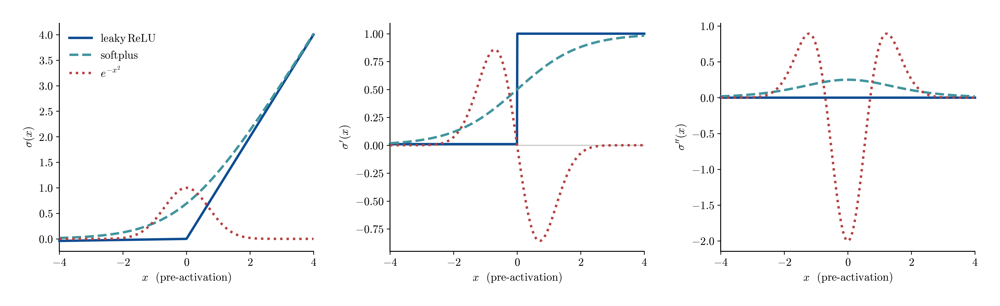
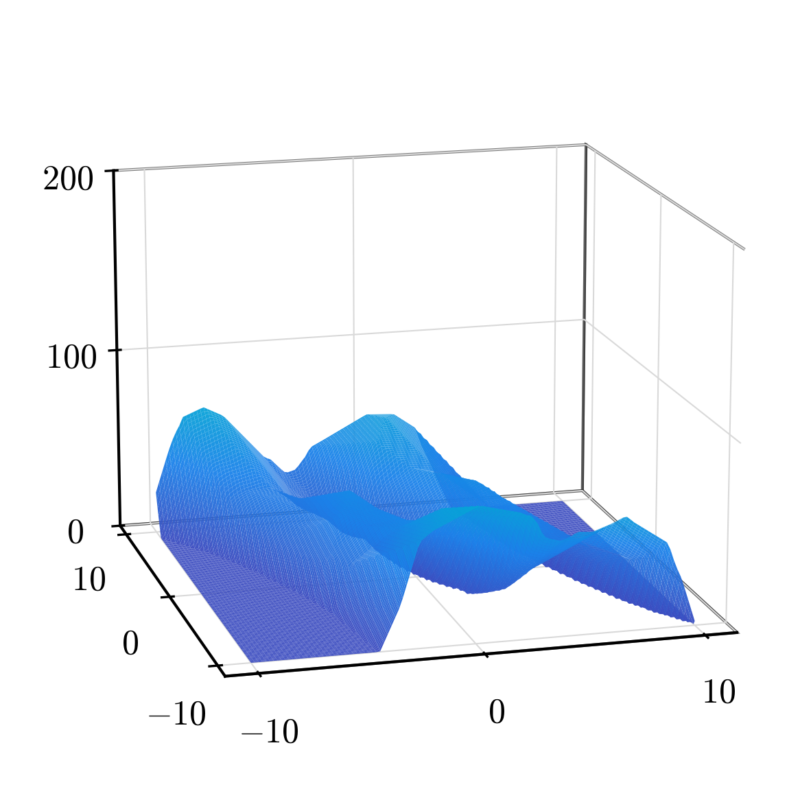
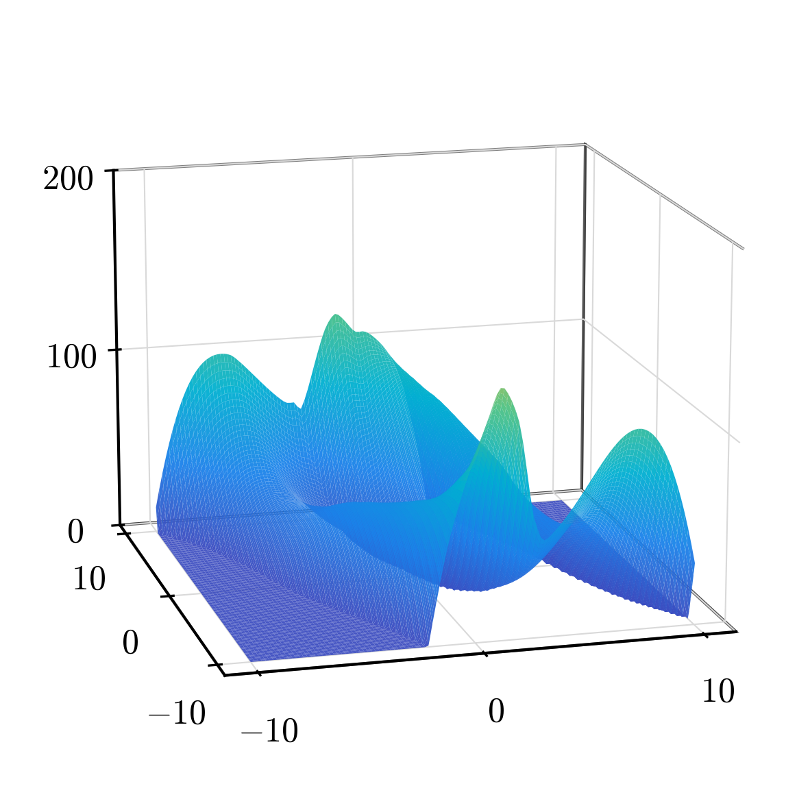
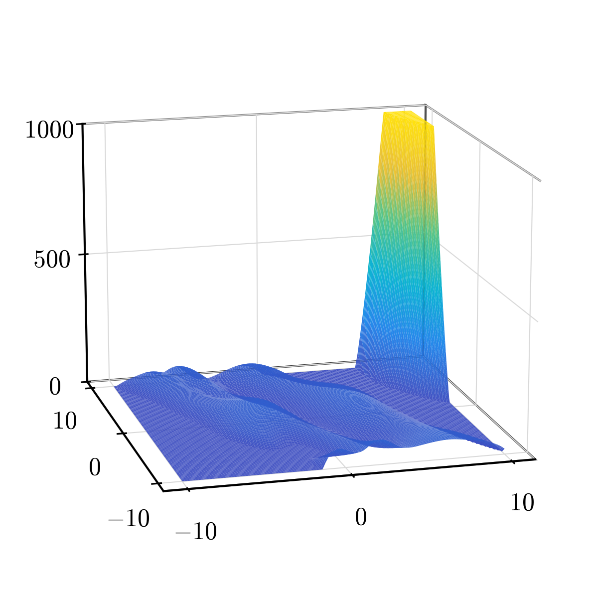
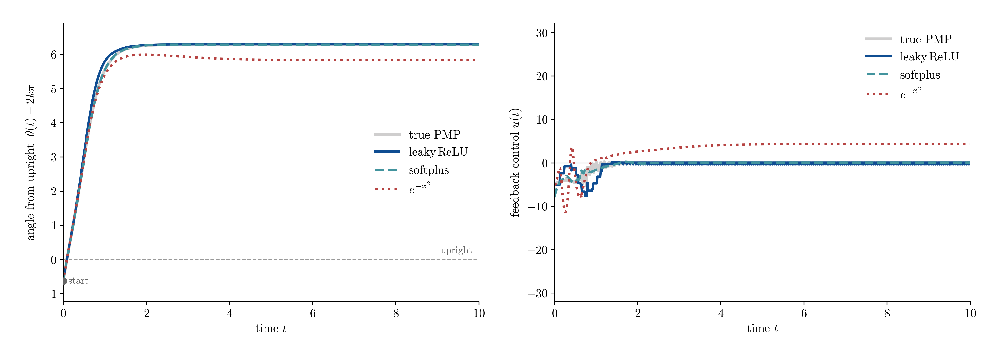
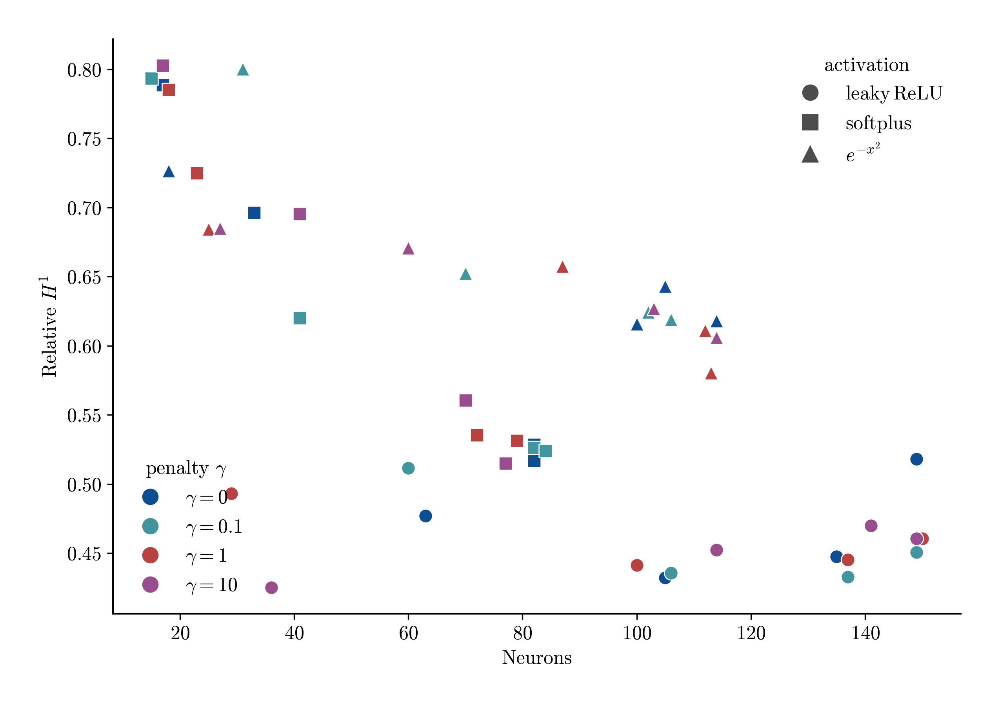

# activationsearch — pendulum (discontinuous gradient)

Which activations fit a value function whose gradient **jumps across a switching
set** (pendulum swing-up). Method, sweep axes, and the activation list are in
`README.md`; this file reports the findings. Three representatives span the
derivative-regularity ladder — `leaky_relu` (kink), `softplus` (smooth ridge),
`gaussian` (localized RBF) — all under the `signed` model (semiconcave models do
not round-trip through the saved result, issue #19; plain `relu` is the convex L1
baseline, not an H1 candidate — see `../../baseline`).

## Key finding

Under the gradient-augmented (H1) loss each neuron contributes σ to V and
**w·σ′ to ∇V**, so the activation *derivative* σ′ is the basis that reconstructs
the gradient field. On the **two-sided** data (3,900 samples: in-basin body +
an envelope-certified pad/collar band straddling the switching arms, so the
gradient jump is in-sample) the ranking flips back from the one-sided
interlude: the switching band dominates the unweighted H1 objective, so the
activation whose derivative can **break across a hyperplane** wins. That is
the **kink (`leaky_relu`)**, best on every error band and stable in closed
loop; the smooth ridge (`softplus`) is a surprising runner-up in both accuracy
and control; the localized RBF (`gaussian`) — the one-sided era's winner —
drops to mid-field and **fails in closed loop**.

### Activation shape

`leaky_relu′` is a step (slope `a`→`1` across its hyperplane — it can seat a finite
gradient jump, and unlike plain `relu` has no dead side); `softplus′` is a smooth
sigmoid (it can only smear a jump over width ≈ 1/β); the Gaussian derivative is a
sign-changing bump (localized, non-monotone). With the switching band in-sample
the step derivative is the right basis where the error mass sits; the localized
bump must tile the jump at high neuron count and extrapolates worst beyond the
data.

### Fitted value surfaces

The learned value function V̂(x) of each representative, plotted as a surface over
the state plane (after Han & Yang Fig. 2 left; z unclipped — note the per-panel
scale). `leaky_relu` keeps a bounded multi-well relief; `softplus` shapes the
wells most visibly; `gaussian` is nearly flat over the data and erupts in a
~10³ off-support corner spike — the surface behind its closed-loop failure.

| $\mathrm{leaky\,ReLU}$ · 36 neurons · rel $H^1$=0.43 | $\mathrm{softplus}$ · 77 neurons · rel $H^1$=0.51 | $e^{-x^2}$ · 113 neurons · rel $H^1$=0.58 |
| --- | --- | --- |
|  |  |  |

### Best metrics

Best signed H1 fit per representative

| activation | neurons | rel H1 | far Lv | far Lg |
| ---------- | ------- | ------ | ------ | ------ |
| leaky_relu | 36      | 0.425  | 0.298  | 0.290  |
| softplus   | 77      | 0.515  | 0.217  | 0.259  |
| gaussian   | 113     | 0.580  | 0.490  | 0.420  |

These are the runs shown in the surface and control panels (the lowest-rel-H1
signed fit per activation). `rel H1` is the relative H1 error on the validation
split; `far Lv`/`far Lg` are the absolute far-field value/gradient L1 (the robust
metric the rest of the doc uses). On the two-sided data the two metrics agree
on the ranking:

- **`leaky_relu` is best on every column** — lowest rel H1 (0.425 at only 36
  neurons), lowest far gradient L1, and in the full table below its far value
  L1 (0.115 at α=1e-3) is roughly half the best smooth activation's. Its step
  derivative seats the in-sample jump instead of averaging across it.
- **`softplus` is the runner-up** (rel H1 0.515, far Lv 0.221) — a reversal of
  its one-sided-era collapse: with large-|V| band samples anchoring both sides
  of the arms, its monotone ridge shapes the wells competently (see the panel).
- **`gaussian` drops to mid-field** (rel H1 0.580, far Lv 0.282 at its best
  cell): the one-sided era's winner tiled a smooth interior; forced to spend
  bumps on an unfittable jump it loses everywhere, and off-support its surface
  erupts (panel above).

### Synthesized control vs true feedback

The pendulum is control-affine with cost `r·u²`, so a value function induces the
feedback `u(x) = −(1/(2r·ml²)) ∂_θ̇ V(x)` (`PendulumSwingUpProblem.feedback_from_gradient`).
We synthesize û from each fitted V̂ and **roll it out in the true dynamics** from the
deepest *supported* state (the hanging configuration θ=π itself remains at the edge
of support — the band samples sit on the switching spiral around it, not at it — so
we start from the highest cost-to-go sample and drive to the nearest upright copy),
beside the true PMP feedback (nearest-neighbour interpolated from the dataset's
costate samples) — the closed-loop test of Han & Yang Fig. 3: does the induced
controller reach upright, and at what cost.

Stabilize to upright from deepest supported start x0=[-6.91, 7.68], T=10

| controller | neurons | reaches upright? | closed-loop cost |
| ---------- | ------- | ---------------- | ---------------- |
| true PMP   | —       | yes              | 57.6             |
| leaky_relu | 36      | yes              | 69.5             |
| softplus   | 77      | yes              | 57.9             |
| gaussian   | 113     | no               | 208.5            |

Left is the angle from upright θ(t)−2kπ; right is the feedback law u(t); cost is the
accumulated running cost. From a supported start the closed loop **agrees with the
accuracy ranking**:

- **`softplus` ≈ true PMP** — it reaches upright at cost 57.9, essentially matching
  the true feedback (57.6): its smooth low-error field is benign along the whole
  swing corridor.
- **`leaky_relu` reaches upright** at a modestly higher cost (69.5) — its
  piecewise-linear extrapolation stays bounded and sign-correct.
- **`gaussian` fails** (cost 208.5): it swings up but settles ≈ 0.4 rad short of
  upright with a persistent u ≈ +4 bias — the residual field of its off-support
  spike. The one-sided era's best controller is now the only failing one.

So on the two-sided data the kink atom wins on-data accuracy and stays reliable
in closed loop, while the RBF's advantage — economically tiling a smooth
interior — is gone once the objective is dominated by a jump it cannot seat.
The closed loop punishes global field quality, and gaussian's is now the worst
of the three.

## Parameter discussion (α, γ)

The nonconvex penalty `α·Σ φ(|c|)` has two knobs: **α** scales the penalty (the
sparsity lever) and **γ** controls the log-term nonconvexity (γ=0 turns it off;
larger γ prunes redundant clustered atoms). The tables take the three signed reps.

Effect of alpha (best gamma per alpha), signed H1

| activation | alpha  | gamma | neurons | rel H1 |
| ---------- | ------ | ----- | ------- | ------ |
| leaky_relu | 1e-05  | 0.1   | 149     | 0.451  |
| leaky_relu | 0.0001 | 0.1   | 137     | 0.433  |
| leaky_relu | 0.001  | 0     | 105     | 0.432  |
| leaky_relu | 0.01   | 10    | 36      | 0.425  |
| softplus   | 1e-05  | 10    | 77      | 0.515  |
| softplus   | 0.0001 | 0.1   | 82      | 0.526  |
| softplus   | 0.001  | 0.1   | 41      | 0.620  |
| softplus   | 0.01   | 1     | 18      | 0.785  |
| gaussian   | 1e-05  | 10    | 114     | 0.606  |
| gaussian   | 0.0001 | 1     | 113     | 0.580  |
| gaussian   | 0.001  | 0     | 100     | 0.616  |
| gaussian   | 0.01   | 1     | 25      | 0.684  |

**α is the dominant sparsity lever**: raising it from 1e-5 to 1e-2 cuts the neuron
count sharply (leaky_relu 149→36, gaussian 114→25). What that pruning costs depends on
the activation, and the dependence is itself a finding:

- `leaky_relu` is **essentially free to prune** — rel H1 stays 0.425–0.451 from
  149 neurons all the way down to 36 (its best cell is the *sparsest* one). A
  kink atom carries irreducible structure, so few are needed; on the two-sided
  target this sparse-robustness compounds its accuracy lead.
- `gaussian` degrades under pruning (0.580 at 113 neurons → 0.684 at 25): its
  fit is bought by tiling with many localized bumps.
- `softplus` degrades the fastest (0.515 at 77 neurons → 0.785 at 18) — the
  ridge needs width to shape the wells.

Effect of gamma (best alpha per gamma), signed H1

| activation | gamma | alpha  | neurons | rel H1 |
| ---------- | ----- | ------ | ------- | ------ |
| leaky_relu | 0     | 0.001  | 105     | 0.432  |
| leaky_relu | 0.1   | 0.0001 | 137     | 0.433  |
| leaky_relu | 1     | 0.001  | 100     | 0.441  |
| leaky_relu | 10    | 0.01   | 36      | 0.425  |
| softplus   | 0     | 1e-05  | 82      | 0.517  |
| softplus   | 0.1   | 1e-05  | 84      | 0.524  |
| softplus   | 1     | 1e-05  | 79      | 0.531  |
| softplus   | 10    | 1e-05  | 77      | 0.515  |
| gaussian   | 0     | 0.001  | 100     | 0.616  |
| gaussian   | 0.1   | 1e-05  | 106     | 0.619  |
| gaussian   | 1     | 0.0001 | 113     | 0.580  |
| gaussian   | 10    | 1e-05  | 114     | 0.606  |

**γ only refines**: the best γ improves `leaky_relu` marginally (0.425 at γ=10 vs
0.432 at γ=0) and `gaussian` slightly (0.580 at γ=1 vs 0.616 at γ=0); it does not
change the ranking.

The scatter places every signed-H1 run on the neurons-vs-accuracy plane (marker =
activation, colour = γ). `leaky_relu` is the low, flat band — best accuracy *and*
it survives the whole sparsity range; `gaussian` and `softplus` sit higher and
rise as they are pruned. The penalty moves a model *along* its frontier, but
where that frontier sits — and whether accuracy survives sparsity — is set by
the activation.

## Full result

Region-split **mean per-sample L1**, normalized by the global mean ‖true‖ — robust
to the V→0 interior. `far` = smooth region, `near` = 10% closest to the switching
set, `near/far` = how much worse the fit is at the switching set. Best (α, γ) per
(model, activation) by far value-L1; ranked best-first; both model kinds, all seven
activations.

### H1 (gradient-augmented) loss

Pendulum H1 fit — best far value-L1 per model/activation

| kind        | activation   | gamma | alpha  | neurons | far Lv  | near Lv | near/far V | far Lg | near/far G |
| ----------- | ------------ | ----- | ------ | ------- | ------- | ------- | ---------- | ------ | ---------- |
| signed      | leaky_relu   | 0     | 0.001  | 105     | 0.114   | 0.524   | 4.60       | 0.294  | 4.98       |
| signed      | softplus     | 10    | 1e-05  | 77      | 0.217   | 1.181   | 5.43       | 0.259  | 7.18       |
| signed      | gausscent_1  | 0.1   | 1e-05  | 123     | 0.259   | 1.746   | 6.74       | 0.477  | 4.89       |
| signed      | gaussian     | 0     | 1e-05  | 114     | 0.272   | 1.794   | 6.60       | 0.474  | 4.97       |
| signed      | tanh         | 1     | 0.0001 | 99      | 0.294   | 1.385   | 4.70       | 0.436  | 4.92       |
| signed      | matern52     | 0.1   | 0.0001 | 129     | 0.363   | 1.755   | 4.84       | 0.274  | 5.97       |
| signed      | gelu_squared | 0.1   | 0.0001 | 30      | 0.469   | 2.428   | 5.18       | 0.566  | 4.47       |
| semiconcave | softplus     | 10    | 0.01   | 4       | 7.837   | 9.517   | 1.21       | 1.442  | 3.23       |
| semiconcave | tanh         | 0.1   | 0.01   | 15      | 8.867   | 14.000  | 1.58       | 1.264  | 3.99       |
| semiconcave | gaussian     | 0.1   | 0.01   | 15      | 19.599  | 16.067  | 0.82       | 2.100  | 2.29       |
| semiconcave | matern52     | 1     | 0.01   | 13      | 26.532  | 22.619  | 0.85       | 1.778  | 2.89       |
| semiconcave | gausscent_1  | 0.1   | 0.01   | 7       | 28.923  | 27.691  | 0.96       | 1.307  | 3.93       |
| semiconcave | leaky_relu   | 1     | 0.01   | 19      | 33.658  | 36.572  | 1.09       | 1.412  | 3.85       |
| semiconcave | gelu_squared | 0     | 1e-05  | 34      | 132.400 | 177.309 | 1.34       | 5.140  | 2.77       |

### L2 (value-only) loss

Pendulum L2 fit — best far value-L1 per model/activation

| kind        | activation   | gamma | alpha  | neurons | far Lv | near Lv | near/far V | far Lg | near/far G |
| ----------- | ------------ | ----- | ------ | ------- | ------ | ------- | ---------- | ------ | ---------- |
| signed      | leaky_relu   | 0.1   | 1e-05  | 123     | 0.166  | 0.595   | 3.58       | 0.981  | 2.15       |
| signed      | gaussian     | 10    | 1e-05  | 124     | 0.300  | 1.236   | 4.12       | 0.762  | 3.52       |
| signed      | matern52     | 10    | 1e-05  | 81      | 0.304  | 1.232   | 4.06       | 0.662  | 4.04       |
| signed      | gausscent_1  | 1     | 1e-05  | 82      | 0.309  | 1.217   | 3.93       | 0.631  | 4.00       |
| signed      | gelu_squared | 10    | 1e-05  | 62      | 0.338  | 1.339   | 3.96       | 0.623  | 3.93       |
| signed      | tanh         | 10    | 1e-05  | 96      | 0.379  | 1.498   | 3.96       | 0.635  | 4.68       |
| signed      | softplus     | 10    | 1e-05  | 39      | 0.780  | 2.106   | 2.70       | 0.772  | 4.68       |
| semiconcave | leaky_relu   | 0     | 0.001  | 2       | 0.802  | 3.671   | 4.58       | 0.769  | 4.63       |
| semiconcave | gelu_squared | 0     | 0.001  | 2       | 0.917  | 2.780   | 3.03       | 0.780  | 4.75       |
| semiconcave | gausscent_1  | 0     | 0.0001 | 5       | 4.575  | 2.954   | 0.65       | 0.774  | 4.75       |
| semiconcave | tanh         | 0     | 0.0001 | 4       | 9.102  | 5.024   | 0.55       | 0.857  | 4.15       |
| semiconcave | gaussian     | 0     | 0.0001 | 27      | 13.693 | 8.778   | 0.64       | 0.788  | 4.47       |
| semiconcave | matern52     | 10    | 0.0001 | 14      | 19.019 | 14.071  | 0.74       | 0.796  | 4.43       |
