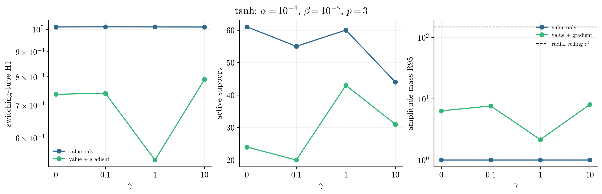
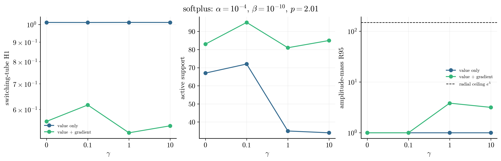
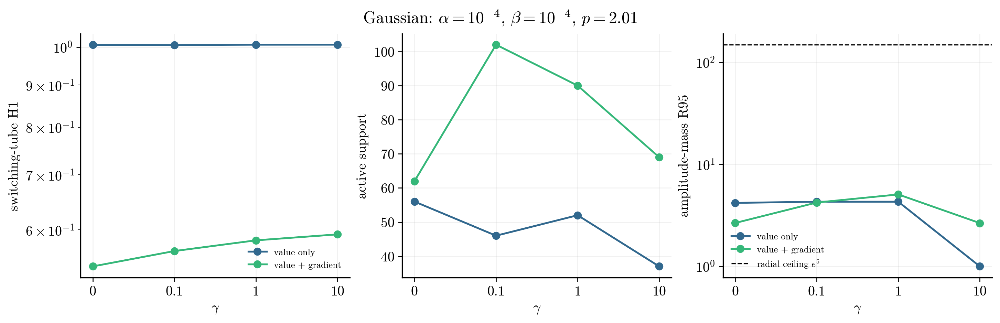
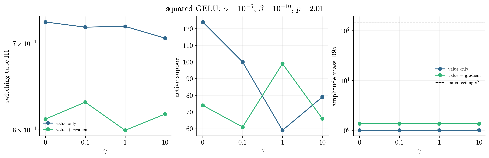
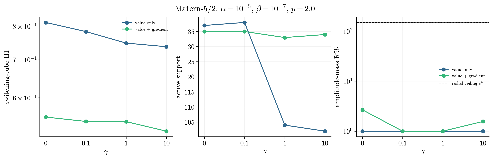

# Pendulum gamma and loss-channel follow-up

**Status: complete.** 35 new seed-42 records vary gamma and the loss channels at five preselected interior positive-beta configurations. Five existing gamma=1 H1 records are reused.

## Headline

The lowest switching-tube H1 away from the radial search ceiling is 0.5217 for `softplus` with value + gradient loss and gamma=1; N=81 and R95=3.83.

## Follow-up observations

- Gradient augmentation wins at 5 of 5 selected activations. The best H1-trained error is 0.5217, compared with 0.7064 for the best value-only fit.
- The error-minimizing gamma values by activation are: tanh=1, softplus=1, gaussian=0, gelu_squared=1, matern52=10. Gamma is therefore retained as an independent hyperparameter rather than fixed universally.
- 0 new records place R95 at the radial search ceiling and are censored for selection.

## Best gamma/loss choice by activation

| activation | loss | gamma | error | N | R95 |
|---|---|---:|---:|---:|---:|
| tanh | value + gradient | 1 | 0.5404 | 43 | 2.15 |
| softplus | value + gradient | 1 | 0.5217 | 81 | 3.83 |
| gaussian | value + gradient | 0 | 0.5416 | 62 | 2.66 |
| gelu_squared | value + gradient | 1 | 0.5993 | 99 | 1.36 |
| matern52 | value + gradient | 10 | 0.5246 | 134 | 1.56 |

## Per-activation comparisons

### tanh

### softplus

### gaussian

### gelu_squared

### matern52

## New record manifest

| stage | activation | loss | gamma | error | N | R95 |
|---|---|---|---:|---:|---:|---:|
| followup/gaussian_l2 | gaussian | value only | 0 | 1.0074 | 56 | 4.19 |
| followup/gaussian_l2 | gaussian | value only | 0.1 | 1.0069 | 46 | 4.3 |
| followup/gaussian_l2 | gaussian | value only | 1 | 1.0078 | 52 | 4.3 |
| followup/gaussian_l2 | gaussian | value only | 10 | 1.0079 | 37 | 1 |
| followup/gaussian_h1 | gaussian | value + gradient | 0 | 0.5416 | 62 | 2.66 |
| followup/gaussian_h1 | gaussian | value + gradient | 0.1 | 0.5654 | 102 | 4.22 |
| followup/gaussian_h1 | gaussian | value + gradient | 10 | 0.5924 | 69 | 2.66 |
| followup/gelu_l2 | gelu_squared | value only | 0 | 0.7270 | 124 | 1 |
| followup/gelu_l2 | gelu_squared | value only | 0.1 | 0.7204 | 100 | 1 |
| followup/gelu_l2 | gelu_squared | value only | 1 | 0.7213 | 59 | 1 |
| followup/gelu_l2 | gelu_squared | value only | 10 | 0.7064 | 79 | 1 |
| followup/gelu_h1 | gelu_squared | value + gradient | 0 | 0.6115 | 74 | 1.36 |
| followup/gelu_h1 | gelu_squared | value + gradient | 0.1 | 0.6302 | 61 | 1.36 |
| followup/gelu_h1 | gelu_squared | value + gradient | 10 | 0.6169 | 66 | 1.36 |
| followup/matern_l2 | matern52 | value only | 0 | 0.8115 | 137 | 1 |
| followup/matern_l2 | matern52 | value only | 0.1 | 0.7822 | 138 | 1 |
| followup/matern_l2 | matern52 | value only | 1 | 0.7469 | 104 | 1 |
| followup/matern_l2 | matern52 | value only | 10 | 0.7363 | 102 | 1 |
| followup/matern_h1 | matern52 | value + gradient | 0 | 0.5552 | 135 | 2.67 |
| followup/matern_h1 | matern52 | value + gradient | 0.1 | 0.5455 | 135 | 1 |
| followup/matern_h1 | matern52 | value + gradient | 10 | 0.5246 | 134 | 1.56 |
| followup/softplus_l2 | softplus | value only | 0 | 1.0130 | 67 | 1 |
| followup/softplus_l2 | softplus | value only | 0.1 | 1.0128 | 72 | 1 |
| followup/softplus_l2 | softplus | value only | 1 | 1.0132 | 35 | 1 |
| followup/softplus_l2 | softplus | value only | 10 | 1.0130 | 34 | 1 |
| followup/softplus_h1 | softplus | value + gradient | 0 | 0.5588 | 83 | 1 |
| followup/softplus_h1 | softplus | value + gradient | 0.1 | 0.6167 | 95 | 1 |
| followup/softplus_h1 | softplus | value + gradient | 10 | 0.5441 | 85 | 3.16 |
| followup/tanh_l2 | tanh | value only | 0 | 1.0108 | 61 | 1 |
| followup/tanh_l2 | tanh | value only | 0.1 | 1.0116 | 55 | 1 |
| followup/tanh_l2 | tanh | value only | 1 | 1.0110 | 60 | 1 |
| followup/tanh_l2 | tanh | value only | 10 | 1.0106 | 44 | 1 |
| followup/tanh_h1 | tanh | value + gradient | 0 | 0.7363 | 24 | 6.33 |
| followup/tanh_h1 | tanh | value + gradient | 0.1 | 0.7398 | 20 | 7.6 |
| followup/tanh_h1 | tanh | value + gradient | 10 | 0.7897 | 31 | 8.03 |
