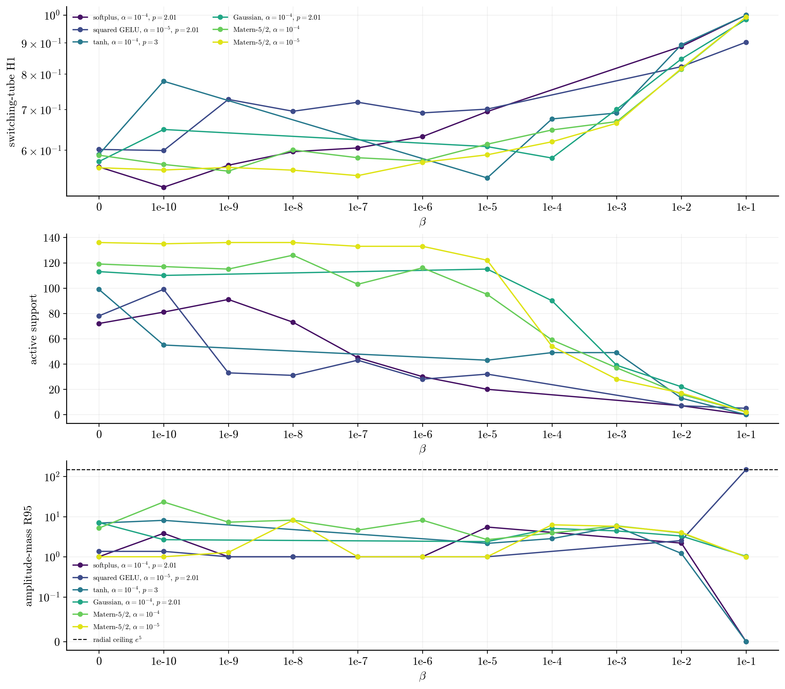

# Pendulum adaptive moment refinement

**Status: complete.** 34 new seed-42 records fill only the unresolved beta decades and add Matern-5/2. The 272 first-pass records remain unchanged.

## Headline

The lowest positive-beta switching-tube H1 away from the radial search ceiling is 0.5217 for `softplus` at alpha=1e-4, beta=1e-10, p=2.01, with N=81 and R95=3.83. Beta=0 remains a plotted reference, not a candidate for the modified narrow-convergence model.

## Best interior positive-beta cell by activation

| activation | p | alpha | beta | error | N | R95 |
|---|---:|---:|---:|---:|---:|---:|
| tanh | 3 | 1e-4 | 1e-5 | 0.5404 | 43 | 2.15 |
| softplus | 2.01 | 1e-4 | 1e-10 | 0.5217 | 81 | 3.83 |
| gaussian | 2.01 | 1e-4 | 1e-4 | 0.5826 | 90 | 5.07 |
| gelu_squared | 2.01 | 1e-5 | 1e-10 | 0.5993 | 99 | 1.36 |
| matern52 | 2.01 | 1e-5 | 1e-7 | 0.5451 | 133 | 1 |

## Best point on each selected beta slice

| activation | p | alpha | beta | error | N | R95 |
|---|---:|---:|---:|---:|---:|---:|
| softplus | 2.01 | 1e-4 | 1e-10 | 0.5217 | 81 | 3.83 |
| gelu_squared | 2.01 | 1e-5 | 1e-10 | 0.5993 | 99 | 1.36 |
| tanh | 3 | 1e-4 | 1e-5 | 0.5404 | 43 | 2.15 |
| gaussian | 2.01 | 1e-4 | 1e-4 | 0.5826 | 90 | 5.07 |
| matern52 | 2.01 | 1e-4 | 1e-9 | 0.5545 | 115 | 7.26 |
| matern52 | 2.01 | 1e-5 | 1e-7 | 0.5451 | 133 | 1 |

## Refined beta slices

The curves retain alpha and p fixed. Missing markers correspond to decades that the first pass did not identify as part of that row's transition.

0 of the new positive-beta records place R95 at the radial search ceiling and are censored for model selection.

## New record manifest

| stage | activation | p | alpha | beta | error | N | R95 |
|---|---|---:|---:|---:|---:|---:|---:|
| refine/gaussian_late | gaussian | 2.01 | 1e-4 | 1e-4 | 0.5826 | 90 | 5.07 |
| refine/gaussian_late | gaussian | 2.01 | 1e-4 | 1e-3 | 0.7004 | 39 | 4.39 |
| refine/gelu_early | gelu_squared | 2.01 | 1e-5 | 1e-9 | 0.7271 | 33 | 1 |
| refine/gelu_early | gelu_squared | 2.01 | 1e-5 | 1e-8 | 0.6953 | 31 | 1 |
| refine/gelu_early | gelu_squared | 2.01 | 1e-5 | 1e-7 | 0.7194 | 43 | 1 |
| refine/gelu_early | gelu_squared | 2.01 | 1e-5 | 1e-6 | 0.6910 | 28 | 1 |
| refine/matern_baseline | matern52 | — | 1e-5 | 0 | 0.5617 | 136 | 1 |
| refine/matern_positive | matern52 | 2.01 | 1e-5 | 1e-10 | 0.5568 | 135 | 1 |
| refine/matern_positive | matern52 | 2.01 | 1e-5 | 1e-9 | 0.5623 | 136 | 1.28 |
| refine/matern_positive | matern52 | 2.01 | 1e-5 | 1e-8 | 0.5565 | 136 | 8.15 |
| refine/matern_positive | matern52 | 2.01 | 1e-5 | 1e-7 | 0.5451 | 133 | 1 |
| refine/matern_positive | matern52 | 2.01 | 1e-5 | 1e-6 | 0.5732 | 133 | 1 |
| refine/matern_positive | matern52 | 2.01 | 1e-5 | 1e-5 | 0.5897 | 122 | 1 |
| refine/matern_positive | matern52 | 2.01 | 1e-5 | 1e-4 | 0.6195 | 54 | 6.24 |
| refine/matern_positive | matern52 | 2.01 | 1e-5 | 1e-3 | 0.6645 | 28 | 5.72 |
| refine/matern_positive | matern52 | 2.01 | 1e-5 | 1e-2 | 0.8175 | 17 | 4.03 |
| refine/matern_positive | matern52 | 2.01 | 1e-5 | 1e-1 | 0.9930 | 2 | 0.983 |
| refine/matern_baseline | matern52 | — | 1e-4 | 0 | 0.5889 | 119 | 5.16 |
| refine/matern_positive | matern52 | 2.01 | 1e-4 | 1e-10 | 0.5687 | 117 | 23.1 |
| refine/matern_positive | matern52 | 2.01 | 1e-4 | 1e-9 | 0.5545 | 115 | 7.26 |
| refine/matern_positive | matern52 | 2.01 | 1e-4 | 1e-8 | 0.6006 | 126 | 8.15 |
| refine/matern_positive | matern52 | 2.01 | 1e-4 | 1e-7 | 0.5833 | 103 | 4.61 |
| refine/matern_positive | matern52 | 2.01 | 1e-4 | 1e-6 | 0.5762 | 116 | 8.14 |
| refine/matern_positive | matern52 | 2.01 | 1e-4 | 1e-5 | 0.6139 | 95 | 2.66 |
| refine/matern_positive | matern52 | 2.01 | 1e-4 | 1e-4 | 0.6479 | 59 | 3.9 |
| refine/matern_positive | matern52 | 2.01 | 1e-4 | 1e-3 | 0.6686 | 37 | 5.89 |
| refine/matern_positive | matern52 | 2.01 | 1e-4 | 1e-2 | 0.8151 | 16 | 3.91 |
| refine/matern_positive | matern52 | 2.01 | 1e-4 | 1e-1 | 0.9930 | 2 | 0.983 |
| refine/softplus_early | softplus | 2.01 | 1e-4 | 1e-9 | 0.5670 | 91 | 1 |
| refine/softplus_early | softplus | 2.01 | 1e-4 | 1e-8 | 0.5967 | 73 | 1 |
| refine/softplus_early | softplus | 2.01 | 1e-4 | 1e-7 | 0.6054 | 45 | 1 |
| refine/softplus_early | softplus | 2.01 | 1e-4 | 1e-6 | 0.6318 | 30 | 1 |
| refine/tanh_late | tanh | 3 | 1e-4 | 1e-4 | 0.6754 | 49 | 2.83 |
| refine/tanh_late | tanh | 3 | 1e-4 | 1e-3 | 0.6907 | 49 | 5.59 |
