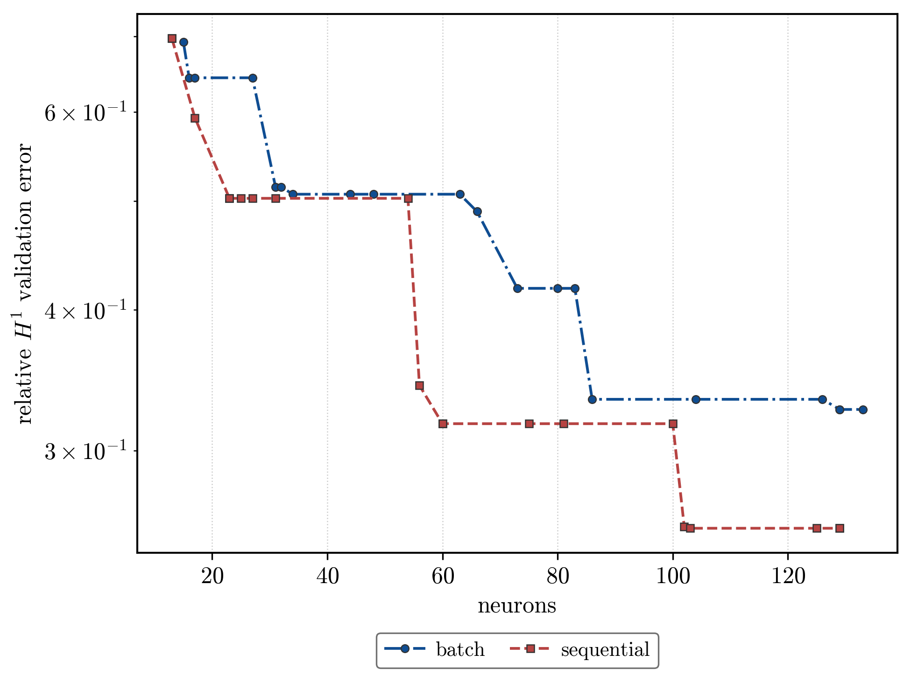

# Results — pendulum / paper_frac_exp_penalty

Generated by `analysis.py`. Scope, sweep axes and what differs from `../frac_exp_penalty` are in `README.md`.

## Key finding

- **batch**: sparsest good fit is `k (power)=3.0`, α=0.001, γ=0 — 16 neurons at relative H¹ 0.6432 (score 10.291). Most accurate fit is `k (power)=2.01`, α=1e-06, γ=0 — relative H¹ 0.3263 at 129 neurons.
- **sequential**: sparsest good fit is `k (power)=4.0`, α=0.001, γ=0 — 13 neurons at relative H¹ 0.6971 (score 9.062). Most accurate fit is `k (power)=2.01`, α=1e-05, γ=0 — relative H¹ 0.2558 at 103 neurons.

The score `H¹ × neurons` rewards very sparse fits, so it and the accuracy envelope pick different cells; both are reported rather than one standing in for the other.

*Running best relative H¹ validation error against neuron count, for the two insertion modes. Batch admits up to `N_ins = 15` atoms per outer iteration against one frozen residual; sequential admits one — the maximizer of `|P_p|` — and runs at `T_out = 150` for a matched neuron budget. All cells at seed 42.*

## Termination

The paper loop stops as soon as no candidate clears the insertion threshold; a run that stops early converged in the algorithm's own terms, one that reaches `T_out` was still finding candidates.

- **batch**: 30/40 cells terminated before `T_out = 10`; median 6 iterations, max 10.
- **sequential**: 36/40 cells terminated before `T_out = 150`; median 25.5 iterations, max 150.

## Versus `../frac_exp_penalty`

Relative errors are ratios of norms, so the metric itself is unaffected by the fidelity renormalization. The **α grid is not**: this study's `l^M` divides by `M` where the comparator's divides by `M·d`, so at equal α *label* a cell here carries `1/d` the effective regularization and therefore tends to buy more neurons. Comparing best-per-α across the two studies would read that head start as an improvement.

The comparison below is therefore made at a **matched neuron budget** — the best relative H¹ reachable with at most N neurons — which is free of both the α shift and any capacity difference.

| ≤ N neurons | ../frac_exp_penalty | paper batch | paper sequential |
| ----------- | ------------------- | ----------- | ---------------- |
| 10          | nan                 | nan         | nan              |
| 20          | 0.5820              | 0.6432      | 0.5926           |
| 40          | 0.5574              | 0.5068      | 0.5026           |
| 80          | 0.4045              | 0.4180      | 0.3169           |
| 120         | 0.3523              | 0.3331      | 0.2558           |
| 160         | 0.3091              | 0.3263      | 0.2558           |

Cell counts are asymmetric and favour the comparator: it draws on 20 H¹ cells against this study's 20 per mode, so it has more chances to find a good one.

### Best-per-variant envelope (α grids not comparable)

Retained for reference only. Each column is the best relative H¹ anywhere in that study's own α/γ grid, so the α shift described above applies and this table flatters the paper columns.

| k (power) | ../frac_exp_penalty | paper batch | paper sequential |
| --------- | ------------------- | ----------- | ---------------- |
| 2         | 0.3091              | 0.3347      | 0.2566           |
| 2.01      | 0.3334              | 0.3263      | 0.2558           |
| 3         | 0.4211              | 0.4703      | 0.3993           |
| 5         | 0.5445              | 0.5700      | 0.4922           |
| 4         | 0.5508              | 0.5223      | 0.4868           |

## Best cell per variant (H¹ loss)

| k (power) | batch N | batch H¹ | batch score | seq N | seq H¹ | seq score |
| --------- | ------- | -------- | ----------- | ----- | ------ | --------- |
| 3         | 16      | 0.6432   | 10.291      | 17    | 0.5926 | 10.074    |
| 4         | 15      | 0.6919   | 10.379      | 13    | 0.6971 | 9.062     |
| 5         | 17      | 0.6653   | 11.310      | 13    | 0.6976 | 9.069     |
| 2.01      | 31      | 0.5144   | 15.947      | 27    | 0.5277 | 14.248    |
| 2         | 34      | 0.5068   | 17.231      | 23    | 0.5026 | 11.559    |

## Full result (H¹ loss)

| k (power) | mode       | α      | γ | neurons | rel L² | rel H¹ | score  |
| --------- | ---------- | ------ | - | ------- | ------ | ------ | ------ |
| 2         | batch      | 1e-06  | 0 | 133     | 0.1640 | 0.3404 | 45.273 |
| 2         | batch      | 1e-05  | 0 | 129     | 0.1487 | 0.3347 | 43.172 |
| 2         | batch      | 0.0001 | 0 | 73      | 0.1678 | 0.4180 | 30.516 |
| 2         | batch      | 0.001  | 0 | 34      | 0.3638 | 0.5068 | 17.231 |
| 2         | sequential | 1e-06  | 0 | 125     | 0.1262 | 0.2628 | 32.845 |
| 2         | sequential | 1e-05  | 0 | 102     | 0.1126 | 0.2566 | 26.177 |
| 2         | sequential | 0.0001 | 0 | 56      | 0.1585 | 0.3427 | 19.193 |
| 2         | sequential | 0.001  | 0 | 23      | 0.5527 | 0.5026 | 11.559 |
| 2.01      | batch      | 1e-06  | 0 | 129     | 0.1655 | 0.3263 | 42.088 |
| 2.01      | batch      | 1e-05  | 0 | 126     | 0.1764 | 0.3456 | 43.550 |
| 2.01      | batch      | 0.0001 | 0 | 86      | 0.1831 | 0.3331 | 28.647 |
| 2.01      | batch      | 0.001  | 0 | 31      | 0.3691 | 0.5144 | 15.947 |
| 2.01      | sequential | 1e-06  | 0 | 129     | 0.1028 | 0.2588 | 33.382 |
| 2.01      | sequential | 1e-05  | 0 | 103     | 0.1047 | 0.2558 | 26.352 |
| 2.01      | sequential | 0.0001 | 0 | 60      | 0.2294 | 0.3169 | 19.014 |
| 2.01      | sequential | 0.001  | 0 | 27      | 0.4663 | 0.5277 | 14.248 |
| 3         | batch      | 1e-06  | 0 | 104     | 0.2822 | 0.4703 | 48.907 |
| 3         | batch      | 1e-05  | 0 | 66      | 0.2582 | 0.4892 | 32.287 |
| 3         | batch      | 0.0001 | 0 | 44      | 0.6579 | 0.5475 | 24.090 |
| 3         | batch      | 0.001  | 0 | 16      | 0.4072 | 0.6432 | 10.291 |
| 3         | sequential | 1e-06  | 0 | 129     | 0.2728 | 0.3993 | 51.511 |
| 3         | sequential | 1e-05  | 0 | 75      | 0.3335 | 0.4149 | 31.118 |
| 3         | sequential | 0.0001 | 0 | 31      | 0.5906 | 0.5574 | 17.280 |
| 3         | sequential | 0.001  | 0 | 17      | 0.4840 | 0.5926 | 10.074 |
| 4         | batch      | 1e-06  | 0 | 80      | 0.5931 | 0.5752 | 46.020 |
| 4         | batch      | 1e-05  | 0 | 63      | 0.6027 | 0.5223 | 32.908 |
| 4         | batch      | 0.0001 | 0 | 32      | 0.4349 | 0.6058 | 19.387 |
| 4         | batch      | 0.001  | 0 | 15      | 0.4574 | 0.6919 | 10.379 |
| 4         | sequential | 1e-06  | 0 | 81      | 0.7427 | 0.4868 | 39.432 |
| 4         | sequential | 1e-05  | 0 | 60      | 0.5947 | 0.5337 | 32.021 |
| 4         | sequential | 0.0001 | 0 | 25      | 0.4788 | 0.6082 | 15.206 |
| 4         | sequential | 0.001  | 0 | 13      | 0.5519 | 0.6971 | 9.062  |
| 5         | batch      | 1e-06  | 0 | 83      | 0.7233 | 0.5700 | 47.313 |
| 5         | batch      | 1e-05  | 0 | 48      | 0.4885 | 0.6120 | 29.374 |
| 5         | batch      | 0.0001 | 0 | 27      | 0.4930 | 0.6959 | 18.791 |
| 5         | batch      | 0.001  | 0 | 17      | 0.4747 | 0.6653 | 11.310 |
| 5         | sequential | 1e-06  | 0 | 100     | 0.8269 | 0.4922 | 49.218 |
| 5         | sequential | 1e-05  | 0 | 54      | 0.5445 | 0.5829 | 31.474 |
| 5         | sequential | 0.0001 | 0 | 23      | 0.3855 | 0.6195 | 14.248 |
| 5         | sequential | 0.001  | 0 | 13      | 0.4866 | 0.6976 | 9.069  |
