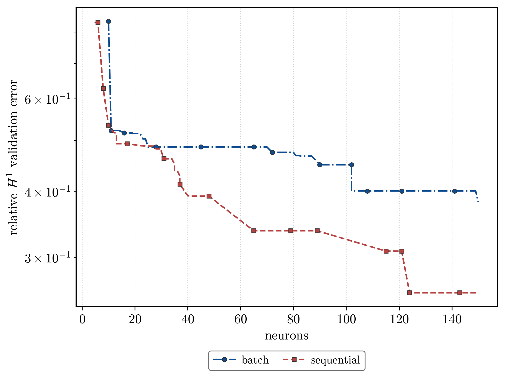

# Results — pendulum / paper_log_penalty

Generated by `analysis.py`. Scope, sweep axes, and fixed settings are documented in `README.md`.

## Key finding

- **batch**: sparsest good fit is `activation=matern52`, α=0.01, γ=10 — 11 neurons at relative H¹ 0.5222 (score 5.745). Most accurate fit is `activation=gaussian`, α=1e-05, γ=0 — relative H¹ 0.3824 at 150 neurons.
- **sequential**: sparsest good fit is `activation=softplus`, α=0.01, γ=10 — 5 neurons at relative H¹ 0.8371 (score 4.186). Most accurate fit is `activation=leaky_relu`, α=0.001, γ=1 — relative H¹ 0.2571 at 124 neurons.

The score `H¹ × neurons` rewards very sparse fits, so it and the accuracy envelope pick different cells; both are reported rather than one standing in for the other.

*Running best relative H¹ validation error against neuron count, for the two insertion modes. Batch admits up to `N_ins = 15` atoms per outer iteration against one frozen residual; sequential admits the highest-scoring candidate returned by the multistart search and runs at `T_out = 150` for a matched neuron budget. All cells at seed 42.*

## Termination

The loop stops when the finite multistart search returns no candidate above the insertion threshold. Early stopping records that numerical event; it is not a certificate that the global profile condition holds. A run that reaches `T_out` was still finding accepted candidates.

- **batch**: 72/224 cells terminated before `T_out = 10`; median 10 iterations, max 10.
- **sequential**: 164/224 cells terminated before `T_out = 150`; median 39 iterations, max 150.

## Best cell per variant (H¹ loss)

| activation   | batch N | batch H¹ | batch score | seq N | seq H¹ | seq score |
| ------------ | ------- | -------- | ----------- | ----- | ------ | --------- |
| matern52     | 11      | 0.5222   | 5.745       | 10    | 0.5348 | 5.348     |
| tanh         | 13      | 0.5577   | 7.250       | 8     | 0.6276 | 5.021     |
| gaussian     | 16      | 0.5167   | 8.266       | 13    | 0.5149 | 6.693     |
| softplus     | 10      | 0.8414   | 8.414       | 5     | 0.8371 | 4.186     |
| gausscent_1  | 17      | 0.5273   | 8.964       | 12    | 0.5184 | 6.221     |
| leaky_relu   | 25      | 0.4861   | 12.151      | 30    | 0.4763 | 14.289    |
| gelu_squared | 49      | 0.5893   | 28.877      | 13    | 0.5124 | 6.661     |

## Moment order p

`p` sets the weight `w_p(ω) = 1 + |ω|^p` inside the penalty and drives the theorem search radius through the exponent `1/(p − s₁)`. The dedicated fixed-versus-theorem ablation records its numerical effect (see `docs/adr/0006`).

| activation   | p    | neurons | rel H¹ | score  |
| ------------ | ---- | ------- | ------ | ------ |
| gaussian     | 2.01 | 78      | 0.3454 | 26.941 |
| gaussian     | 2.5  | 60      | 0.4123 | 24.736 |
| gaussian     | 3    | 45      | 0.4816 | 21.671 |
| gaussian     | 4    | 34      | 0.5543 | 18.847 |
| gelu_squared | 2.01 | 79      | 0.3994 | 31.550 |
| gelu_squared | 2.5  | 52      | 0.4834 | 25.138 |
| gelu_squared | 3    | 54      | 0.5140 | 27.758 |
| gelu_squared | 4    | 40      | 0.5581 | 22.323 |
| softplus     | 2.01 | 30      | 0.5206 | 15.618 |
| softplus     | 2.5  | 26      | 0.5482 | 14.254 |
| softplus     | 3    | 14      | 0.6353 | 8.894  |
| softplus     | 4    | 10      | 0.6848 | 6.848  |
| tanh         | 2.01 | 65      | 0.3870 | 25.156 |
| tanh         | 2.5  | 53      | 0.4945 | 26.208 |
| tanh         | 3    | 34      | 0.5261 | 17.888 |
| tanh         | 4    | 34      | 0.5656 | 19.231 |

## Full result (H¹ loss)

| activation   | mode       | α      | γ   | neurons | rel L² | rel H¹ | score  |
| ------------ | ---------- | ------ | --- | ------- | ------ | ------ | ------ |
| gausscent_1  | batch      | 1e-05  | 0   | 150     | 0.2219 | 0.4029 | 60.436 |
| gausscent_1  | batch      | 1e-05  | 0.1 | 150     | 0.1836 | 0.4310 | 64.643 |
| gausscent_1  | batch      | 1e-05  | 1   | 150     | 0.1830 | 0.4290 | 64.354 |
| gausscent_1  | batch      | 1e-05  | 10  | 150     | 0.2593 | 0.4408 | 66.123 |
| gausscent_1  | batch      | 0.0001 | 0   | 140     | 0.1618 | 0.4357 | 60.998 |
| gausscent_1  | batch      | 0.0001 | 0.1 | 133     | 0.3871 | 0.5096 | 67.780 |
| gausscent_1  | batch      | 0.0001 | 1   | 135     | 0.3586 | 0.4521 | 61.029 |
| gausscent_1  | batch      | 0.0001 | 10  | 132     | 0.2525 | 0.4460 | 58.876 |
| gausscent_1  | batch      | 0.001  | 0   | 82      | 0.2915 | 0.4807 | 39.421 |
| gausscent_1  | batch      | 0.001  | 0.1 | 72      | 0.3193 | 0.4748 | 34.189 |
| gausscent_1  | batch      | 0.001  | 1   | 87      | 0.2616 | 0.4686 | 40.767 |
| gausscent_1  | batch      | 0.001  | 10  | 83      | 0.2698 | 0.4670 | 38.761 |
| gausscent_1  | batch      | 0.01   | 0   | 28      | 0.4743 | 0.5282 | 14.788 |
| gausscent_1  | batch      | 0.01   | 0.1 | 17      | 0.4846 | 0.5273 | 8.964  |
| gausscent_1  | batch      | 0.01   | 1   | 23      | 0.4666 | 0.5037 | 11.584 |
| gausscent_1  | batch      | 0.01   | 10  | 19      | 0.5024 | 0.5156 | 9.796  |
| gausscent_1  | sequential | 1e-05  | 0   | 141     | 0.1604 | 0.3557 | 50.159 |
| gausscent_1  | sequential | 1e-05  | 0.1 | 141     | 0.1350 | 0.3320 | 46.809 |
| gausscent_1  | sequential | 1e-05  | 1   | 135     | 0.1327 | 0.3286 | 44.364 |
| gausscent_1  | sequential | 1e-05  | 10  | 142     | 0.1041 | 0.3170 | 45.017 |
| gausscent_1  | sequential | 0.0001 | 0   | 86      | 0.2028 | 0.4132 | 35.538 |
| gausscent_1  | sequential | 0.0001 | 0.1 | 79      | 0.1397 | 0.3858 | 30.481 |
| gausscent_1  | sequential | 0.0001 | 1   | 75      | 0.0969 | 0.3504 | 26.282 |
| gausscent_1  | sequential | 0.0001 | 10  | 89      | 0.1550 | 0.3460 | 30.794 |
| gausscent_1  | sequential | 0.001  | 0   | 40      | 0.1706 | 0.3929 | 15.714 |
| gausscent_1  | sequential | 0.001  | 0.1 | 36      | 0.1791 | 0.4547 | 16.368 |
| gausscent_1  | sequential | 0.001  | 1   | 40      | 0.1387 | 0.4106 | 16.424 |
| gausscent_1  | sequential | 0.001  | 10  | 35      | 0.1683 | 0.4508 | 15.779 |
| gausscent_1  | sequential | 0.01   | 0   | 15      | 0.3973 | 0.5107 | 7.661  |
| gausscent_1  | sequential | 0.01   | 0.1 | 13      | 0.4470 | 0.5196 | 6.755  |
| gausscent_1  | sequential | 0.01   | 1   | 12      | 0.4839 | 0.5184 | 6.221  |
| gausscent_1  | sequential | 0.01   | 10  | 13      | 0.4203 | 0.4931 | 6.410  |
| gaussian     | batch      | 1e-05  | 0   | 150     | 0.2554 | 0.3824 | 57.365 |
| gaussian     | batch      | 1e-05  | 0.1 | 150     | 0.2060 | 0.4212 | 63.175 |
| gaussian     | batch      | 1e-05  | 1   | 150     | 0.2348 | 0.4122 | 61.836 |
| gaussian     | batch      | 1e-05  | 10  | 150     | 0.1959 | 0.4235 | 63.532 |
| gaussian     | batch      | 0.0001 | 0   | 142     | 0.2429 | 0.4791 | 68.028 |
| gaussian     | batch      | 0.0001 | 0.1 | 143     | 0.2347 | 0.4579 | 65.486 |
| gaussian     | batch      | 0.0001 | 1   | 141     | 0.2515 | 0.4719 | 66.533 |
| gaussian     | batch      | 0.0001 | 10  | 133     | 0.2576 | 0.4013 | 53.379 |
| gaussian     | batch      | 0.001  | 0   | 108     | 0.2555 | 0.4718 | 50.956 |
| gaussian     | batch      | 0.001  | 0.1 | 90      | 0.2593 | 0.4497 | 40.475 |
| gaussian     | batch      | 0.001  | 1   | 85      | 0.3663 | 0.4931 | 41.910 |
| gaussian     | batch      | 0.001  | 10  | 82      | 0.3632 | 0.4874 | 39.965 |
| gaussian     | batch      | 0.01   | 0   | 24      | 0.3915 | 0.5203 | 12.487 |
| gaussian     | batch      | 0.01   | 0.1 | 17      | 0.3562 | 0.5463 | 9.287  |
| gaussian     | batch      | 0.01   | 1   | 16      | 0.4595 | 0.5167 | 8.266  |
| gaussian     | batch      | 0.01   | 10  | 19      | 0.4695 | 0.5201 | 9.881  |
| gaussian     | sequential | 1e-05  | 0   | 143     | 0.1591 | 0.3292 | 47.072 |
| gaussian     | sequential | 1e-05  | 0.1 | 138     | 0.0900 | 0.3280 | 45.270 |
| gaussian     | sequential | 1e-05  | 1   | 142     | 0.1379 | 0.3372 | 47.889 |
| gaussian     | sequential | 1e-05  | 10  | 145     | 0.1476 | 0.3745 | 54.298 |
| gaussian     | sequential | 0.0001 | 0   | 85      | 0.1804 | 0.3418 | 29.050 |
| gaussian     | sequential | 0.0001 | 0.1 | 77      | 0.2059 | 0.3612 | 27.812 |
| gaussian     | sequential | 0.0001 | 1   | 78      | 0.1145 | 0.3454 | 26.941 |
| gaussian     | sequential | 0.0001 | 10  | 77      | 0.1516 | 0.3611 | 27.805 |
| gaussian     | sequential | 0.001  | 0   | 45      | 0.2258 | 0.4555 | 20.497 |
| gaussian     | sequential | 0.001  | 0.1 | 41      | 0.1914 | 0.3923 | 16.084 |
| gaussian     | sequential | 0.001  | 1   | 37      | 0.1463 | 0.4286 | 15.860 |
| gaussian     | sequential | 0.001  | 10  | 37      | 0.1517 | 0.4135 | 15.300 |
| gaussian     | sequential | 0.01   | 0   | 15      | 0.3893 | 0.5110 | 7.665  |
| gaussian     | sequential | 0.01   | 0.1 | 14      | 0.4704 | 0.5183 | 7.256  |
| gaussian     | sequential | 0.01   | 1   | 14      | 0.4611 | 0.5147 | 7.206  |
| gaussian     | sequential | 0.01   | 10  | 13      | 0.4825 | 0.5149 | 6.693  |
| gelu_squared | batch      | 1e-05  | 0   | 150     | 0.1809 | 0.4417 | 66.261 |
| gelu_squared | batch      | 1e-05  | 0.1 | 150     | 0.1850 | 0.4429 | 66.432 |
| gelu_squared | batch      | 1e-05  | 1   | 150     | 0.1890 | 0.4547 | 68.210 |
| gelu_squared | batch      | 1e-05  | 10  | 150     | 0.1749 | 0.4127 | 61.899 |
| gelu_squared | batch      | 0.0001 | 0   | 144     | 0.4102 | 0.4956 | 71.370 |
| gelu_squared | batch      | 0.0001 | 0.1 | 150     | 0.1918 | 0.4521 | 67.818 |
| gelu_squared | batch      | 0.0001 | 1   | 144     | 0.1756 | 0.4440 | 63.930 |
| gelu_squared | batch      | 0.0001 | 10  | 148     | 0.1822 | 0.4276 | 63.282 |
| gelu_squared | batch      | 0.001  | 0   | 135     | 0.3025 | 0.4739 | 63.983 |
| gelu_squared | batch      | 0.001  | 0.1 | 118     | 0.3218 | 0.4829 | 56.987 |
| gelu_squared | batch      | 0.001  | 1   | 132     | 0.3568 | 0.4816 | 63.570 |
| gelu_squared | batch      | 0.001  | 10  | 138     | 0.3458 | 0.4862 | 67.099 |
| gelu_squared | batch      | 0.01   | 0   | 77      | 0.5765 | 0.6135 | 47.237 |
| gelu_squared | batch      | 0.01   | 0.1 | 49      | 0.4274 | 0.5893 | 28.877 |
| gelu_squared | batch      | 0.01   | 1   | 67      | 0.4219 | 0.5860 | 39.263 |
| gelu_squared | batch      | 0.01   | 10  | 67      | 0.4151 | 0.5601 | 37.525 |
| gelu_squared | sequential | 1e-05  | 0   | 135     | 0.1998 | 0.3611 | 48.753 |
| gelu_squared | sequential | 1e-05  | 0.1 | 147     | 0.2012 | 0.3934 | 57.830 |
| gelu_squared | sequential | 1e-05  | 1   | 139     | 0.1589 | 0.3701 | 51.438 |
| gelu_squared | sequential | 1e-05  | 10  | 139     | 0.1421 | 0.3789 | 52.661 |
| gelu_squared | sequential | 0.0001 | 0   | 71      | 0.1595 | 0.3990 | 28.327 |
| gelu_squared | sequential | 0.0001 | 0.1 | 74      | 0.1076 | 0.4265 | 31.557 |
| gelu_squared | sequential | 0.0001 | 1   | 79      | 0.1176 | 0.3994 | 31.550 |
| gelu_squared | sequential | 0.0001 | 10  | 88      | 0.1472 | 0.3385 | 29.784 |
| gelu_squared | sequential | 0.001  | 0   | 33      | 0.2774 | 0.4719 | 15.571 |
| gelu_squared | sequential | 0.001  | 0.1 | 34      | 0.2569 | 0.4702 | 15.987 |
| gelu_squared | sequential | 0.001  | 1   | 31      | 0.2670 | 0.4692 | 14.544 |
| gelu_squared | sequential | 0.001  | 10  | 33      | 0.2759 | 0.4699 | 15.507 |
| gelu_squared | sequential | 0.01   | 0   | 17      | 0.3791 | 0.5309 | 9.025  |
| gelu_squared | sequential | 0.01   | 0.1 | 13      | 0.4019 | 0.5124 | 6.661  |
| gelu_squared | sequential | 0.01   | 1   | 16      | 0.3782 | 0.5089 | 8.142  |
| gelu_squared | sequential | 0.01   | 10  | 15      | 0.4266 | 0.5142 | 7.713  |
| leaky_relu   | batch      | 1e-05  | 0   | 150     | 0.2600 | 0.4765 | 71.468 |
| leaky_relu   | batch      | 1e-05  | 0.1 | 150     | 0.2367 | 0.4974 | 74.607 |
| leaky_relu   | batch      | 1e-05  | 1   | 150     | 0.3797 | 0.5372 | 80.575 |
| leaky_relu   | batch      | 1e-05  | 10  | 149     | 0.2800 | 0.5096 | 75.926 |
| leaky_relu   | batch      | 0.0001 | 0   | 140     | 0.2190 | 0.5097 | 71.359 |
| leaky_relu   | batch      | 0.0001 | 0.1 | 136     | 0.2322 | 0.4786 | 65.095 |
| leaky_relu   | batch      | 0.0001 | 1   | 135     | 0.1681 | 0.4690 | 63.313 |
| leaky_relu   | batch      | 0.0001 | 10  | 137     | 0.2030 | 0.5444 | 74.581 |
| leaky_relu   | batch      | 0.001  | 0   | 102     | 0.2030 | 0.4011 | 40.917 |
| leaky_relu   | batch      | 0.001  | 0.1 | 114     | 0.2327 | 0.5034 | 57.383 |
| leaky_relu   | batch      | 0.001  | 1   | 121     | 0.3412 | 0.5161 | 62.445 |
| leaky_relu   | batch      | 0.001  | 10  | 121     | 0.2912 | 0.5067 | 61.317 |
| leaky_relu   | batch      | 0.01   | 0   | 41      | 0.3702 | 0.5244 | 21.501 |
| leaky_relu   | batch      | 0.01   | 0.1 | 31      | 0.3643 | 0.5581 | 17.300 |
| leaky_relu   | batch      | 0.01   | 1   | 25      | 0.2405 | 0.4861 | 12.151 |
| leaky_relu   | batch      | 0.01   | 10  | 37      | 0.3224 | 0.5058 | 18.713 |
| leaky_relu   | sequential | 1e-05  | 0   | 150     | 0.1011 | 0.3540 | 53.098 |
| leaky_relu   | sequential | 1e-05  | 0.1 | 147     | 0.0981 | 0.3176 | 46.689 |
| leaky_relu   | sequential | 1e-05  | 1   | 149     | 0.0919 | 0.3902 | 58.134 |
| leaky_relu   | sequential | 1e-05  | 10  | 148     | 0.1468 | 0.3264 | 48.310 |
| leaky_relu   | sequential | 0.0001 | 0   | 138     | 0.0846 | 0.3686 | 50.870 |
| leaky_relu   | sequential | 0.0001 | 0.1 | 138     | 0.0997 | 0.3832 | 52.884 |
| leaky_relu   | sequential | 0.0001 | 1   | 136     | 0.0993 | 0.2763 | 37.578 |
| leaky_relu   | sequential | 0.0001 | 10  | 133     | 0.0811 | 0.3484 | 46.334 |
| leaky_relu   | sequential | 0.001  | 0   | 121     | 0.0942 | 0.3161 | 38.252 |
| leaky_relu   | sequential | 0.001  | 0.1 | 116     | 0.1006 | 0.3333 | 38.666 |
| leaky_relu   | sequential | 0.001  | 1   | 124     | 0.0857 | 0.2571 | 31.886 |
| leaky_relu   | sequential | 0.001  | 10  | 115     | 0.1037 | 0.3085 | 35.479 |
| leaky_relu   | sequential | 0.01   | 0   | 68      | 0.2127 | 0.4023 | 27.357 |
| leaky_relu   | sequential | 0.01   | 0.1 | 35      | 0.2005 | 0.4387 | 15.355 |
| leaky_relu   | sequential | 0.01   | 1   | 31      | 0.1911 | 0.4724 | 14.644 |
| leaky_relu   | sequential | 0.01   | 10  | 30      | 0.2177 | 0.4763 | 14.289 |
| matern52     | batch      | 1e-05  | 0   | 150     | 0.3270 | 0.4425 | 66.370 |
| matern52     | batch      | 1e-05  | 0.1 | 149     | 0.2371 | 0.4291 | 63.942 |
| matern52     | batch      | 1e-05  | 1   | 150     | 0.3009 | 0.4324 | 64.859 |
| matern52     | batch      | 1e-05  | 10  | 150     | 0.2090 | 0.4317 | 64.761 |
| matern52     | batch      | 0.0001 | 0   | 133     | 0.1917 | 0.4561 | 60.660 |
| matern52     | batch      | 0.0001 | 0.1 | 140     | 0.2183 | 0.4569 | 63.960 |
| matern52     | batch      | 0.0001 | 1   | 132     | 0.2827 | 0.4542 | 59.949 |
| matern52     | batch      | 0.0001 | 10  | 135     | 0.4123 | 0.5159 | 69.649 |
| matern52     | batch      | 0.001  | 0   | 95      | 0.4323 | 0.5219 | 49.578 |
| matern52     | batch      | 0.001  | 0.1 | 84      | 0.2940 | 0.4718 | 39.632 |
| matern52     | batch      | 0.001  | 1   | 94      | 0.2890 | 0.4783 | 44.956 |
| matern52     | batch      | 0.001  | 10  | 81      | 0.2984 | 0.4682 | 37.923 |
| matern52     | batch      | 0.01   | 0   | 22      | 0.4313 | 0.5451 | 11.992 |
| matern52     | batch      | 0.01   | 0.1 | 14      | 0.5370 | 0.5346 | 7.485  |
| matern52     | batch      | 0.01   | 1   | 16      | 0.5070 | 0.5219 | 8.350  |
| matern52     | batch      | 0.01   | 10  | 11      | 0.5308 | 0.5222 | 5.745  |
| matern52     | sequential | 1e-05  | 0   | 142     | 0.1524 | 0.3636 | 51.629 |
| matern52     | sequential | 1e-05  | 0.1 | 142     | 0.2129 | 0.3714 | 52.732 |
| matern52     | sequential | 1e-05  | 1   | 146     | 0.2288 | 0.3635 | 53.064 |
| matern52     | sequential | 1e-05  | 10  | 146     | 0.1674 | 0.3386 | 49.439 |
| matern52     | sequential | 0.0001 | 0   | 65      | 0.1113 | 0.3372 | 21.915 |
| matern52     | sequential | 0.0001 | 0.1 | 75      | 0.1714 | 0.3629 | 27.220 |
| matern52     | sequential | 0.0001 | 1   | 81      | 0.1595 | 0.3620 | 29.318 |
| matern52     | sequential | 0.0001 | 10  | 70      | 0.1935 | 0.3430 | 24.008 |
| matern52     | sequential | 0.001  | 0   | 40      | 0.2396 | 0.4422 | 17.686 |
| matern52     | sequential | 0.001  | 0.1 | 31      | 0.2611 | 0.4621 | 14.324 |
| matern52     | sequential | 0.001  | 1   | 35      | 0.2164 | 0.4595 | 16.082 |
| matern52     | sequential | 0.001  | 10  | 32      | 0.2266 | 0.4616 | 14.771 |
| matern52     | sequential | 0.01   | 0   | 15      | 0.4380 | 0.5432 | 8.148  |
| matern52     | sequential | 0.01   | 0.1 | 10      | 0.4617 | 0.5348 | 5.348  |
| matern52     | sequential | 0.01   | 1   | 12      | 0.4336 | 0.5189 | 6.227  |
| matern52     | sequential | 0.01   | 10  | 11      | 0.5080 | 0.5246 | 5.771  |
| softplus     | batch      | 1e-05  | 0   | 150     | 0.3898 | 0.5219 | 78.290 |
| softplus     | batch      | 1e-05  | 0.1 | 139     | 0.3733 | 0.5088 | 70.719 |
| softplus     | batch      | 1e-05  | 1   | 150     | 0.3290 | 0.5086 | 76.288 |
| softplus     | batch      | 1e-05  | 10  | 143     | 0.3306 | 0.5073 | 72.549 |
| softplus     | batch      | 0.0001 | 0   | 107     | 0.4950 | 0.5577 | 59.675 |
| softplus     | batch      | 0.0001 | 0.1 | 102     | 0.5853 | 0.5899 | 60.169 |
| softplus     | batch      | 0.0001 | 1   | 108     | 0.4548 | 0.5617 | 60.660 |
| softplus     | batch      | 0.0001 | 10  | 90      | 0.5358 | 0.5686 | 51.174 |
| softplus     | batch      | 0.001  | 0   | 94      | 0.5108 | 0.6523 | 61.321 |
| softplus     | batch      | 0.001  | 0.1 | 82      | 0.4296 | 0.6490 | 53.220 |
| softplus     | batch      | 0.001  | 1   | 35      | 0.3320 | 0.6294 | 22.030 |
| softplus     | batch      | 0.001  | 10  | 45      | 0.3718 | 0.6376 | 28.694 |
| softplus     | batch      | 0.01   | 0   | 18      | 1.9083 | 0.8414 | 15.146 |
| softplus     | batch      | 0.01   | 0.1 | 16      | 2.0057 | 0.8445 | 13.512 |
| softplus     | batch      | 0.01   | 1   | 10      | 2.0173 | 0.8414 | 8.414  |
| softplus     | batch      | 0.01   | 10  | 10      | 2.0151 | 0.8415 | 8.415  |
| softplus     | sequential | 1e-05  | 0   | 142     | 0.1257 | 0.4248 | 60.317 |
| softplus     | sequential | 1e-05  | 0.1 | 146     | 0.1374 | 0.3917 | 57.188 |
| softplus     | sequential | 1e-05  | 1   | 148     | 0.1298 | 0.3747 | 55.449 |
| softplus     | sequential | 1e-05  | 10  | 145     | 0.1258 | 0.4290 | 62.205 |
| softplus     | sequential | 0.0001 | 0   | 30      | 0.4079 | 0.5109 | 15.327 |
| softplus     | sequential | 0.0001 | 0.1 | 48      | 0.3907 | 0.5167 | 24.800 |
| softplus     | sequential | 0.0001 | 1   | 30      | 0.3963 | 0.5206 | 15.618 |
| softplus     | sequential | 0.0001 | 10  | 30      | 0.3922 | 0.5321 | 15.962 |
| softplus     | sequential | 0.001  | 0   | 14      | 0.4185 | 0.5860 | 8.204  |
| softplus     | sequential | 0.001  | 0.1 | 12      | 0.5645 | 0.6105 | 7.326  |
| softplus     | sequential | 0.001  | 1   | 11      | 0.4860 | 0.6078 | 6.686  |
| softplus     | sequential | 0.001  | 10  | 13      | 0.6938 | 0.6195 | 8.053  |
| softplus     | sequential | 0.01   | 0   | 6       | 1.9032 | 0.8412 | 5.047  |
| softplus     | sequential | 0.01   | 0.1 | 5       | 1.9575 | 0.8393 | 4.196  |
| softplus     | sequential | 0.01   | 1   | 5       | 1.9856 | 0.8374 | 4.187  |
| softplus     | sequential | 0.01   | 10  | 5       | 1.9897 | 0.8371 | 4.186  |
| tanh         | batch      | 1e-05  | 0   | 150     | 0.2318 | 0.4615 | 69.221 |
| tanh         | batch      | 1e-05  | 0.1 | 150     | 0.2294 | 0.4618 | 69.272 |
| tanh         | batch      | 1e-05  | 1   | 150     | 0.3469 | 0.4907 | 73.599 |
| tanh         | batch      | 1e-05  | 10  | 150     | 0.2109 | 0.4554 | 68.314 |
| tanh         | batch      | 0.0001 | 0   | 134     | 0.2526 | 0.4720 | 63.251 |
| tanh         | batch      | 0.0001 | 0.1 | 131     | 0.2773 | 0.4854 | 63.591 |
| tanh         | batch      | 0.0001 | 1   | 137     | 0.3414 | 0.4749 | 65.068 |
| tanh         | batch      | 0.0001 | 10  | 132     | 0.3781 | 0.4792 | 63.255 |
| tanh         | batch      | 0.001  | 0   | 70      | 0.4168 | 0.4990 | 34.931 |
| tanh         | batch      | 0.001  | 0.1 | 80      | 0.4066 | 0.5029 | 40.231 |
| tanh         | batch      | 0.001  | 1   | 72      | 0.4023 | 0.4959 | 35.702 |
| tanh         | batch      | 0.001  | 10  | 65      | 0.4376 | 0.5231 | 34.000 |
| tanh         | batch      | 0.01   | 0   | 24      | 0.4725 | 0.6098 | 14.636 |
| tanh         | batch      | 0.01   | 0.1 | 13      | 0.4778 | 0.5734 | 7.454  |
| tanh         | batch      | 0.01   | 1   | 13      | 0.4616 | 0.5577 | 7.250  |
| tanh         | batch      | 0.01   | 10  | 16      | 0.4373 | 0.5613 | 8.980  |
| tanh         | sequential | 1e-05  | 0   | 137     | 0.1814 | 0.3935 | 53.913 |
| tanh         | sequential | 1e-05  | 0.1 | 145     | 0.1298 | 0.3871 | 56.133 |
| tanh         | sequential | 1e-05  | 1   | 143     | 0.1563 | 0.3862 | 55.225 |
| tanh         | sequential | 1e-05  | 10  | 139     | 0.1869 | 0.3794 | 52.732 |
| tanh         | sequential | 0.0001 | 0   | 69      | 0.1197 | 0.4080 | 28.155 |
| tanh         | sequential | 0.0001 | 0.1 | 69      | 0.1380 | 0.3510 | 24.222 |
| tanh         | sequential | 0.0001 | 1   | 65      | 0.1671 | 0.3870 | 25.156 |
| tanh         | sequential | 0.0001 | 10  | 75      | 0.1320 | 0.4065 | 30.486 |
| tanh         | sequential | 0.001  | 0   | 27      | 0.3663 | 0.4882 | 13.182 |
| tanh         | sequential | 0.001  | 0.1 | 25      | 0.3157 | 0.4879 | 12.197 |
| tanh         | sequential | 0.001  | 1   | 28      | 0.3036 | 0.4821 | 13.498 |
| tanh         | sequential | 0.001  | 10  | 22      | 0.3946 | 0.4889 | 10.756 |
| tanh         | sequential | 0.01   | 0   | 11      | 0.4533 | 0.6060 | 6.666  |
| tanh         | sequential | 0.01   | 0.1 | 8       | 0.4408 | 0.6276 | 5.021  |
| tanh         | sequential | 0.01   | 1   | 10      | 0.6348 | 0.5840 | 5.840  |
| tanh         | sequential | 0.01   | 10  | 10      | 0.4262 | 0.6209 | 6.209  |
