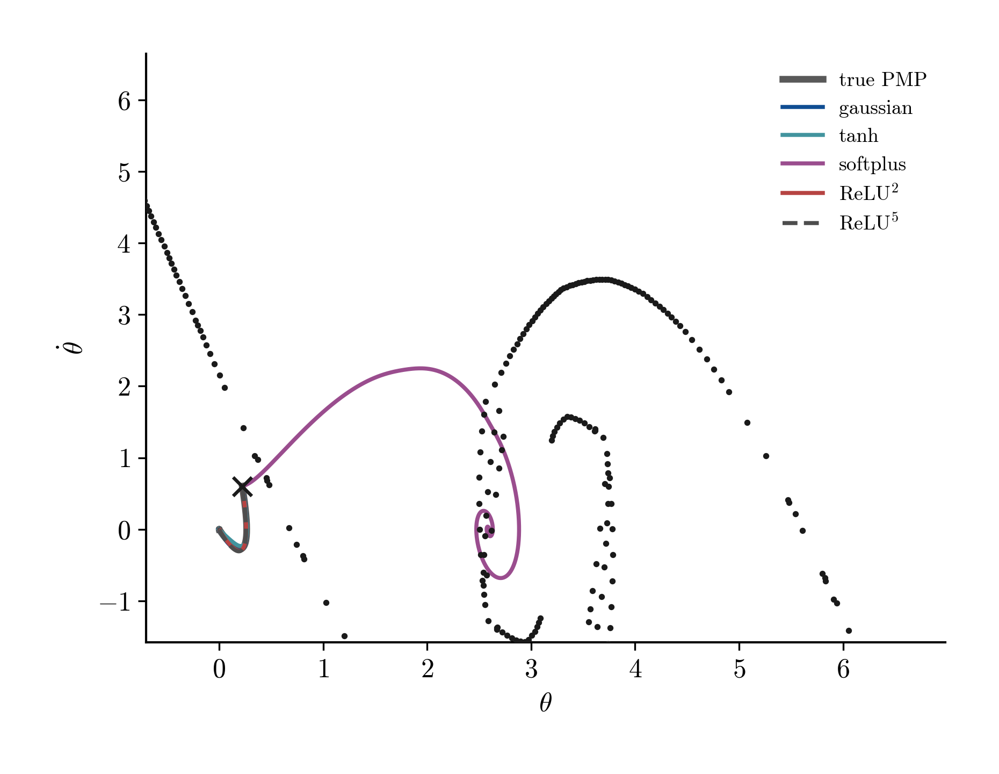
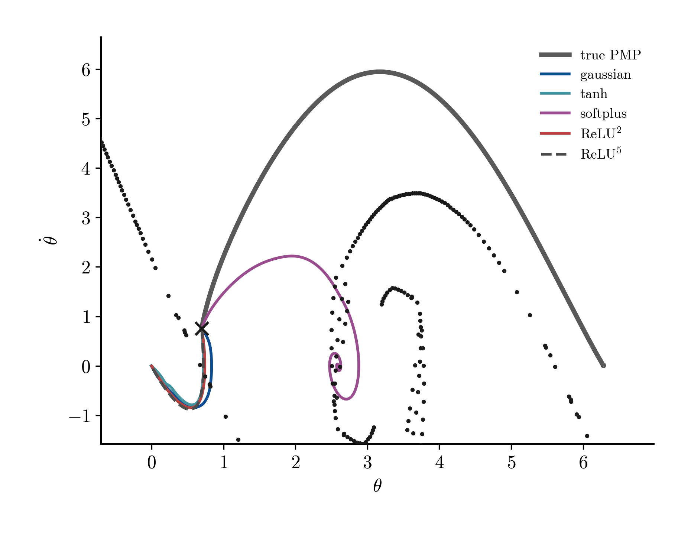

# Pendulum Switching-Set Model Comparison

Comparison set: signed H1-trained `gaussian`, `softplus` with the
log penalty, and signed H1-trained `ReLU^2`, `ReLU^5` with the fractional
penalty `|c|^q`, `q = 2/(p+1)`. Each row uses the best run in its cell by far
L1 error.

| model | penalty | neurons | near L1 | far L1 | near/far |
| --- | --- | ---: | ---: | ---: | ---: |
| `ReLU^2` | fractional, `q=2/3` | 107 | 4.34e-2 | 1.87e-2 | 2.32 |
| `ReLU^5` | fractional, `q=1/3` | 55 | 1.64e-1 | 5.57e-2 | 2.94 |
| gaussian | log | 97 | 3.64e-1 | 1.43e-1 | 2.54 |
| softplus | log | 77 | 2.13e+0 | 5.73e-1 | 3.71 |

Main conclusion: `ReLU^2` is the best fit by a large margin in both the
near-switching band and the smooth far region. `ReLU^5` is much sparser, but
the higher power and stronger fractional penalty degrade the switching-band fit.
The smooth activations shown are worse in absolute error, with softplus clearly
failing.

## Geometry

| Value samples | Value surface | Switching set |
| --- | --- | --- |
|  |  |  |

The pendulum value is continuous, but the gradient changes branch across the
switching spirals. This is why global H1 alone is not enough: the fit must be
checked by distance to the switching set and by the induced feedback law.

## Learned Value Surfaces

All learned surfaces use the same physical window as the true value surface,
`theta, theta_dot in [-8, 8]`, and the same displayed value range, `V in [0, 60]`.

| gaussian | softplus |
| --- | --- |
|  |  |

| `ReLU^2` | `ReLU^5` |
| --- | --- |
|  |  |

The surface view explains why global value appearance is not enough. Gaussian
produces a smooth basin-like surface, but still misses the sharp
switching-gradient structure measured later. Softplus is visibly too flat near
the central basin and too saturated off-support, matching its poor error and
feedback results. `ReLU^2` gives the sharpest piecewise surface and the best
near/far errors; `ReLU^5` is sparser but visibly stiffer, which is consistent
with its larger switching-band error.

## Insertion Frontier

The frontier shows the running best relative `H1` validation error reached as
neurons are inserted for the selected run in each model family. `ReLU^5` reaches
relative `H1` around `9.3e-2` with 55 neurons, while gaussian remains around
`1.9e-1` at 97 neurons and softplus plateaus near `6.8e-1`. `ReLU^2` reaches the
lowest validation error, about `3.4e-2`, but with 107 neurons. This is the
sparsity side of the same story as the near/far table: ReLU atoms buy accuracy
per atom, while the distance and feedback diagnostics below show where that
accuracy is still fragile near the switching set.

## Near/Far Error

`ReLU^2` is closest to the origin on both endpoints: it has the smallest far
error and the smallest near-switching error. `ReLU^5` is second best but loses
more near the switching set. Gaussian is the best smooth activation, but its
absolute error is still far above `ReLU^2`. Softplus is not competitive.

## Error By Distance

| Value error | Gradient error |
| --- | --- |
|  |  |

The smoothed distance profiles show where each model concentrates its own error:
each bin mean is divided by that model's global mean error. Values above one
therefore mark regions where that same model fails more than usual. Read this as
a spatial failure diagnostic, not as the absolute model ranking.

The nearest bins to the switching set are elevated for all models, especially in
gradient. The dense sample band is around distance `0.6-0.7`; the far tail has
few samples, so far-tail changes should not be over-interpreted point by point.
The absolute ranking remains the near/far table above: `ReLU^2`, then `ReLU^5`,
then gaussian, with softplus worst.

## Switching-Set Transect

| True value branches | True normal-gradient branches |
| --- | --- |
|  |  |

The blue and teal curves are the two candidate PMP branches before taking the
minimum: one goes to the upright at `0`, the other to the upright at `2π`. The
true value is the dashed lower envelope. In the value plot the lower envelope is
continuous: it follows the blue branch on the left and the teal branch on the
right. In the gradient plot the selected branch changes at the switching set, so
`n · grad V` jumps.

| Value along normal direction | Normal gradient along normal direction |
| --- | --- |
|  |  |

The learned-model transect should be read against the branch-reference plot
above. On the trained side of the switching set, `ReLU^2`, `ReLU^5`, gaussian,
and softplus show very different behavior: the ReLU models and gaussian follow
the steep branch reasonably well, while softplus underfits. Across the
switching set, the true lower envelope switches from one PMP branch to the other,
but the learned models mostly continue the branch they saw in the data. This is
a data-support problem as much as an approximation problem.

The previous combined transect made `ReLU^5` look like it had only half a curve
because the y-limit was set from the true branch only. `ReLU^5` was not missing;
it was clipped. In the split figures the full curve is visible: on the off-data
side it grows to roughly `V=145` and `n·grad V=190`, far above the true branch.

## Feedback Reliability

| Start A: data side | Start B: opposite side |
| --- | --- |
|  |  |

| Control from start B |
| --- |
|  |

| controller | cost A | upright A | cost B | upright B |
| --- | ---: | --- | ---: | --- |
| true PMP | 10.6 | yes | 26.3 | yes |
| gaussian | 10.6 | yes | 66.3 | yes |
| softplus | 335.5 | no | 343.9 | no |
| `ReLU^2` | 10.5 | yes | 51.3 | yes |
| `ReLU^5` | 10.6 | yes | 51.6 | yes |

On the data side, every model except softplus stabilizes with almost the same
cost as the PMP feedback. On the opposite side of the switching set, the learned
models still stabilize, but they choose the wrong branch and pay roughly twice
the PMP cost. Softplus fails from both starts.

So the fitted feedback law is reliable only on the supported side of the
switching set. Establishing reliable cross-switching feedback requires training
data from both branches, not just more accuracy on the one branch.

## Sampling Check

| Density balancing | ReLU power under balanced sampling |
| --- | --- |
|  |  |

Balancing the sample density collapses much of the near/far gap, so the original
near/far ratio is partly a sampling-density effect. The remaining model effect
is still meaningful: with balanced data and H1 training, the near/far ratio stays
near one, while value-only training gets worse as the ReLU power increases.

This supports the final interpretation: the nonsmooth region is harder, but the
dominant failure mode for feedback reliability is one-sided branch support near
the switching set. Among the tested models, `ReLU^2` is the best approximation
choice; `ReLU^5` buys sparsity but loses switching accuracy.
