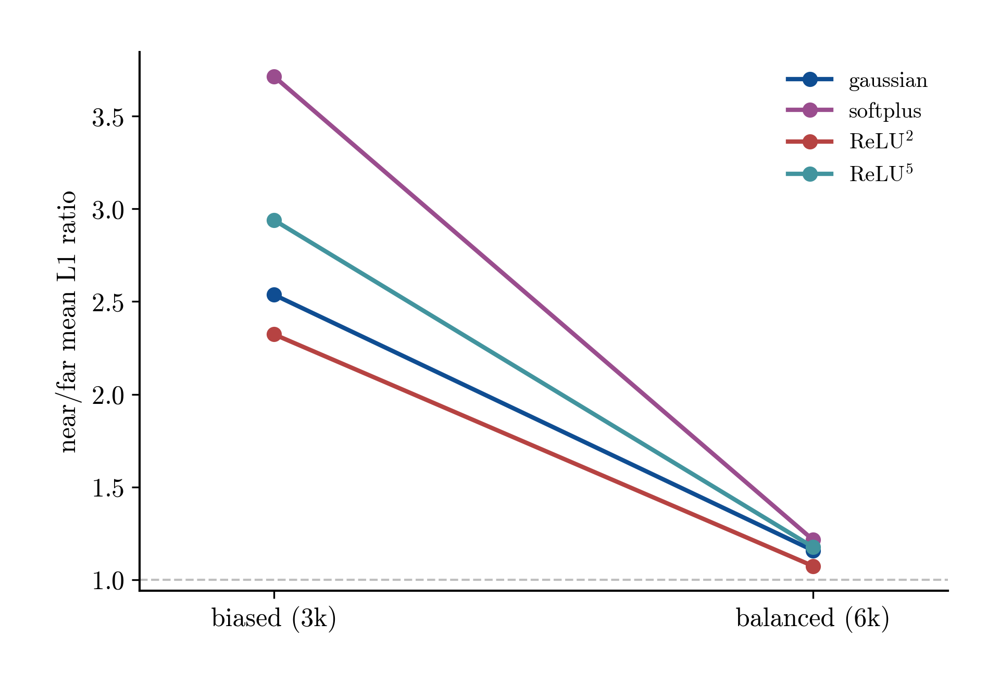
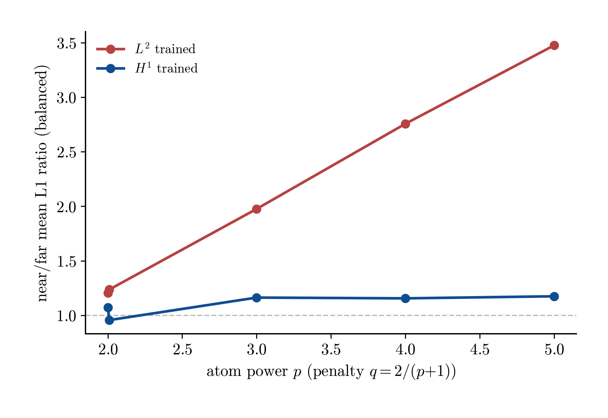

# region_split_pendulum Results

**Questions.** (1) How well do sparse shallow models fit an optimal value function whose **gradient jumps across the swing-up switching set**, and what role do the activation and the nonconvex penalty play? (2) Can a reliable **feedback law** be synthesized from the fitted value function near — and across — the switching set?

**Setup.** Pendulum swing-up value samples (3k, branch-restricted basin; see `README.md` for data and the error-metric rationale). Two sweeps on the same dataset and `eval=region_split` hook: smooth activations (profile insertion, gamma selected per cell) and **ReLU^p atoms with the fractional-exponent penalty** q = 2/(p+1) (finite_step insertion, gamma=0 by design, alpha selected per cell) — see `../02_pendulum/frac_exp_penalty`. `near` = lowest 10% of samples by distance to the switching set (d ≤ 0.57); `far` = the rest. The model-level studies (§4–§5) use four representative signed H1 models — gaussian, softplus, relu², relu⁵; semiconcave models are excluded there (they do not round-trip through the fit artifact, #19).

## 1. The target: a value function with a gradient discontinuity

The regions of attraction of the (periodic) upright equilibria — PMP characteristics filled by nearest-point classification — are separated by the nonsmooth switching curves the region split is built on (open-loop data visualisations are centralised in [`experiments/00_openloop/pendulum`](../00_openloop/pendulum)).

### 1.1 The kink, seen in the data

Along a transect normal to the switching curve (through the densest data region), the two PMP branch values cross; the optimal V is their lower envelope — continuous, with a concave kink where the branches exchange optimality, so ∇V jumps (left: V; right: n·∇V):

| value along the transect | normal gradient along the transect |
| --- | --- |
|  |  |

One structural fact controls everything below: **the branch-restricted training data stop AT the curve** — no arm has samples on both sides, so the far branch (and the jump itself) is invisible to every model. Ground truth on both sides is reconstructed as the lower envelope of the raw (unrestricted) PMP trajectories tiled by 2πk in θ.

## 2. Symptom: error concentrates near the switching set

Region mean per-sample L1 (absolute) error / global mean ‖true‖ — count-fair and robust to the V→0 interior; `near/far` > 1 ⇒ worse at the switching set. (The naive relative-H1 metric flips this conclusion — see the Appendix.)

Mean per-sample L1 over the full dataset — count-fair, robust to V→0

| kind        | insertion   | activation   | loss | gamma | neurons | near L1  | far L1   | near/far |
| ----------- | ----------- | ------------ | ---- | ----- | ------- | -------- | -------- | -------- |
| semiconcave | profile     | gaussian     | h1   | 1     | 19      | 1.05e+00 | 4.12e-01 | 2.54     |
| semiconcave | profile     | gelu_squared | h1   | 1     | 28      | 1.60e+00 | 5.39e-01 | 2.97     |
| semiconcave | profile     | tanh         | h1   | 0     | 22      | 1.96e+00 | 6.34e-01 | 3.09     |
| semiconcave | profile     | softplus     | h1   | 0     | 18      | 2.35e+00 | 7.33e-01 | 3.20     |
| semiconcave | profile     | matern52     | h1   | 0     | 21      | 1.91e+00 | 5.59e-01 | 3.42     |
| signed      | finite_step | relu^2.01    | h1   | 0     | 106     | 4.91e-02 | 2.24e-02 | 2.19     |
| signed      | finite_step | relu^2       | h1   | 0     | 107     | 4.34e-02 | 1.87e-02 | 2.32     |
| signed      | finite_step | relu^4       | h1   | 0     | 58      | 2.58e-01 | 1.03e-01 | 2.52     |
| signed      | finite_step | relu^3       | h1   | 0     | 71      | 9.94e-02 | 3.85e-02 | 2.58     |
| signed      | finite_step | relu^5       | h1   | 0     | 55      | 1.64e-01 | 5.57e-02 | 2.94     |
| signed      | profile     | tanh         | h1   | 0     | 80      | 6.91e-01 | 3.02e-01 | 2.29     |
| signed      | profile     | gelu_squared | h1   | 1     | 51      | 1.14e+00 | 4.74e-01 | 2.41     |
| signed      | profile     | gaussian     | h1   | 1     | 97      | 3.64e-01 | 1.43e-01 | 2.54     |
| signed      | profile     | matern52     | h1   | 0     | 107     | 4.93e-01 | 1.61e-01 | 3.05     |
| signed      | profile     | softplus     | h1   | 1     | 77      | 2.13e+00 | 5.73e-01 | 3.71     |

Every model — both kinds, every activation, every penalty — is **2.2–3.7× worse in the near band**. The ReLU^p rows sit in the same ratio band as the smooth activations (2.19–2.94, rising with p) while being an order of magnitude better in absolute terms: the *relative* near-band penalty is family-independent, a first hint that it is a property of the sampling/geometry rather than of the atom class.

### 2.1 The error profile is a valley

Per-sample absolute error against distance to the switching set (equal-width bins; count-weighted smoothing), split into the value and gradient components:

| value error vs distance | gradient error vs distance |
| --- | --- |
|  |  |

Error peaks right at the switching set, drops to its minimum in the dense band at distance ≈ 0.7 (where ~2/3 of the samples sit — the upright equilibrium), then climbs toward the under-sampled outer basin edge. The near/far ratio stays > 1 because `near` sits on the switching-set peak while the bulk of `far` is the low-error dense band. The valley tracks the **sample density**, which motivates the controls in §3.

## 3. Diagnosis: sampling density, not the kink

### 3.1 Density-balanced resampling collapses the near/far gap

Refitting on a density-balanced 6k resample (same spatial band d ≤ 0.57, `eval.near_percentile` matched) collapses the near/far ratio to ≈ 1 for every model (left). On the balanced data the residual *intrinsic* switching-set penalty is small, grows with the ReLU power (more concave penalty, stiffer atoms), and is visible mainly without gradient supervision — H1 training absorbs it (right).

| near/far ratio: biased → balanced | residual vs ReLU power (balanced) |
| --- | --- |
|  |  |

### 3.2 Reallocating a fixed budget toward the near band does not help

All signed gaussian (γ=1) models fitted on the oversampling dataset variants, re-scored on ONE common evaluation set — the full restricted raw pool (~823k points), one near band (d ≤ 0.571), one denominator — since each variant's own recorded metrics use its own band and denominator and are not cross-comparable. Faint dots = individual runs (capacity levels), lines = the best run per variant; bands: ultra-near d ≤ 0.2, near d ≤ 0.571, far = rest.

Best common-set error per variant (min over that variant's runs; neurons = size of the near-best run)

| variant           | runs | ultra-near | near  | far   | neurons |
| ----------------- | ---- | ---------- | ----- | ----- | ------- |
| 3k 10% (baseline) | 1    | 0.969      | 0.346 | 0.134 | 97      |
| 6k 10% prop       | 6    | 0.167      | 0.096 | 0.063 | 238     |
| 6k 10% strat      | 6    | 0.277      | 0.204 | 0.065 | 176     |
| 6k 20% strat      | 6    | 0.773      | 0.533 | 0.482 | 179     |
| 6k 40% strat      | 1    | 0.771      | 0.579 | 0.809 | 110     |

**Doubling the budget helps; reallocating it does not.** Keeping the sampling distribution and doubling the count (6k 10% prop) improves every band — ultra-near 0.97 → 0.17. Raising the near share at a fixed budget (20%, 40%) makes *every* band worse, including the ultra-near band the extra samples were spent on: stratifying away the dense equilibrium band starves the region that anchors the global fit. This is not a capacity artifact (the 20% variant is bad even at 429 neurons). Caveat: gaussian γ=1 only, single seed, and the common evaluation measure is the pool's time-uniform (equilibrium-heavy) distribution — the near/far *ratio* study (§3.1) used each dataset's own balanced measure, which is why both statements can hold at once.

## 4. Which atoms fit the switching-set target best

### 4.1 Accuracy per model

Mean per-sample L1 (log scale) in the near band (filled) and far region (open), per model, from the primary table (§2); rows ordered by far L1. **ReLU² dominates on both bands** — near 4.3e-02 / far 1.9e-02, roughly 8× better than the best smooth activation (gaussian: 3.6e-01 / 1.4e-01) at a comparable neuron count (107 vs 97).

### 4.2 Learned value surfaces

| gaussian | softplus |
| --- | --- |
|  |  |

| ReLU² | ReLU⁵ |
| --- | --- |
|  |  |

The learned V̂ over the state plane (z clipped at 60): gaussian and the ReLU powers reproduce the in-basin bowl; softplus — the weakest fit throughout — flattens it.

### 4.3 Models on the transect

The same transect as §1.1, with the fitted models overlaid (grey dots = lower-envelope truth; the models saw data only on s < 0):

| value | normal gradient |
| --- | --- |
|  |  |

On the data side every model except softplus tracks V and n·∇V up to the curve. At s = 0 the true n·∇V jumps from ≈ +80 to ≈ −3; **every model continues smoothly across** — the jump was never in their data. The near-band error of §2 is therefore a *boundary-layer* fitting effect (steep one-sided values + thin data), not a failure to represent a seen discontinuity.

### 4.4 Mechanism: where the atoms sit

Each atom's active line {a·x + b = 0} in the physical (θ, θ̇) plane (line strength ∝ |outer weight|), for relu² (left) and gaussian (right), with the switching curve in black. ReLU²'s strongest atom lines align with the main switching arm — piecewise low-degree ridges seat the steep one-sided gradient — while gaussian bumps tile the basin isotropically. This is the mechanism behind §4.1.

## 5. Can a reliable feedback law be synthesized?

Closed-loop rollouts of u(x) = −(1/(2r·ml²)) ∂_θ̇ V̂(x), one phase panel per feedback law, from two starts placed symmetrically either side of the switching curve (× markers): **start A** (blue) on the data side, **start B** (red) beyond the curve — off-data for every model. Switching set in black; all panels share the same axes. True PMP feedback = envelope nearest-neighbour over the tiled raw trajectories (valid on both sides): from B it swings over the top to the 2π upright, while every model pulls back through the curve to the θ = 0 upright.

| true PMP | gaussian | softplus |
| --- | --- | --- |
|  |  |  |

| ReLU² | ReLU⁵ |
| --- | --- |
|  |  |

The control signal from the off-data start B, per feedback law (true PMP pushes positive to swing over; the models brake toward θ = 0; softplus settles at a spurious equilibrium with u ≈ −5):

Closed-loop cost / stabilization from the two straddling starts (A = (0.22, 0.60), B = (0.70, 0.76); T=10)

| model    | cost A | upright A | cost B | upright B |
| -------- | ------ | --------- | ------ | --------- |
| true PMP | 10.6   | yes       | 26.3   | yes       |
| gaussian | 10.6   | yes       | 66.3   | yes       |
| softplus | 335.5  | no        | 343.9  | no        |
| ReLU^2   | 10.5   | yes       | 51.3   | yes       |
| ReLU^5   | 10.6   | yes       | 51.6   | yes       |

From start A every model except softplus matches the true closed-loop cost (10.5–10.9 vs 10.6) — the feedback is reliable arbitrarily close to the switching set, *on the training branch*. From the off-data start B the true law pays 26.3; the models stabilize but on the wrong branch, at ~2× the cost (51–66), because the branch beyond the curve was never in the data.

## 6. Conclusions

- **The switching set is the boundary of the training data, not an interior kink** (§1.1, §4.3). No curve arm has branch-restricted samples on both sides, so no model ever faces the gradient jump; each fits a smooth one-sided target on an irregular domain.
- **The near-band accuracy gap is a sampling artifact** (§3.1): density-balancing collapses near/far from 2.2–3.7 to ≈ 1 for every model. The residual intrinsic penalty is small, grows with atom stiffness, and is absorbed by gradient (H1) training.
- **But rebalancing a fixed budget is the wrong fix** (§3.2): doubling the sample count at the natural distribution improves every band ~6×, while shifting a fixed 6k budget toward the near band degrades every band — including the near band itself.
- **ReLU² + fractional-exponent penalty is the best atom class for this target** (§4.1, §4.4): ~8× more accurate than any smooth activation on both bands, by aligning its strongest ridges with the switching arm.
- **Feedback synthesis is reliable up to the curve and mis-branches beyond it** (§5). The limit is **data coverage across the curve**, not the atoms' ability to fit — two-branch (multi-well or ±2π-tiled) training data are required if cross-switching feedback is needed.

## Appendix: relative H1 (confounded)

The naive region-local relative H1 metric reports models as *better* near the switching set (`near/far ≈ 0.55–1.15`, < 1 for 14 of 15 rows) — the V→0 artifact: with a single well, the `far` denominator is dominated by the near-zero interior at the upright, inflating far relative error. Kept for continuity; the count-fair absolute mean-L1 of §2 is the primary metric.

Relative H1 (kept for continuity — confounded by the V→0 interior)

| kind        | insertion   | activation   | loss | gamma | neurons | near H1  | far H1   | near/far |
| ----------- | ----------- | ------------ | ---- | ----- | ------- | -------- | -------- | -------- |
| semiconcave | profile     | gaussian     | h1   | 1     | 19      | 3.65e-01 | 5.19e-01 | 0.70     |
| semiconcave | profile     | gelu_squared | h1   | 1     | 28      | 5.38e-01 | 7.03e-01 | 0.77     |
| semiconcave | profile     | tanh         | h1   | 0     | 22      | 6.51e-01 | 7.94e-01 | 0.82     |
| semiconcave | profile     | softplus     | h1   | 0     | 18      | 7.75e-01 | 9.14e-01 | 0.85     |
| semiconcave | profile     | matern52     | h1   | 0     | 21      | 6.64e-01 | 7.21e-01 | 0.92     |
| signed      | finite_step | relu^2       | h1   | 0     | 107     | 1.61e-02 | 2.94e-02 | 0.55     |
| signed      | finite_step | relu^2.01    | h1   | 0     | 106     | 1.90e-02 | 3.38e-02 | 0.56     |
| signed      | finite_step | relu^4       | h1   | 0     | 58      | 9.78e-02 | 1.39e-01 | 0.70     |
| signed      | finite_step | relu^5       | h1   | 0     | 55      | 6.43e-02 | 8.36e-02 | 0.77     |
| signed      | finite_step | relu^3       | h1   | 0     | 71      | 3.93e-02 | 4.79e-02 | 0.82     |
| signed      | profile     | tanh         | h1   | 0     | 80      | 2.52e-01 | 4.13e-01 | 0.61     |
| signed      | profile     | gaussian     | h1   | 1     | 97      | 1.50e-01 | 2.23e-01 | 0.67     |
| signed      | profile     | gelu_squared | h1   | 1     | 51      | 3.93e-01 | 5.58e-01 | 0.70     |
| signed      | profile     | matern52     | h1   | 0     | 107     | 2.01e-01 | 2.36e-01 | 0.85     |
| signed      | profile     | softplus     | h1   | 1     | 77      | 7.26e-01 | 6.30e-01 | 1.15     |
