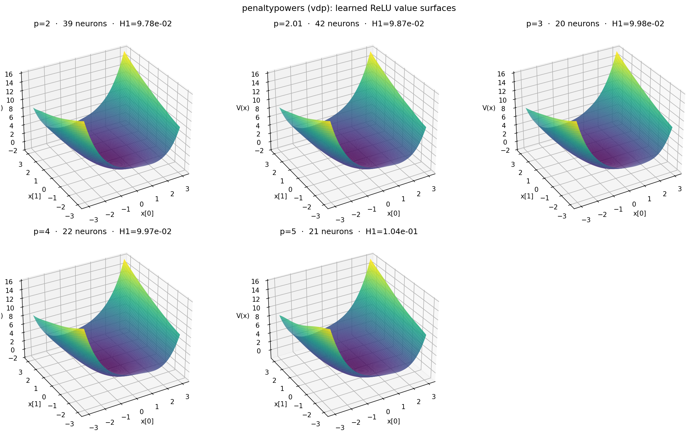

# penaltypowers Results

## Sweep coverage

- Configured data: vdp, pendulum
- Observed data: vdp
- Missing configured data: pendulum
- Configured homogeneous activations: relu, leaky_relu, abs_act, cubic, x_absx, quartic, smoothy_relu_sphere, leaky_relu2_a0_001_sphere, leaky_relu2_sphere, leaky_relu2_a0_015_sphere, leaky_relu2_a0_02_sphere, leaky_relu2_a0_025_sphere, leaky_relu2_a0_0375_sphere, leaky_relu2_a0_05_sphere, leaky_relu2_a0_05, leaky_relu2_a0_0625_sphere, leaky_relu2_a0_075_sphere, leaky_relu2_a0_1_sphere, relu2
- Observed activations: abs_act, cubic, leaky_relu, leaky_relu2_a0_001_sphere, leaky_relu2_a0_015_sphere, leaky_relu2_a0_025_sphere, leaky_relu2_a0_02_sphere, leaky_relu2_a0_0375_sphere, leaky_relu2_a0_05, leaky_relu2_a0_05_sphere, leaky_relu2_a0_0625_sphere, leaky_relu2_a0_075_sphere, leaky_relu2_a0_1_sphere, leaky_relu2_sphere, quartic, relu, relu2, smoothy_relu_sphere, x_absx
- Missing configured activations: none

## ReLU activation function

Dedicated view of the `relu` runs (signed model, H1 loss): the best-gamma row per penalty power, and the learned value surface V(x) for each — the fitted network evaluated on the physical state plane.

### vdp

ReLU on vdp (H1 loss) — best gamma per power

| power | gamma | neurons | Val H1   | score    |
| ----- | ----- | ------- | -------- | -------- |
| 2     | 10    | 39      | 9.78e-02 | 3.81e+00 |
| 2.01  | 10    | 42      | 9.87e-02 | 4.15e+00 |
| 3     | 10    | 20      | 9.98e-02 | 2.00e+00 |
| 4     | 0     | 22      | 9.97e-02 | 2.19e+00 |
| 5     | 0.1   | 21      | 1.04e-01 | 2.18e+00 |

## All activations — best gamma per cell

### H1 loss

Best gamma per data/activation/power/seed (h1 loss)

| data | activation                 | power | seed | gamma | neurons | Val H1   | score    |
| ---- | -------------------------- | ----- | ---- | ----- | ------- | -------- | -------- |
| vdp  | abs_act                    | 2     | 42   | 10    | 8       | 2.56e-01 | 2.05e+00 |
| vdp  | abs_act                    | 2.01  | 42   | 10    | 12      | 1.64e-01 | 1.96e+00 |
| vdp  | abs_act                    | 3     | 42   | 0     | 27      | 1.02e-01 | 2.76e+00 |
| vdp  | abs_act                    | 4     | 42   | 10    | 20      | 1.13e-01 | 2.25e+00 |
| vdp  | abs_act                    | 5     | 42   | 0     | 25      | 1.10e-01 | 2.76e+00 |
| vdp  | cubic                      | 2     | 42   | 1     | 46      | 9.70e-02 | 4.46e+00 |
| vdp  | cubic                      | 2.01  | 42   | 0     | 0       | 1.00e+00 | 1.00e+00 |
| vdp  | cubic                      | 3     | 42   | 0.1   | 76      | 1.47e-01 | 1.12e+01 |
| vdp  | cubic                      | 4     | 42   | 1     | 77      | 3.86e-01 | 2.97e+01 |
| vdp  | cubic                      | 5     | 42   | 0     | 89      | 6.26e-01 | 5.57e+01 |
| vdp  | leaky_relu                 | 2     | 42   | 0.1   | 45      | 1.01e-01 | 4.52e+00 |
| vdp  | leaky_relu                 | 2.01  | 42   | 0     | 0       | 1.00e+00 | 1.00e+00 |
| vdp  | leaky_relu                 | 3     | 42   | 10    | 21      | 9.91e-02 | 2.08e+00 |
| vdp  | leaky_relu                 | 4     | 42   | 10    | 24      | 9.91e-02 | 2.38e+00 |
| vdp  | leaky_relu                 | 5     | 42   | 1     | 20      | 1.02e-01 | 2.05e+00 |
| vdp  | leaky_relu2_a0_001_sphere  | 2     | 42   | 1     | 26      | 9.74e-02 | 2.53e+00 |
| vdp  | leaky_relu2_a0_001_sphere  | 2.01  | 42   | 0     | 24      | 9.73e-02 | 2.34e+00 |
| vdp  | leaky_relu2_a0_001_sphere  | 3     | 42   | 10    | 26      | 9.87e-02 | 2.57e+00 |
| vdp  | leaky_relu2_a0_001_sphere  | 4     | 42   | 1     | 42      | 1.03e-01 | 4.33e+00 |
| vdp  | leaky_relu2_a0_001_sphere  | 5     | 42   | 10    | 73      | 1.31e-01 | 9.55e+00 |
| vdp  | leaky_relu2_a0_015_sphere  | 2     | 42   | 1     | 24      | 9.76e-02 | 2.34e+00 |
| vdp  | leaky_relu2_a0_015_sphere  | 2.01  | 42   | 1     | 25      | 9.74e-02 | 2.43e+00 |
| vdp  | leaky_relu2_a0_015_sphere  | 3     | 42   | 0.1   | 25      | 9.87e-02 | 2.47e+00 |
| vdp  | leaky_relu2_a0_015_sphere  | 4     | 42   | 10    | 47      | 1.02e-01 | 4.79e+00 |
| vdp  | leaky_relu2_a0_015_sphere  | 5     | 42   | 1     | 77      | 1.48e-01 | 1.14e+01 |
| vdp  | leaky_relu2_a0_025_sphere  | 2     | 42   | 10    | 26      | 9.74e-02 | 2.53e+00 |
| vdp  | leaky_relu2_a0_025_sphere  | 2.01  | 42   | 1     | 25      | 9.74e-02 | 2.43e+00 |
| vdp  | leaky_relu2_a0_025_sphere  | 3     | 42   | 1     | 26      | 9.85e-02 | 2.56e+00 |
| vdp  | leaky_relu2_a0_025_sphere  | 4     | 42   | 0.1   | 54      | 1.08e-01 | 5.84e+00 |
| vdp  | leaky_relu2_a0_025_sphere  | 5     | 42   | 1     | 76      | 1.48e-01 | 1.12e+01 |
| vdp  | leaky_relu2_a0_02_sphere   | 2     | 42   | 10    | 26      | 9.73e-02 | 2.53e+00 |
| vdp  | leaky_relu2_a0_02_sphere   | 2.01  | 42   | 10    | 25      | 9.74e-02 | 2.43e+00 |
| vdp  | leaky_relu2_a0_02_sphere   | 3     | 42   | 0.1   | 27      | 9.72e-02 | 2.62e+00 |
| vdp  | leaky_relu2_a0_02_sphere   | 4     | 42   | 10    | 50      | 1.06e-01 | 5.28e+00 |
| vdp  | leaky_relu2_a0_02_sphere   | 5     | 42   | 0.1   | 83      | 1.71e-01 | 1.42e+01 |
| vdp  | leaky_relu2_a0_0375_sphere | 2     | 42   | 1     | 24      | 9.79e-02 | 2.35e+00 |
| vdp  | leaky_relu2_a0_0375_sphere | 2.01  | 42   | 1     | 25      | 9.74e-02 | 2.43e+00 |
| vdp  | leaky_relu2_a0_0375_sphere | 3     | 42   | 1     | 26      | 9.85e-02 | 2.56e+00 |
| vdp  | leaky_relu2_a0_0375_sphere | 4     | 42   | 0     | 41      | 1.03e-01 | 4.21e+00 |
| vdp  | leaky_relu2_a0_0375_sphere | 5     | 42   | 1     | 80      | 1.50e-01 | 1.20e+01 |
| vdp  | leaky_relu2_a0_05          | 2     | 42   | 1     | 25      | 9.74e-02 | 2.44e+00 |
| vdp  | leaky_relu2_a0_05          | 2.01  | 42   | 0.1   | 23      | 9.73e-02 | 2.24e+00 |
| vdp  | leaky_relu2_a0_05          | 3     | 42   | 0.1   | 28      | 9.73e-02 | 2.73e+00 |
| vdp  | leaky_relu2_a0_05          | 4     | 42   | 10    | 51      | 1.04e-01 | 5.28e+00 |
| vdp  | leaky_relu2_a0_05          | 5     | 42   | 0     | 58      | 2.15e-01 | 1.25e+01 |
| vdp  | leaky_relu2_a0_05_sphere   | 2     | 42   | 1     | 25      | 9.74e-02 | 2.44e+00 |
| vdp  | leaky_relu2_a0_05_sphere   | 2.01  | 42   | 0.1   | 23      | 9.73e-02 | 2.24e+00 |
| vdp  | leaky_relu2_a0_05_sphere   | 3     | 42   | 0.1   | 28      | 9.73e-02 | 2.73e+00 |
| vdp  | leaky_relu2_a0_05_sphere   | 4     | 42   | 10    | 51      | 1.04e-01 | 5.28e+00 |
| vdp  | leaky_relu2_a0_05_sphere   | 5     | 42   | 0     | 58      | 2.15e-01 | 1.25e+01 |
| vdp  | leaky_relu2_a0_0625_sphere | 2     | 42   | 0     | 24      | 9.75e-02 | 2.34e+00 |
| vdp  | leaky_relu2_a0_0625_sphere | 2.01  | 42   | 0     | 25      | 9.75e-02 | 2.44e+00 |
| vdp  | leaky_relu2_a0_0625_sphere | 3     | 42   | 1     | 29      | 9.82e-02 | 2.85e+00 |
| vdp  | leaky_relu2_a0_0625_sphere | 4     | 42   | 0     | 68      | 1.23e-01 | 8.34e+00 |
| vdp  | leaky_relu2_a0_0625_sphere | 5     | 42   | 1     | 77      | 1.48e-01 | 1.14e+01 |
| vdp  | leaky_relu2_a0_075_sphere  | 2     | 42   | 10    | 25      | 9.74e-02 | 2.43e+00 |
| vdp  | leaky_relu2_a0_075_sphere  | 2.01  | 42   | 0     | 33      | 9.78e-02 | 3.23e+00 |
| vdp  | leaky_relu2_a0_075_sphere  | 3     | 42   | 0.1   | 36      | 9.94e-02 | 3.58e+00 |
| vdp  | leaky_relu2_a0_075_sphere  | 4     | 42   | 0.1   | 38      | 1.06e-01 | 4.04e+00 |
| vdp  | leaky_relu2_a0_075_sphere  | 5     | 42   | 1     | 75      | 2.23e-01 | 1.67e+01 |
| vdp  | leaky_relu2_a0_1_sphere    | 2     | 42   | 10    | 32      | 9.77e-02 | 3.13e+00 |
| vdp  | leaky_relu2_a0_1_sphere    | 2.01  | 42   | 10    | 33      | 9.76e-02 | 3.22e+00 |
| vdp  | leaky_relu2_a0_1_sphere    | 3     | 42   | 10    | 34      | 9.71e-02 | 3.30e+00 |
| vdp  | leaky_relu2_a0_1_sphere    | 4     | 42   | 10    | 56      | 1.27e-01 | 7.10e+00 |
| vdp  | leaky_relu2_a0_1_sphere    | 5     | 42   | 0.1   | 96      | 1.66e-01 | 1.60e+01 |
| vdp  | leaky_relu2_sphere         | 2     | 42   | 1     | 25      | 9.73e-02 | 2.43e+00 |
| vdp  | leaky_relu2_sphere         | 2.01  | 42   | 0.1   | 25      | 9.74e-02 | 2.43e+00 |
| vdp  | leaky_relu2_sphere         | 3     | 42   | 0.1   | 27      | 9.77e-02 | 2.64e+00 |
| vdp  | leaky_relu2_sphere         | 4     | 42   | 1     | 45      | 1.07e-01 | 4.81e+00 |
| vdp  | leaky_relu2_sphere         | 5     | 42   | 0.1   | 34      | 2.64e-01 | 8.98e+00 |
| vdp  | quartic                    | 2     | 42   | 0.1   | 64      | 1.05e-01 | 6.70e+00 |
| vdp  | quartic                    | 2.01  | 42   | 0     | 81      | 1.01e-01 | 8.15e+00 |
| vdp  | quartic                    | 3     | 42   | 0     | 75      | 3.38e-01 | 2.54e+01 |
| vdp  | quartic                    | 4     | 42   | 0     | 88      | 6.22e-01 | 5.48e+01 |
| vdp  | quartic                    | 5     | 42   | 0     | 99      | 6.03e-01 | 5.97e+01 |
| vdp  | relu                       | 2     | 42   | 10    | 39      | 9.78e-02 | 3.81e+00 |
| vdp  | relu                       | 2.01  | 42   | 10    | 42      | 9.87e-02 | 4.15e+00 |
| vdp  | relu                       | 3     | 42   | 10    | 20      | 9.98e-02 | 2.00e+00 |
| vdp  | relu                       | 4     | 42   | 0     | 22      | 9.97e-02 | 2.19e+00 |
| vdp  | relu                       | 5     | 42   | 0.1   | 21      | 1.04e-01 | 2.18e+00 |
| vdp  | relu2                      | 2     | 42   | 1     | 26      | 9.73e-02 | 2.53e+00 |
| vdp  | relu2                      | 2.01  | 42   | 0     | 24      | 9.73e-02 | 2.34e+00 |
| vdp  | relu2                      | 3     | 42   | 0     | 28      | 1.01e-01 | 2.83e+00 |
| vdp  | relu2                      | 4     | 42   | 0     | 56      | 1.26e-01 | 7.03e+00 |
| vdp  | relu2                      | 5     | 42   | 10    | 73      | 1.31e-01 | 9.55e+00 |
| vdp  | smoothy_relu_sphere        | 2     | 42   | 1     | 129     | 7.29e-02 | 9.40e+00 |
| vdp  | smoothy_relu_sphere        | 2.01  | 42   | 0.1   | 131     | 7.58e-02 | 9.93e+00 |
| vdp  | smoothy_relu_sphere        | 3     | 42   | 0     | 114     | 9.20e-02 | 1.05e+01 |
| vdp  | smoothy_relu_sphere        | 4     | 42   | 1     | 77      | 8.53e-02 | 6.57e+00 |
| vdp  | smoothy_relu_sphere        | 5     | 42   | 1     | 48      | 9.85e-02 | 4.73e+00 |
| vdp  | x_absx                     | 2     | 42   | 0     | 20      | 1.13e-01 | 2.25e+00 |
| vdp  | x_absx                     | 2.01  | 42   | 0     | 0       | 1.00e+00 | 1.00e+00 |
| vdp  | x_absx                     | 3     | 42   | 1     | 48      | 1.02e-01 | 4.91e+00 |
| vdp  | x_absx                     | 4     | 42   | 0     | 46      | 1.01e-01 | 4.66e+00 |
| vdp  | x_absx                     | 5     | 42   | 1     | 76      | 2.79e-01 | 2.12e+01 |

### L2 loss

Best gamma per data/activation/power/seed (l2 loss)

| data | activation                 | power | seed | gamma | neurons | Val H1   | score    |
| ---- | -------------------------- | ----- | ---- | ----- | ------- | -------- | -------- |
| vdp  | abs_act                    | 2     | 42   | 1     | 6       | 5.57e-01 | 3.34e+00 |
| vdp  | abs_act                    | 2.01  | 42   | 1     | 5       | 5.57e-01 | 2.78e+00 |
| vdp  | abs_act                    | 3     | 42   | 0     | 10      | 4.72e-01 | 4.72e+00 |
| vdp  | abs_act                    | 4     | 42   | 10    | 13      | 4.68e-01 | 6.08e+00 |
| vdp  | abs_act                    | 5     | 42   | 10    | 14      | 4.84e-01 | 6.77e+00 |
| vdp  | cubic                      | 2     | 42   | 1     | 15      | 4.10e-01 | 6.15e+00 |
| vdp  | cubic                      | 2.01  | 42   | 0     | 0       | 1.00e+00 | 1.00e+00 |
| vdp  | cubic                      | 3     | 42   | 0     | 30      | 4.09e-01 | 1.23e+01 |
| vdp  | cubic                      | 4     | 42   | 0     | 39      | 5.63e-01 | 2.20e+01 |
| vdp  | cubic                      | 5     | 42   | 10    | 30      | 9.61e-01 | 2.88e+01 |
| vdp  | leaky_relu                 | 2     | 42   | 0.1   | 14      | 4.11e-01 | 5.76e+00 |
| vdp  | leaky_relu                 | 2.01  | 42   | 0     | 1       | 9.85e-01 | 9.85e-01 |
| vdp  | leaky_relu                 | 3     | 42   | 0.1   | 11      | 4.23e-01 | 4.65e+00 |
| vdp  | leaky_relu                 | 4     | 42   | 0     | 10      | 4.71e-01 | 4.71e+00 |
| vdp  | leaky_relu                 | 5     | 42   | 0     | 10      | 4.00e-01 | 4.00e+00 |
| vdp  | leaky_relu2_a0_001_sphere  | 2     | 42   | 10    | 12      | 4.38e-01 | 5.26e+00 |
| vdp  | leaky_relu2_a0_001_sphere  | 2.01  | 42   | 1     | 13      | 4.35e-01 | 5.66e+00 |
| vdp  | leaky_relu2_a0_001_sphere  | 3     | 42   | 10    | 12      | 4.13e-01 | 4.95e+00 |
| vdp  | leaky_relu2_a0_001_sphere  | 4     | 42   | 1     | 14      | 4.12e-01 | 5.77e+00 |
| vdp  | leaky_relu2_a0_001_sphere  | 5     | 42   | 1     | 19      | 3.75e-01 | 7.12e+00 |
| vdp  | leaky_relu2_a0_015_sphere  | 2     | 42   | 0     | 11      | 4.35e-01 | 4.78e+00 |
| vdp  | leaky_relu2_a0_015_sphere  | 2.01  | 42   | 0.1   | 12      | 4.37e-01 | 5.24e+00 |
| vdp  | leaky_relu2_a0_015_sphere  | 3     | 42   | 0     | 12      | 4.14e-01 | 4.97e+00 |
| vdp  | leaky_relu2_a0_015_sphere  | 4     | 42   | 1     | 14      | 4.12e-01 | 5.77e+00 |
| vdp  | leaky_relu2_a0_015_sphere  | 5     | 42   | 0     | 18      | 3.94e-01 | 7.08e+00 |
| vdp  | leaky_relu2_a0_025_sphere  | 2     | 42   | 0     | 12      | 4.46e-01 | 5.36e+00 |
| vdp  | leaky_relu2_a0_025_sphere  | 2.01  | 42   | 0     | 12      | 4.44e-01 | 5.33e+00 |
| vdp  | leaky_relu2_a0_025_sphere  | 3     | 42   | 0.1   | 12      | 4.12e-01 | 4.95e+00 |
| vdp  | leaky_relu2_a0_025_sphere  | 4     | 42   | 0.1   | 14      | 4.23e-01 | 5.93e+00 |
| vdp  | leaky_relu2_a0_025_sphere  | 5     | 42   | 10    | 18      | 3.87e-01 | 6.97e+00 |
| vdp  | leaky_relu2_a0_02_sphere   | 2     | 42   | 0     | 12      | 4.47e-01 | 5.36e+00 |
| vdp  | leaky_relu2_a0_02_sphere   | 2.01  | 42   | 0.1   | 12      | 4.38e-01 | 5.25e+00 |
| vdp  | leaky_relu2_a0_02_sphere   | 3     | 42   | 0     | 12      | 4.01e-01 | 4.81e+00 |
| vdp  | leaky_relu2_a0_02_sphere   | 4     | 42   | 1     | 14      | 4.21e-01 | 5.90e+00 |
| vdp  | leaky_relu2_a0_02_sphere   | 5     | 42   | 1     | 19      | 3.75e-01 | 7.12e+00 |
| vdp  | leaky_relu2_a0_0375_sphere | 2     | 42   | 10    | 13      | 4.43e-01 | 5.76e+00 |
| vdp  | leaky_relu2_a0_0375_sphere | 2.01  | 42   | 0.1   | 13      | 4.27e-01 | 5.55e+00 |
| vdp  | leaky_relu2_a0_0375_sphere | 3     | 42   | 0.1   | 12      | 4.23e-01 | 5.08e+00 |
| vdp  | leaky_relu2_a0_0375_sphere | 4     | 42   | 1     | 14      | 4.23e-01 | 5.92e+00 |
| vdp  | leaky_relu2_a0_0375_sphere | 5     | 42   | 0     | 17      | 3.99e-01 | 6.78e+00 |
| vdp  | leaky_relu2_a0_05          | 2     | 42   | 10    | 13      | 4.33e-01 | 5.63e+00 |
| vdp  | leaky_relu2_a0_05          | 2.01  | 42   | 1     | 14      | 4.34e-01 | 6.08e+00 |
| vdp  | leaky_relu2_a0_05          | 3     | 42   | 0.1   | 13      | 4.15e-01 | 5.39e+00 |
| vdp  | leaky_relu2_a0_05          | 4     | 42   | 0.1   | 14      | 4.23e-01 | 5.92e+00 |
| vdp  | leaky_relu2_a0_05          | 5     | 42   | 1     | 19      | 3.75e-01 | 7.12e+00 |
| vdp  | leaky_relu2_a0_05_sphere   | 2     | 42   | 10    | 13      | 4.33e-01 | 5.63e+00 |
| vdp  | leaky_relu2_a0_05_sphere   | 2.01  | 42   | 1     | 14      | 4.34e-01 | 6.08e+00 |
| vdp  | leaky_relu2_a0_05_sphere   | 3     | 42   | 0.1   | 13      | 4.15e-01 | 5.39e+00 |
| vdp  | leaky_relu2_a0_05_sphere   | 4     | 42   | 0.1   | 14      | 4.23e-01 | 5.92e+00 |
| vdp  | leaky_relu2_a0_05_sphere   | 5     | 42   | 1     | 19      | 3.75e-01 | 7.12e+00 |
| vdp  | leaky_relu2_a0_0625_sphere | 2     | 42   | 1     | 13      | 4.50e-01 | 5.85e+00 |
| vdp  | leaky_relu2_a0_0625_sphere | 2.01  | 42   | 0.1   | 14      | 4.36e-01 | 6.10e+00 |
| vdp  | leaky_relu2_a0_0625_sphere | 3     | 42   | 0.1   | 13      | 4.15e-01 | 5.39e+00 |
| vdp  | leaky_relu2_a0_0625_sphere | 4     | 42   | 0     | 14      | 4.23e-01 | 5.92e+00 |
| vdp  | leaky_relu2_a0_0625_sphere | 5     | 42   | 1     | 19      | 3.75e-01 | 7.12e+00 |
| vdp  | leaky_relu2_a0_075_sphere  | 2     | 42   | 0     | 15      | 4.42e-01 | 6.63e+00 |
| vdp  | leaky_relu2_a0_075_sphere  | 2.01  | 42   | 1     | 14      | 4.42e-01 | 6.19e+00 |
| vdp  | leaky_relu2_a0_075_sphere  | 3     | 42   | 0     | 14      | 4.16e-01 | 5.83e+00 |
| vdp  | leaky_relu2_a0_075_sphere  | 4     | 42   | 0     | 14      | 4.23e-01 | 5.92e+00 |
| vdp  | leaky_relu2_a0_075_sphere  | 5     | 42   | 1     | 19      | 3.75e-01 | 7.12e+00 |
| vdp  | leaky_relu2_a0_1_sphere    | 2     | 42   | 0     | 15      | 4.33e-01 | 6.49e+00 |
| vdp  | leaky_relu2_a0_1_sphere    | 2.01  | 42   | 0     | 13      | 4.43e-01 | 5.75e+00 |
| vdp  | leaky_relu2_a0_1_sphere    | 3     | 42   | 1     | 17      | 4.24e-01 | 7.20e+00 |
| vdp  | leaky_relu2_a0_1_sphere    | 4     | 42   | 10    | 13      | 3.87e-01 | 5.03e+00 |
| vdp  | leaky_relu2_a0_1_sphere    | 5     | 42   | 0     | 19      | 3.73e-01 | 7.09e+00 |
| vdp  | leaky_relu2_sphere         | 2     | 42   | 0     | 12      | 4.39e-01 | 5.27e+00 |
| vdp  | leaky_relu2_sphere         | 2.01  | 42   | 10    | 12      | 4.49e-01 | 5.39e+00 |
| vdp  | leaky_relu2_sphere         | 3     | 42   | 1     | 12      | 4.12e-01 | 4.94e+00 |
| vdp  | leaky_relu2_sphere         | 4     | 42   | 0.1   | 14      | 4.26e-01 | 5.97e+00 |
| vdp  | leaky_relu2_sphere         | 5     | 42   | 1     | 19      | 3.75e-01 | 7.12e+00 |
| vdp  | quartic                    | 2     | 42   | 10    | 38      | 4.18e-01 | 1.59e+01 |
| vdp  | quartic                    | 2.01  | 42   | 10    | 27      | 4.32e-01 | 1.17e+01 |
| vdp  | quartic                    | 3     | 42   | 10    | 93      | 4.01e-01 | 3.73e+01 |
| vdp  | quartic                    | 4     | 42   | 0     | 53      | 1.08e+00 | 5.72e+01 |
| vdp  | quartic                    | 5     | 42   | 0     | 86      | 8.39e-01 | 7.21e+01 |
| vdp  | relu                       | 2     | 42   | 1     | 13      | 4.83e-01 | 6.28e+00 |
| vdp  | relu                       | 2.01  | 42   | 1     | 12      | 4.85e-01 | 5.82e+00 |
| vdp  | relu                       | 3     | 42   | 0     | 12      | 4.94e-01 | 5.92e+00 |
| vdp  | relu                       | 4     | 42   | 0.1   | 9       | 4.34e-01 | 3.90e+00 |
| vdp  | relu                       | 5     | 42   | 0     | 10      | 4.04e-01 | 4.04e+00 |
| vdp  | relu2                      | 2     | 42   | 0     | 13      | 4.42e-01 | 5.75e+00 |
| vdp  | relu2                      | 2.01  | 42   | 0     | 13      | 4.41e-01 | 5.73e+00 |
| vdp  | relu2                      | 3     | 42   | 1     | 13      | 4.15e-01 | 5.39e+00 |
| vdp  | relu2                      | 4     | 42   | 1     | 14      | 4.12e-01 | 5.77e+00 |
| vdp  | relu2                      | 5     | 42   | 1     | 19      | 3.75e-01 | 7.12e+00 |
| vdp  | smoothy_relu_sphere        | 2     | 42   | 10    | 24      | 5.38e-01 | 1.29e+01 |
| vdp  | smoothy_relu_sphere        | 2.01  | 42   | 0     | 24      | 5.20e-01 | 1.25e+01 |
| vdp  | smoothy_relu_sphere        | 3     | 42   | 0     | 13      | 5.20e-01 | 6.76e+00 |
| vdp  | smoothy_relu_sphere        | 4     | 42   | 0     | 10      | 4.52e-01 | 4.52e+00 |
| vdp  | smoothy_relu_sphere        | 5     | 42   | 10    | 11      | 4.79e-01 | 5.27e+00 |
| vdp  | x_absx                     | 2     | 42   | 0     | 13      | 4.24e-01 | 5.51e+00 |
| vdp  | x_absx                     | 2.01  | 42   | 0     | 0       | 1.00e+00 | 1.00e+00 |
| vdp  | x_absx                     | 3     | 42   | 0     | 16      | 4.23e-01 | 6.77e+00 |
| vdp  | x_absx                     | 4     | 42   | 0     | 16      | 3.87e-01 | 6.19e+00 |
| vdp  | x_absx                     | 5     | 42   | 1     | 22      | 4.22e-01 | 9.29e+00 |

