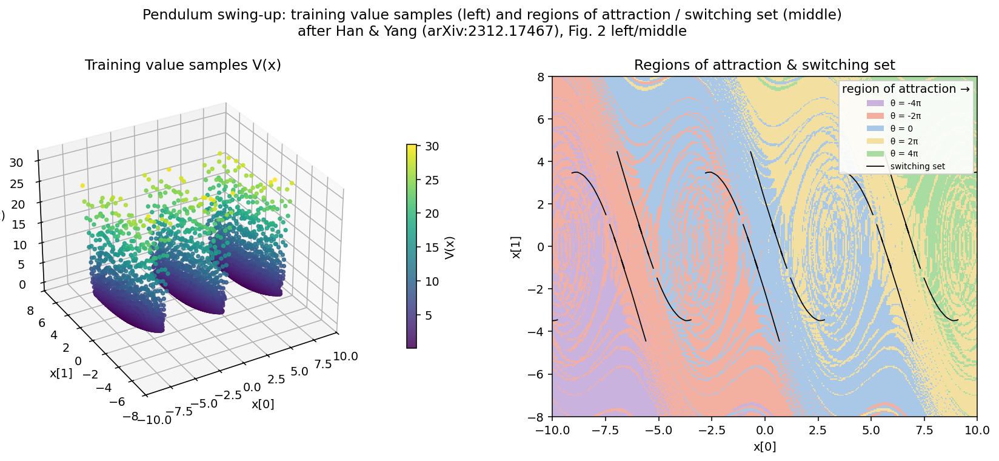
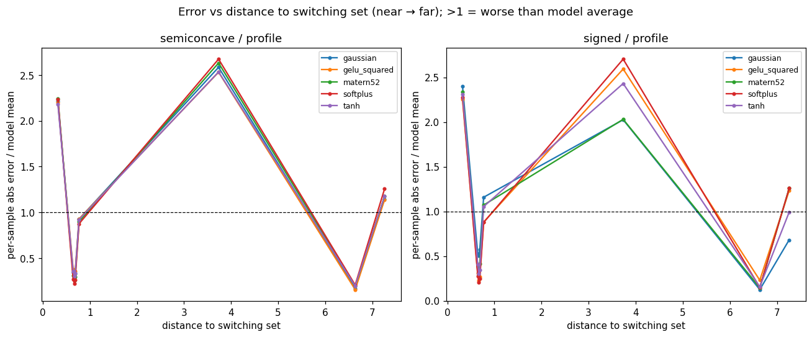

# region_split_pendulum Results

Region split scored over the **full dataset** on the live as-fit model. `near` = lowest 10% of samples by distance to the switching set; `far` = the rest. See `README.md` for the error-metric rationale.

## Value samples & regions of attraction (Fig. 2 left/middle)

Left: a 3D scatter of the raw training value samples (no interpolation), on the same state-plane extent as the right panel. Right: the regions of attraction to the (periodic) upright equilibria — PMP characteristics filled by nearest-point classification — separated by the nonsmooth switching curves. After Han & Yang (arXiv:2312.17467), Fig. 2 left/middle.

## Mean per-sample L1 (primary)

`near/far` > 1 ⇒ worse at the switching set. Region mean per-sample L1 (absolute) error / global mean ‖true‖ — count-fair and robust to the V→0 interior.

Mean per-sample L1 over the full dataset — count-fair, robust to V→0. All runs use `profile` insertion; rows are grouped by activation, comparing the two models (semiconcave vs signed) side by side.

| activation   | kind        | loss | gamma | neurons | near L1  | far L1   | near/far |
| ------------ | ----------- | ---- | ----- | ------- | -------- | -------- | -------- |
| gaussian     | semiconcave | h1   | 1     | 47      | 2.84e+00 | 8.99e-01 | 3.16     |
| gaussian     | signed      | h1   | 1     | 130     | 1.32e+00 | 3.78e-01 | 3.50     |
| gelu_squared | semiconcave | h1   | 0     | 32      | 2.81e+00 | 9.02e-01 | 3.12     |
| gelu_squared | signed      | h1   | 0     | 48      | 2.74e+00 | 8.42e-01 | 3.25     |
| matern52     | semiconcave | h1   | 0     | 45      | 2.81e+00 | 8.73e-01 | 3.22     |
| matern52     | signed      | h1   | 1     | 145     | 5.73e-01 | 1.65e-01 | 3.47     |
| softplus     | semiconcave | h1   | 0     | 16      | 2.76e+00 | 8.56e-01 | 3.22     |
| softplus     | signed      | h1   | 0     | 83      | 2.77e+00 | 8.39e-01 | 3.30     |
| tanh         | semiconcave | h1   | 1     | 57      | 2.84e+00 | 9.23e-01 | 3.08     |
| tanh         | signed      | h1   | 1     | 139     | 1.78e+00 | 5.34e-01 | 3.33     |

## Error vs distance to switching set (diagnostic)

## Relative H1 (kept for continuity — confounded)

Relative H1 (kept for continuity — confounded by the V→0 interior)

| kind        | insertion | activation   | loss | gamma | neurons | near H1  | far H1   | near/far |
| ----------- | --------- | ------------ | ---- | ----- | ------- | -------- | -------- | -------- |
| semiconcave | profile   | softplus     | h1   | 0     | 16      | 1.00e+00 | 9.92e-01 | 1.01     |
| semiconcave | profile   | tanh         | h1   | 1     | 57      | 9.97e-01 | 9.77e-01 | 1.02     |
| semiconcave | profile   | gelu_squared | h1   | 0     | 32      | 9.87e-01 | 9.66e-01 | 1.02     |
| semiconcave | profile   | gaussian     | h1   | 1     | 47      | 9.99e-01 | 9.70e-01 | 1.03     |
| semiconcave | profile   | matern52     | h1   | 0     | 45      | 1.01e+00 | 9.76e-01 | 1.03     |
| signed      | profile   | softplus     | h1   | 0     | 83      | 1.01e+00 | 9.86e-01 | 1.02     |
| signed      | profile   | gelu_squared | h1   | 0     | 48      | 9.94e-01 | 9.43e-01 | 1.05     |
| signed      | profile   | tanh         | h1   | 1     | 139     | 6.81e-01 | 5.94e-01 | 1.15     |
| signed      | profile   | matern52     | h1   | 1     | 145     | 2.76e-01 | 2.17e-01 | 1.27     |
| signed      | profile   | gaussian     | h1   | 1     | 130     | 5.13e-01 | 4.04e-01 | 1.27     |
